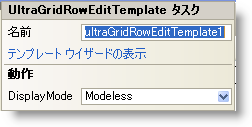

////

|metadata|
{
    "name": "wingridrowedittemplate-smart-tag",
    "controlName": [],
    "tags": ["Getting Started"],
    "guid": "{3F386CCF-8840-4A64-878D-1C4CDF156C8A}",  
    "buildFlags": [],
    "createdOn": "0001-01-01T00:00:00Z"
}
|metadata|
////

= WinGridRowEditTemplate スマート タグ

Visual Studio 2005（.NET Framework 2.0）では、{ProductName} コントロール/コンポーネントがそれぞれ固有のスマート タグを備えています。コントロールやコンポーネントを選択するだけで、スマート タグのアンカーが表示されます。このアンカーをクリックするとポップアップ パネルが表示され、そこからコントロール/コンポーネントの最もよく使うプロパティや設定にすばやく簡単にアクセスできます。

WinGridRowEditTemplate™ スマート タグには、以下のセクションと共にコントロールの名前が含まれます。

* 動作 -- フォーム上でのコントロールの動作を制御するプロパティに簡単にアクセスできます。

各セクションの項目（フィールド、ドロップダウン リスト、チェックボックスなど）の説明と、各項目が対応するプロパティ グリッドのプロパティについては、以下の表を参照してください。

[options="header", cols="a,a,a"]
|====
|動作|説明|対応するプロパティ

|表示モード
|WinGridRowEditTemplate はパネルであるので、モーダル ダイアログボックス、非モーダル ダイアログボックス、またはポップアップとしてそれを表示するオプションを持ちます。
| link:{ApiPlatform}win.ultrawingrid{ApiVersion}~infragistics.win.ultrawingrid.ultragridrowedittemplate~displaymode.html[DisplayMode]

|====