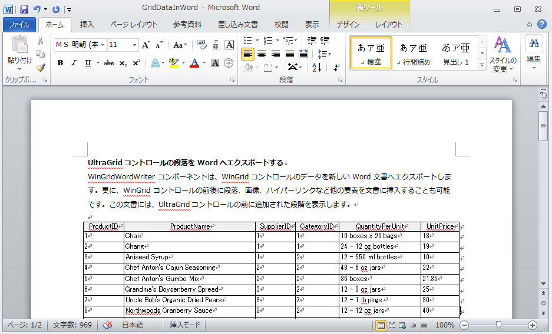

////

|metadata|
{
    "name": "wingridwordwriter-export-wingrid-with-paragraphs-to-word",
    "controlName": ["WinGridWordWriter"],
    "tags": ["Exporting","Getting Started","How Do I"],
    "guid": "228dea03-dcfa-4762-be93-0873749b291a",  
    "buildFlags": [],
    "createdOn": "2011-03-15T16:09:45.9785985Z"
}
|metadata|
////

= 段落がある WinGrid を Word にエクスポート

WinGridWordWriter™ コンポーネントは、WinGrid™ コントロールから新しい Word ドキュメントにデータをエクスポートすることを可能にします。更に、WinGrid コントロールの前後に段落、画像、ハイパーリンクなど他の要素を文書に挿入することも可能です。

以下のスクリーンショットは、エクスポートされたグリッドが Word でどのように表示されるかを示します。

エクスポートは、Infragisitcs.Documents.IO アセンブリの link:{ApiPlatform}documents.io{ApiVersion}~infragistics.documents.word.worddocumentwriter.html[WordDocumentWriter] クラスに基づいて、WinGridWordWriter コンポーネントで Export メソッドを呼び出すことによって可能となります。 link:{ApiPlatform}win.ultrawingrid.wordwriter{ApiVersion}~infragistics.win.ultrawingrid.wordwriter.ultragridwordwriter~export.html[Export] メソッドは、WordDocumentWriter の宛先ファイル名、ストリームまたはインスタンスとともに WinGrid コントロールのインスタンスをパラメーターとして受け付けます。

以下のコードは、特定のファイル名で UltraGrid コントロールを新しい Word ドキュメントにエクスポートする方法を示します。

*C# の場合:*

----
// Export メソッドは Grid コントロールとファイル名をパラメーターとして取得します
this.ultraGridWordWriter1.Export(ultraGrid1,"C:\\Samples_Projects\\GridDataInWord.docx");
----

*Visual Basic の場合:*

----
'  Export メソッドは Grid コントロールとファイル名をパラメーターとして取得します
Me.ultraGridWordWriter1.Export(ultraGrid1, "C:\Samples_Projects\GridDataInWord.docx")
----

生データをドキュメントにエクスポートすることに加えて、エクスポートされたデータを伴うその他の要素をページに追加する機能も提供されています。以下のコードは、プログラムによって追加された段落とともに UltraGrid コントロールからデータを新しい Word ドキュメントにエクスポートする方法を示します。

開始するには、UltraGrid コントロールと UltraGridWordWriter コンポーネントをツールボックスからフォームにドラッグ アンド ドロップします。次に、UltraGrid コントロールを Northwind データベースの Products テーブルにバインドします。Infragistics3.Documents.IO、Infragistics3.Win.UltraWinGrid.WordWriter および {ApiPlatform}Win.UltraWinGrid アセンブリへの参照が必要とされます。

[NOTE]
====
*注:* WinGrid コントロールのデータ バインディングの詳細は、「WinGrid をフラット データ ソースにバインドする」を参照してください。
====

*C# の場合:*

----
// 静的な 'Create' メソッドを使用して、WordDocumentWriter クラスの
// 新しいインスタンスを作成します
// コンテンツを書いた後は、このインスタンスを閉じる必要があります
WordDocumentWriter wordDocWriter = WordDocumentWriter.Create(@"C:\Samples_Projects\GridDataInWord.docx");
// Font クラスのインスタンスを作成します
Infragistics.Documents.Word.Font font = wordDocWriter.CreateFont();
// ドキュメントを開始します。StartDocument への各呼び出しは
// EndDocument への対応する呼び出しとバランスを取らなければならないこと
// に留意します
wordDocWriter.StartDocument();
// 段落を開始しますこれは、
// EndParagraph への対応する呼び出しとバランスを取らなければなりません
wordDocWriter.StartParagraph();
font.Reset();
font.Bold = true;
wordDocWriter.AddTextRun("Categories of Consumer Products", font);
wordDocWriter.AddNewLine();
font.Reset();
wordDocWriter.AddTextRun("In addition to categorizing by type of offering, most products intended for consumer use can be further categorized by how frequently and where they are purchased.");
// 段落を終わります
wordDocWriter.EndParagraph();
wordDocWriter.AddEmptyParagraph();
// WinGridWordWriter で Export メソッドを呼び出し、
// Grid コントロールと WordDocumentWriter オブジェクトをパラメーターとして渡します this.ultraGridWordWriter1.Export(ultraGrid1, wordDocWriter); 
// ドキュメントを終了します
wordDocWriter.EndDocument();
// ライターを閉じてコンテンツをファイナライズします
wordDocWriter.Close();
----

*Visual Basic の場合:*

----
' 静的な 'Create' メソッドを使用して、WordDocumentWriter クラスの
' 新しいインスタンスを作成します
' コンテンツを書いた後は、このインスタンスを閉じる必要があります
Dim wordDocWriter As WordDocumentWriter = WordDocumentWriter.Create("C:\Samples_Projects\GridDataInWord.docx")
Dim font As Infragistics.Documents.Word.Font = wordDocWriter.CreateFont()
' ドキュメントを開始します。StartDocument への各呼び出しは
' EndDocument への対応する呼び出しとバランスを取らなければならないこと
' に留意します
wordDocWriter.StartDocument()
' 段落を開始しますこれは、
' EndParagraph への対応する呼び出しとバランスを取らなければなりません
wordDocWriter.StartParagraph()
font.Reset()
font.Bold = True
wordDocWriter.AddTextRun("Categories of Consumer Products", font)
wordDocWriter.AddNewLine()
font.Reset()
wordDocWriter.AddTextRun("In addition to categorizing by type of offering, most products intended for consumer use can be further categorized by how frequently and where they are purchased.")
' 段落を終わります
wordDocWriter.EndParagraph()
wordDocWriter.AddEmptyParagraph()
' WinGridWordWriter で Export メソッドを呼び出し、
' Grid コントロールと WordDocumentWriter オブジェクトをパラメーターとして渡します
Me.ultraGridWordWriter1.Export(ultraGrid1, wordDocWriter)
wordDocWriter.EndDocument()
' ライターを閉じてコンテンツをファイナライズします
wordDocWriter.Close()
----

== 関連トピック

* link:wingridwordwriter-about-wingridwordwriter.html[WinGridWordWriter について]
* link:wingridwordwriter-export-multiple-wingrid-to-word.html[複数の WinGrids を Word にエクスポート]