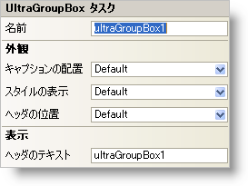

////

|metadata|
{
    "name": "wingroupbox-smart-tag",
    "controlName": ["WinGroupBox"],
    "tags": ["API","Design Environment"],
    "guid": "{45D3FCF1-3EEF-4E0E-A7CA-EA6EE2B0F0D2}",  
    "buildFlags": [],
    "createdOn": "2005-07-11T00:00:00Z"
}
|metadata|
////

= WinGroupBox スマート タグ

Visual Studio 2005（.NET Framework 2.0）では、それぞれの {ProductName} コントロール/コンポーネントが固有のスマート タグを備えています。 コントロール/コンポーネントを単に選択すると、Smart Tag のアンカーが表示されます。このアンカーをクリックするとポップアップ パネルが表示され、そこからコントロール/コンポーネントの最もよく使用するプロパティや設定にすばやく簡単にアクセスできます。

WinGroupBox スマート タグには、以下のセクションと共にコントロールの名前が含まれます。

* 外観 -- コントロールの外観やルック アンド フィールに関連する一般的なタスクがあります。

各セクションの項目（たとえば、フィールド、ドロップダウン リスト、チェックボックス）およびプロパティ グリッドの項目の対応するプロパティの説明については以下を参照してください。

[options="header", cols="a,a,a"]
|====
|外観|説明|対応するプロパティ

|キャプションの配置
|キャプションとは、WinGroupBox の上部に表示されるテキストのことです。キャプションの位置揃えを Near（Left）、 Center 、 Far（Right）の中から選択します。
| link:{ApiPlatform}win.misc{ApiVersion}~infragistics.win.misc.ultragroupbox~captionalignment.html[CaptionAlignment]

|ヘッダの位置
|ヘッダの位置を inGroupBox 上下左右いずれかの境界線上、境界線の内側、または境界線の外側から選択します。
| link:{ApiPlatform}win.misc{ApiVersion}~infragistics.win.misc.ultragroupbox~headerposition.html[HeaderPosition]

|スタイルの表示
|WinGroupBox のスタイルを、Windows XP、Office 2000、Office 2003、または Visual Studio 2005、Office 2007 に似たスタイルに変更します。
| link:{ApiPlatform}win.misc{ApiVersion}~infragistics.win.misc.ultragroupbox~viewstyle.html[ViewStyle]

|ヘッダのテキスト
|これはヘッダに表示するテキストです。
| link:{ApiPlatform}win.misc{ApiVersion}~infragistics.win.misc.ultragroupbox~text.html[Text]

|====