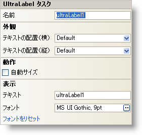

////

|metadata|
{
    "name": "winlabel-smart-tag",
    "controlName": ["WinLabel"],
    "tags": ["API","Design Environment"],
    "guid": "{09FBB01E-A2A0-4E7B-833E-FC73A9942715}",  
    "buildFlags": [],
    "createdOn": "2005-07-11T00:00:00Z"
}
|metadata|
////

= WinLabel スマート タグ

Visual Studio 2005（.NET Framework 2.0）では、それぞれの {ProductName} コントロール/コンポーネントが固有のスマート タグを備えています。 コントロール/コンポーネントを単に選択すると、Smart Tag のアンカーが表示されます。このアンカーをクリックするとポップアップ パネルが表示され、そこからコントロール/コンポーネントの最もよく使用するプロパティや設定にすばやく簡単にアクセスできます。

WinLabel スマート タグには、以下のセクションと共にコントロールの名前が含まれます。

* 外観 -- コントロールの外観やルック アンド フィールに関連する一般的なタスクがあります。
* レイアウト -- コントロールをフォームのどこに、どのように配置するかを指定するプロパティがあります。

各セクションの項目（たとえば、フィールド、ドロップダウン リスト、チェックボックス）およびプロパティ グリッドの項目の対応するプロパティの説明については以下を参照してください。

[options="header", cols="a,a,a"]
|====
|外観|説明|対応するプロパティ

|フォント
|省略（...）ボタンをクリックすると、[フォント] ダイアログが開きます。ここから、フォント、フォント サイズ、フォント スタイルなどを選択できます。
| link:{ApiPlatform}win{ApiVersion}~infragistics.win.appearance~fontdata.html[Font]

|テキスト
|ラベルに表示するテキスト。
| link:{ApiPlatform}win.misc{ApiVersion}~infragistics.win.misc.controlbase~text.html[Text]

|テキストの配置 

（水平）
|テキストの水平方向の位置揃えを Left、Center、Right の中から選択します。
| link:{ApiPlatform}win{ApiVersion}~infragistics.win.appearance~texthalign.html[TextHAlign]

|テキストの配置 

(垂直）
|テキストの垂直方向の位置揃えを Top、Middle、Bottom の中から選択します。
| link:{ApiPlatform}win{ApiVersion}~infragistics.win.appearance~textvalign.html[TextVAlign]

|フォントをリセット
|これをクリックすると、ラベルのフォントをデフォルト値にリセットします。
|なし

|====

[options="header", cols="a,a,a"]
|====
|レイアウト|説明|対応するプロパティ

|AutoSize
|このチェックボックスをオンにすると、内容のサイズに基づいてラベル自体のサイズが変更されます。
| link:{ApiPlatform}win.misc{ApiVersion}~infragistics.win.misc.autosizecontrolbase~autosize.html[AutoSize]

|====