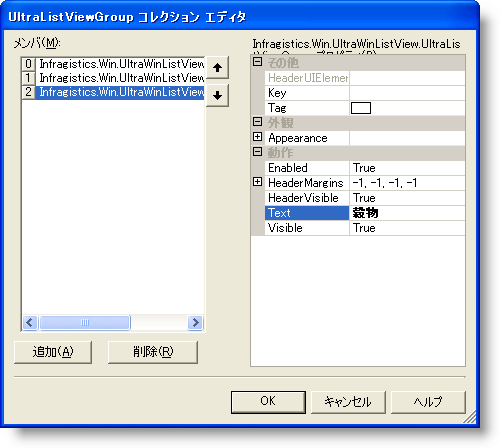
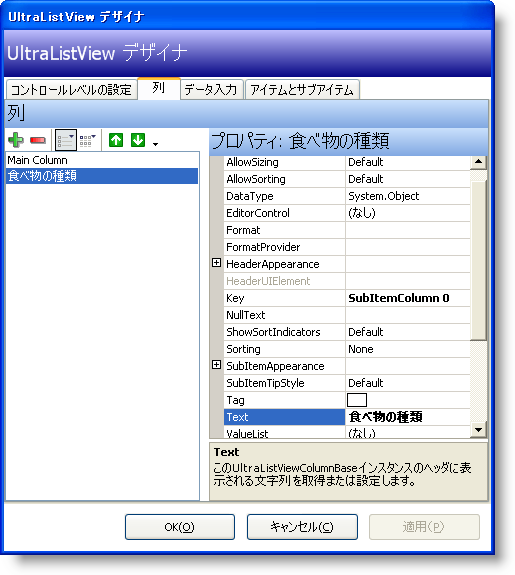
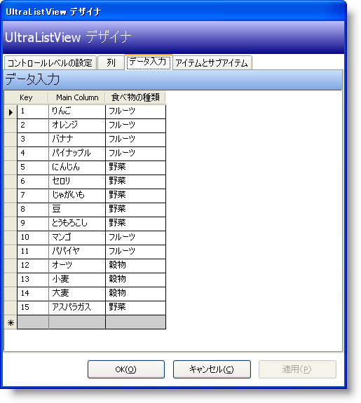
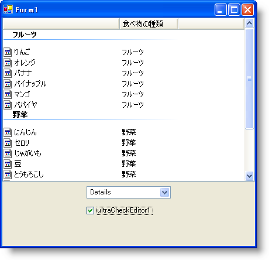

////
|metadata|
{
    "name": "winlistview-showing-groups-in-winlistview",
    "controlName": ["WinListView"],
    "tags": ["How Do I"],
    "guid": "{1EC01644-C9FF-4C2B-B62B-07D8F94669E9}",
    "buildFlags": [],
    "createdOn": "0001-01-01T00:00:00Z"
}
|metadata|
////

= WinListView でグループを表示

== 始める前に

WinListView コントロールは、グループのすべての項目を表示する能力があります。これは Windows® Explorer の機能と似ています。各 pick:[win-forms="link:{ApiPlatform}win.ultrawinlistview{ApiVersion}~infragistics.win.ultrawinlistview.ultralistviewitem.html[UltraListViewItem]"]  は、対応する pick:[win-forms="link:{ApiPlatform}win.ultrawinlistview{ApiVersion}~infragistics.win.ultrawinlistview.ultralistviewgroup.html[Group]"]  に指定できます。この詳細なガイドでは、複数の項目で満たされた WinListView コントロールを作成します。pick:[win-forms="link:{ApiPlatform}win.ultrawinlistview{ApiVersion}~infragistics.win.ultrawinlistview.ultralistviewmaincolumn.html[MainColumn]"]  は食物の特定のタイプで、pick:[win-forms="link:{ApiPlatform}win.ultrawinlistview{ApiVersion}~infragistics.win.ultrawinlistview.ultralistviewsubitemcolumn.html[SubItemColumn]"]  は項目がグループ化された食物の一般的なタイプです。WinListView の異なる表示スタイルを切り替えるために WinComboEditor を使用したり、グループをオン/オフにするために WinCheckEditor を使用します。

== 達成すること

このトピックは WinListView コントロールのグループを理解する支援をします。3 つの個別の {ProductName} コントロールを互いに組み合わせて使用し、どのようにグループが機能するか、そして WinListView の異なる表示でどのように表示されるかを示します。WinListView デザイナについて、そしてそれを使用してどのように作業を実行するかについても理解します。

== 次の手順を実行します

*フォームに必要なコントロールを追加します。*

[start=1]
. コードの記述を開始する前にコードビハインドに使用/インポートのディレクティブを配置します。そうすれば、メンバーは完全に記述された名前を常にタイプする必要がなくなります。

*Visual Basic の場合：*

----
Imports Infragistics.Win.UltraWinListView
Imports Infragistics.Win
----

*C# の場合：*

----
using Infragistics.Win.UltraWinListView;
using Infragistics.Win;
----

[start=2]
. テキストボックスからフォームに pick:[win-forms="link:{ApiPlatform}win.ultrawinlistview{ApiVersion}~infragistics.win.ultrawinlistview.ultralistview.html[UltraListView]"]  コントロールを追加します。
[start=3]
. その Dock プロパティを Top に設定します。
[start=4]
.pick:[win-forms="link:{ApiPlatform}win.ultrawineditors{ApiVersion}~infragistics.win.ultrawineditors.ultracomboeditor.html[UltraComboEditor]"]  および pick:[win-forms="link:{ApiPlatform}win.ultrawineditors{ApiVersion}~infragistics.win.ultrawineditors.ultracheckeditor.html[UltraCheckEditor]"]  を追加します。コントロールを配置すれば、以下のように見えます。

image::images/WinListView_Showing_Groups_in_WinListView_02.png[]

*WinListView コントロールを設定し、データを追加します。*

[start=1]
. WinListView を選択して、[プロパティ] ウィンドウの pick:[win-forms="link:{ApiPlatform}win.ultrawinlistview{ApiVersion}~infragistics.win.ultrawinlistview.ultralistview~view.html[View]"]  プロパティを Details に、pick:[win-forms="link:{ApiPlatform}win.ultrawinlistview{ApiVersion}~infragistics.win.ultrawinlistview.ultralistview~showgroups.html[ShowGroups]"]  プロパティを False に設定します。
[start=2]
. [プロパティ] ウィンドウの pick:[win-forms="link:{ApiPlatform}win.ultrawinlistview{ApiVersion}~infragistics.win.ultrawinlistview.ultralistviewgroupscollection.html[Groups]"]  コレクションを検索し、その隣にある省略記号 (…) をクリックします。UltraListViewGroup Collection エディタが開きます。
[start=3]
. [追加] をクリックします。 [追加] をクリックすると、最初のグループが作成されます。Text プロパティを "Fruit" に設定します。
[start=4]
. [追加] を再度クリックし、2 番目のグループの Text プロパティを "Vegetables" に設定します。
[start=5]
. [追加] を再度クリックし、3 番目のグループの Text プロパティを "Grains" に設定します。完了したら、UltraListViewGroup コレクション エディタは以下のようになります。

[start=6]
. [OK] をクリックしてエディタを終了します。
[start=7]
. [プロパティ] ウィンドウの pick:[win-forms="link:{ApiPlatform}win.ultrawinlistview{ApiVersion}~infragistics.win.ultrawinlistview.ultralistviewsubitemcolumnscollection.html[SubItemColumns]"]  コレクションを検索し、省略記号 (…) をクリックし、UltraListView デザイナを開きます。[列] タブがデフォルトで選択されます。
[start=8]
. 緑色 (+) ボタンをクリックして [サブアイテム] 列を追加します。
[start=9]
. Text プロパティを "Type of Food" に設定します。完了したら、[列] タブは以下のようになります。

[start=10]
. UltraListView デザイナが未だ開いている状態で、[データ入力] タブをクリックします。以下のデータをテーブルに入れます。

[options="header", cols="a,a,a"]
|====
|キー|MainColumn|食物のタイプ

|1
|りんご
|果物

|2
|オレンジ
|果物

|3
|バナナ
|果物

|4
|パイナップル
|果物

|5
|にんじん
|野菜

|6
|セロリ
|野菜

|7
|ポテト
|野菜

|8
|エンドウ豆
|野菜

|9
|とうもろこし
|野菜

|10
|マンゴ
|果物

|11
|パパイヤ
|果物

|12
|オート麦
|穀物

|13
|小麦
|穀物

|14
|大麦
|穀物

|15
|アスパラガス
|野菜

|====

デザイナは次のようになります。

[start=11]
. [OK] をクリックしてデザイナを終了します。

*WinListView のグループのコードビハインドを追加します。*

Form Load イベントに次のコードを配置します。

*Visual Basic の場合：*

----
Dim item As UltraListViewItem
' Column 1 (SubItems(0)) のテキストが "果物" である場合、
' 項目のグループを Group 1 に設定します。"野菜" の場合、
' その項目のグループを Group 2 に設定します。"穀物" の場合は Group 3 です。
For Each item In Me.UltraListView1.Items
	Select Case item.SubItems(0).Text
		Case "Fruit"
			item.Group = Me.UltraListView1.Groups(0)
		Case "Vegetable"
			item.Group = Me.UltraListView1.Groups(1)
		Case "Grain"
			item.Group = Me.UltraListView1.Groups(2)
	End Select
Next
----

*C# の場合：*

----
foreach(UltraListViewItem item in this.ultraListView1.Items)
{
	// Column 1 (SubItems[0]) のテキストが "果物" である場合、 
	// 項目のグループを Group 1 に設定します。"野菜" の場合、
	// その項目のグループを Group 2 に設定します。"穀物" の場合は Group 3 です。
	switch(item.SubItems[0].Text)
	{
		case "Fruit":
			item.Group = this.ultraListView1.Groups[0];
			break;
		case "Vegetable":
			item.Group = this.ultraListView1.Groups[1];
			break;
		case "Grain":
			item.Group = this.ultraListView1.Groups[2];
			break;
	}
}
----

上記のコードは、項目すべてを以前に設定した 3 つのグループのひとつに追加します。FOREACH ループは、WinListView コントロールのすべての項目をループします。ループがすべての項目をヒットすると、SubItemColumn のテキストを見ます。テキストが "果物" であれば、項目が最初のグループに追加されます。テキストが "野菜" であれば、項目が 2 番目のグループに追加されます。その後の項目も同様です。

*WinComboEditorControl のコードビハインドを追加します。*

Form Load イベントで、前の FOREACH ループの後に次のコードを追加します。

*Visual Basic の場合：*

----
Dim s As String
For Each s In [Enum].GetNames(GetType(UltraListViewStyle))
	Me.UltraComboEditor1.Items.Add(s)
Next s
----

*C# の場合：*

----
foreach (string s in Enum.GetNames(typeof (UltraListViewStyle)))
{
	this.ultraComboEditor1.Items.Add(s);
}
----

このコードは、UltraListViewStyle の各列挙体をループします。各列挙体では、ループは文字列値を取得し、それを項目として WinComboEditor に追加します。

ultraComboEditor1 の pick:[win-forms="link:{ApiPlatform}win.ultrawineditors{ApiVersion}~infragistics.win.ultrawineditors.ultracomboeditor~selectionchanged_ev.html[SelectionChanged]"]  イベントを作成し、それを以下のコードに追加します。

*Visual Basic の場合：*

----
Private Sub UltraComboEditor1_SelectionChanged(ByVal sender As Object, _
  ByVal e As System.EventArgs) Handles UltraComboEditor1.SelectionChanged
	Me.UltraListView1.View = [Enum].Parse(GetType(UltraListViewStyle), _
	  Me.UltraComboEditor1.SelectedItem.ToString())
End Sub
----

*C# の場合：*

----
private void ultraComboEditor1_SelectionChanged(object sender, System.EventArgs e)
{
this.ultraListView1.View = 
  (UltraListViewStyle) Enum.Parse(typeof (UltraListViewStyle),
  this.ultraComboEditor1.SelectedItem.ToString());
}
----

このコードは、System.Enum クラスの Parse メソッドを使用します。このメソッドは列挙体タイプ（このケースでは、 pick:[win-forms="link:{ApiPlatform}win.ultrawinlistview{ApiVersion}~infragistics.win.ultrawinlistview.ultralistviewstyle.html[UltraListViewStyle]"]  列挙体）と列挙体を表す文字列の 2 つのパラメータを取ります。上記のコードでは、WinComboEditor の選択が変更されると、変更した文字列を使用し、UltraListViewStyle で列挙体に文字列を一致し、対応する列挙体に ultraListView1 の View プロパティを設定します。

*WinCheckEditor のコードビハインドを追加します。*

ultraCheckEditor1 の  pick:[win-forms="link:{ApiPlatform}win.ultrawineditors{ApiVersion}~infragistics.win.ultrawineditors.ultratoggleeditorbase~checkedchanged_ev.html[CheckedChanged]"]   イベント ハンドラを作成し、それを以下のコードに追加します。

*Visual Basic の場合：*

----
Private Sub UltraCheckEditor1_CheckedChanged(ByVal sender As Object, _
  ByVal e As System.EventArgs) Handles UltraCheckEditor1.CheckedChanged
	Me.UltraListView1.ShowGroups = Me.UltraCheckEditor1.Checked
End Sub
----

*C# の場合：*

----
private void ultraCheckEditor1_CheckedChanged(object sender,
  System.EventArgs e)
{
	this.ultraListView1.ShowGroups = this.ultraCheckEditor1.Checked;
}
----

エンド ユーザーがチェックボックスを選択またはクリアすると、CheckedChanged イベントが発生します。このイベントが発生すると、ShowGroups プロパティが True または False に設定されます。いずれの場合も ultraCheckEditor1 が設定されます。

*アプリケーションを実行します。*

アプリケーションを実行すると、[詳細] ビューに食物項目の長いリストが表示されます。ultraCheckEditor1 チェックボックスを選択すると、これらの項目は食物タイプでグループ化されます。ultraComboEditor1 で実験し、異なるビューを選択してください。異なるビューでグループがどのように維持されるかに注意してください。この唯一の例外は、[リスト] ビューです。[リスト] ビューはグループをサポートしません。項目はグループ セパレータが水平方向で描画できない方法で配置されるからです。

