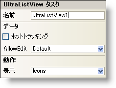

////

|metadata|
{
    "name": "winlistview-smart-tag",
    "controlName": ["WinListView"],
    "tags": ["Getting Started"],
    "guid": "{CFF83F9A-58EE-4C9C-9870-1CFF17C6C7E4}",  
    "buildFlags": [],
    "createdOn": "0001-01-01T00:00:00Z"
}
|metadata|
////

= WinListView スマート タグ

Visual Studio 2005（.NET Framework 2.0）では、それぞれの {ProductName} コントロール/コンポーネントが固有のスマート タグを備えています。 コントロール/コンポーネントを単に選択すると、Smart Tag のアンカーが表示されます。このアンカーをクリックするとポップアップ パネルが表示され、そこからコントロール/コンポーネントの最もよく使用するプロパティや設定にすばやく簡単にアクセスできます。

WinListView スマート タグには、以下のセクションと共にコントロールの名前が含まれます。

* 動作 -- フォーム上でのコントロールの動作を制御するプロパティに簡単にアクセスできます。
* データ -- コントロールの基になるデータを参照し、その操作方法を説明しています。

各セクションの項目（たとえば、フィールド、ドロップダウン リスト、チェックボックス）およびプロパティ グリッドの項目の対応するプロパティの説明については以下を参照してください。

[options="header", cols="a,a,a"]
|====
|動作|説明|対応するプロパティ

|ビュー
|WinListViewでは、「詳細」、「アイコン」、「リスト」、「タイル」、「サムネイル」の 5 種類のビューを表示できます。[詳細] ビューでは、主な項目といくつかのサブアイテムの列が追加情報として表示されます。[アイコン] ビューでは、カーソルをアイコン上に置いたときに表示される主な項目のテキストが表示されます。[リスト] ビューでは、ListBox コントロールとよく似た形式で情報のリストが表示されます。[タイル] ビューでは、アイコンの右側に主な列のテキストが表示されます。[サムネイル] ビューは、複数の画像を含むフォルダを表示するのに適しており、主な列のテキストはサムネイル画像の下に表示されます。
| link:{ApiPlatform}win.ultrawinlistview{ApiVersion}~infragistics.win.ultrawinlistview.ultralistview~view.html[View]

|====

[options="header", cols="a,a,a"]
|====
|データ|説明|対応するプロパティ

|ホットトラッキング
|このチェックボックスを選択すると、WinListView コントロール内でマウスを項目上でホバーさせるとその項目を強調表示することができます。
| link:{ApiPlatform}win.ultrawinlistview{ApiVersion}~infragistics.win.ultrawinlistview.ultralistviewitemsettings~hottracking.html[HotTracking]

|AllowEdit
|ドロップダウン リストから True を選択すると、エンド ユーザーが WinListView コントロールの内容を編集できるようになります。
| link:{ApiPlatform}win.ultrawinlistview{ApiVersion}~infragistics.win.ultrawinlistview.ultralistviewitemsettings~allowedit.html[AllowEdit]

|====