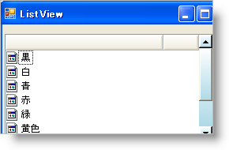

////

|metadata|
{
    "name": "winlistview-style-the-scrollbars-of-winlistview",
    "controlName": ["WinListView"],
    "tags": ["How Do I","Styling"],
    "guid": "{1D5B0E1D-2281-44F6-9CF6-DD227B3DF5DD}",  
    "buildFlags": [],
    "createdOn": "0001-01-01T00:00:00Z"
}
|metadata|
////

= WinListView のスクロールバーのスタイル

{ProductName} 2006 Volume 2 では、WinScrollBar の場合と同じように WinListView のスクロールバーをスタイルすることができます。pick:[win-forms="link:{ApiPlatform}win.ultrawinlistview{ApiVersion}~infragistics.win.ultrawinlistview.ultralistview~scrollbarlook.html[ScrollBarLook]"]  プロパティを WinScrollBar コントロールと同じ複数のオブジェクトを公開する WinExplorerBar に追加しました。pick:[win-forms="link:{ApiPlatform}win{ApiVersion}~infragistics.win.appearance.html[Appearance]"]  オブジェクトに ScrollBarLook プロパティの pick:[win-forms="link:{ApiPlatform}win{ApiVersion}~infragistics.win.ultrawinscrollbar.scrollbarlook~appearance.html[Appearance]"]  プロパティを設定することによって、スクロールバー全体をスタイルできます。あるいは、より多くのコントロールが必要であれば、pick:[win-forms="link:{ApiPlatform}win{ApiVersion}~infragistics.win.ultrawinscrollbar.scrollbarlook~buttonappearance.html[ButtonAppearance]"] 、pick:[win-forms="link:{ApiPlatform}win{ApiVersion}~infragistics.win.ultrawinscrollbar.scrollbarlook~thumbappearance.html[ThumbAppearance]"] 、および pick:[win-forms="link:{ApiPlatform}win{ApiVersion}~infragistics.win.ultrawinscrollbar.scrollbarlook~trackappearance.html[TrackAppearance]"]  などのプロパティを設定できます。

以下のコードは、Appearance オブジェクトを作成し、そのプロパティのいくつかに明るい青の垂直のグラデーションを表示するように設定し、WinListView のスクロールバーにその外観を適用します。

*Visual Basic の場合：*

----
' 外観オブジェクトを作成します。
Dim app1 As New Infragistics.Win.Appearance()
' 最初の外観オブジェクトのプロパティを設定します。
app1.BackColor = Color.White
app1.BackColor2 = Color.LightBlue
app1.BackGradientStyle = GradientStyle.Vertical
app1.ThemedElementAlpha = Alpha.Transparent
' WinListView のスクロールバーの外観を設定します。
Me.UltraListView1.ScrollBarLook.Appearance = app1
----

*C# の場合：*

----
// 外観オブジェクトを作成します。
Infragistics.Win.Appearance app1 = new Infragistics.Win.Appearance();
// 最初の外観オブジェクトのプロパティを設定します。
app1.BackColor = Color.White;
app1.BackColor2 = Color.LightBlue;
app1.BackGradientStyle = GradientStyle.Vertical;
app1.ThemedElementAlpha = Alpha.Transparent;
// WinListView のスクロールバーの外観を設定します。
this.ultraListView1.ScrollBarLook.Appearance = app1;
----