////

|metadata|
{
    "name": "winlivetileview-adding-winlivetileview-using-the-designer",
    "controlName": [],
    "tags": [],
    "guid": "8018ea38-7663-404a-8e97-e39166dcdf4f",  
    "buildFlags": [],
    "createdOn": "2013-09-15T23:21:59.3488342Z"
}
|metadata|
////

= デザイナーを使用した WinLiveTileView の追加

== トピックの概要

=== 目的

このトピックでは、デザイナー インターフェイスを使用して link:{ApiPlatform}win.ultrawinlivetileview{ApiVersion}~infragistics.win.ultrawinlivetileview.ultralivetileview_members.html[UltraLiveTileView]™ コントロールやタイルをアプリケーションで追加する方法を示します。

=== このトピックの内容

このトピックは、以下のセクションで構成されます。

* <<_Ref366271127, _WinLiveTileView_   コントロールの追加>>
** <<_Ref366271137,静的タイルの追加>>
** <<_Ref366261059,ライブ タイルの追加>>
** <<_Ref366271158,アニメーション有りのライブ タイルの追加>>

* <<_Ref366271169,関連コンテンツ>>

[[_Ref366271127]]
== _WinLiveTileView_   コントロールの追加

=== コントロールの追加

1.新しい Windows Forms プロジェクトを作成し、 link:{ApiPlatform}win.ultrawinlivetileview{ApiVersion}~infragistics.win.ultrawinlivetileview.ultralivetileview_members.html[UltraLiveTileView] コントロールをツールボックス領域からフォームまたはコンテナーにドロップします。

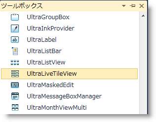

2.コントロールの`スマート タグ` (スクリーンショットのアウトラインで示す部分) を使用し、タスク ダイアログ ウィンドウをドロップダウンして  *UltraLiveTileView デザイナー* リンクをクリックします。

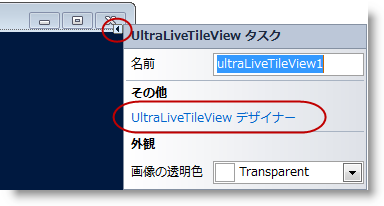

または、 link:{ApiPlatform}win.ultrawinlivetileview{ApiVersion}~infragistics.win.ultrawinlivetileview.ultralivetileview_members.html[UltraLiveTileView] コントロールで右クリックして、 *UltraLiveTileView デザイナー* リンクを選択します。

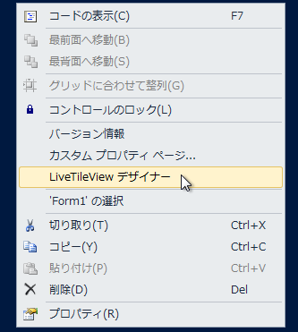

以下のように、デザイナー ウィンドウが開きます。

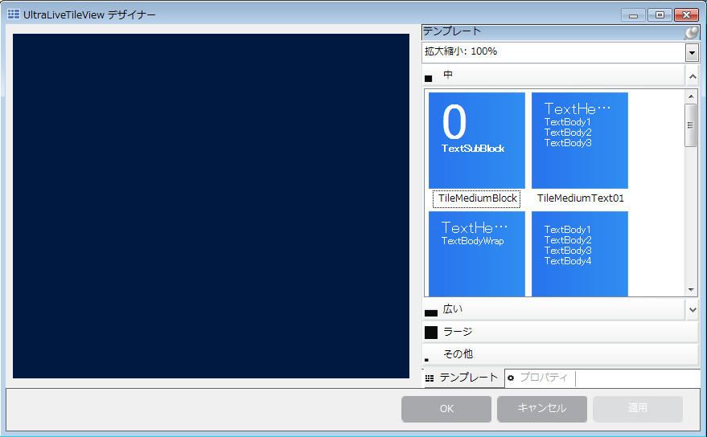

3.デザイナー要素を確認します。デザイナーのスケール ドロップダウンはグループ領域のタイルを拡大縮小し、タイルの操作中に他のタイルを見ることができるようにします。

.注:
[NOTE]
====
以下のスクリーンショットは、テンプレートのビュー (アウトラインされた部分) を示します。
====

image::images/Adding_WinLiveTileView_Using_the_Designer_5.png[]

[[_Ref366271137]]
== 静的タイルの追加

=== 静的タイルの追加

1.テンプレートの *その他* グループをクリックして、静的タイルのテンプレートを表示します。静的タイルには、中と小の 2 種類のサイズがあります。

静的テンプレートの下に表示されたライブ タイルは、1 か所で簡単にプレビューするために中も小も同じ小さなサイズになります。

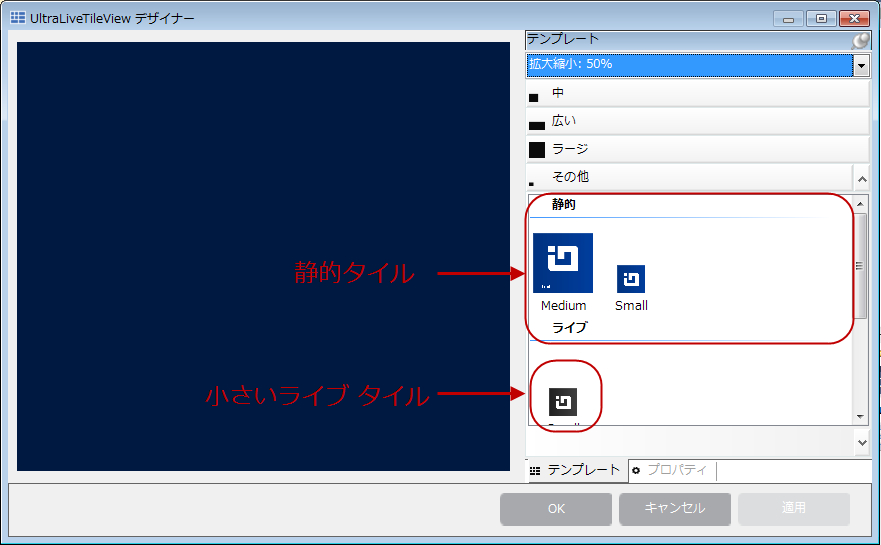

2.中サイズのタイルをプレビュー領域からコントロールにドラッグします。

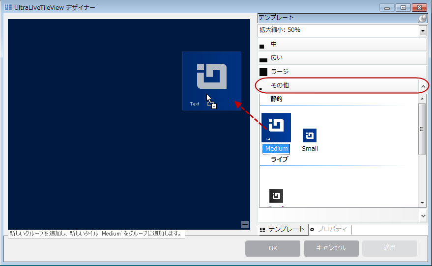

3.タイルをドラッグした後の結果です。

グループを自動生成する一意のキーを作成します。デフォルトでは、グループ名は変更可能でテキストで指定できます。タイルのテンプレート上の画像は、タイルをプレビュー領域からコントロールにドラッグすると消去されます。これらの画像は、単なるプレビュー用です。

image::images/Adding_WinLiveTileView_Using_the_Designer_8.png[]

4.タイルにテキストや画像ソースからの画像を追加して、タイルを設定します。画像を追加するには、画像のプロパティで楕円形のドロップダウン ボタン (`…`) を使用します。

link:{ApiPlatform}win.ultrawinlivetileview{ApiVersion}~infragistics.win.ultrawinlivetileview.multiresolutionpropertyset`1~scale80percent.html[Scale80Percent] と同様に、 link:{ApiPlatform}win.ultrawinlivetileview{ApiVersion}~infragistics.win.ultrawinlivetileview.multiresolutionpropertyset`1~scale100percent.html[Scale100Percent]、 link:{ApiPlatform}win.ultrawinlivetileview{ApiVersion}~infragistics.win.ultrawinlivetileview.multiresolutionpropertyset`1~scale140percent.html[Scale140Percent] と link:{ApiPlatform}win.ultrawinlivetileview{ApiVersion}~infragistics.win.ultrawinlivetileview.multiresolutionpropertyset`1~scale180percent.html[Scale180Percent] を設定し、タイル画像がどのスケール ビューでも正しく表示されるようにします。サイズの詳細については、 link:winlivetileview-winlivetileview-control.html[WinLiveTileView Control] トピックを参照してください。

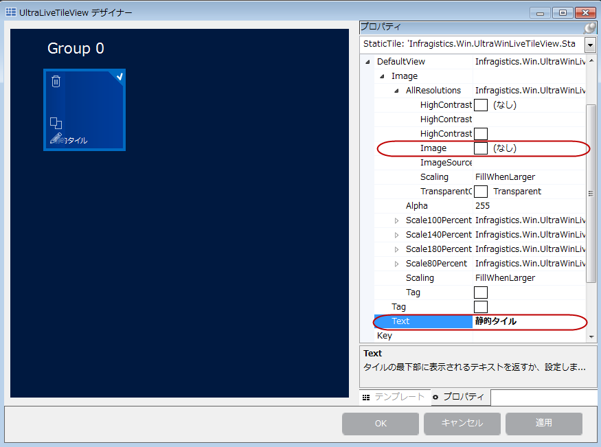

5.設定後のデザイナー画像です。結果を検証するアプリケーションを実行します (オプション)。

image::images/Adding_WinLiveTileView_Using_the_Designer_10.png[]

[[_Ref366261059]]
== ライブ タイルの追加

=== ライブ タイルの追加

1.タイルのテンプレートをクリックし、タイルをコントロールの左側にドラッグします。

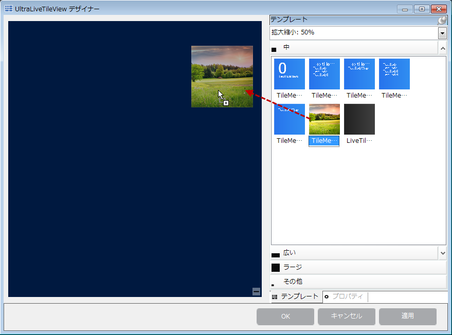

以下のスクリーンショットは、プレビュー領域からコントロールにドラッグしたタイルの結果を示します。

.注:
[NOTE]
====
タイル グループにドラッグしたタイルのテンプレートは、プレビュー領域に表示された画像を移行しません。画像は、単なるプレビュー用です。
====

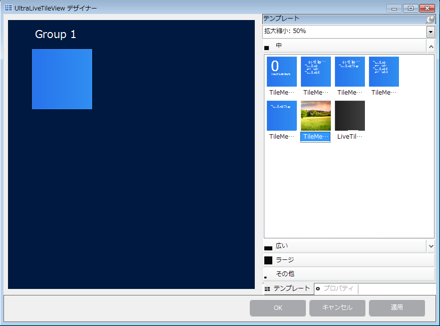

2.すばやく簡単に設定できるように、タイルには 3 つのボタン (`削除`、`複製`および`編集`) があります。タイルをクリックすると、左側にボタンが表示されます。タイルが選択されていない場合は、ボタンも表示されません。

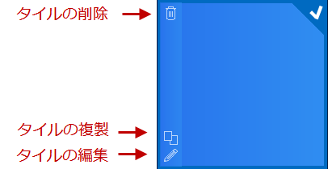

また、タイルを`右クリック`すると、設定のオプションを選択できます。

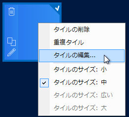

3.[ *タイルの編集…* ] オプションを選択する、または [ *編集* ] ボタンをクリックして、タイルの設定ダイアログ ウィンドウを開きます。

このウィンドウには、左側に選択したライブ タイルの異なるタイプのフレームおよび 2 つの画像プロパティ (小サイズと縮小) が表示されます。このプロパティのレイアウトにより、テンプレートをドラッグするだけで、フレームのコンテンツとしてコレクションに簡単に追加して設定できます。

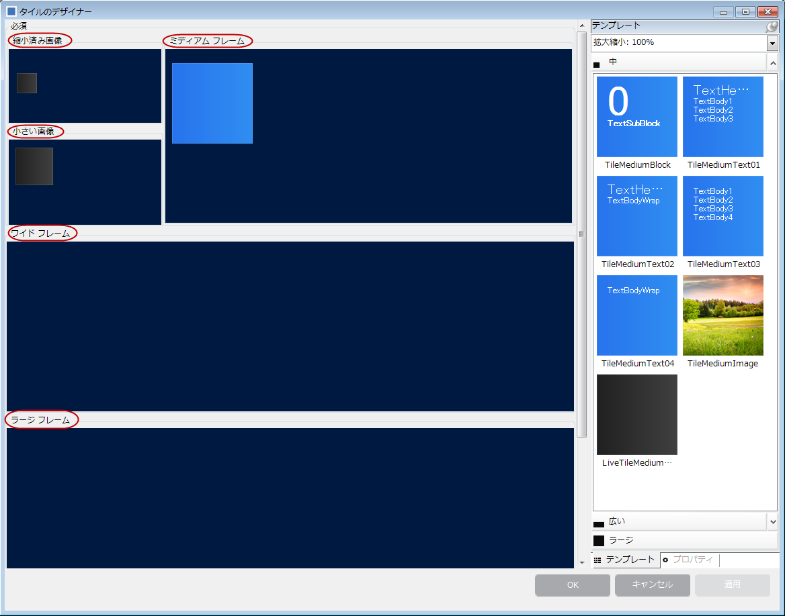

*ミディアム フレーム* のレイアウトでタイルをクリックして、次に右側の [ *プロパティ* ] タブをクリックします。タブには、対象のオブジェクトのプロパティのみが表示されます。この表示が非常に便利なのは、すべてのコントロールのプロパティを検索してミディアム フレーム オブジェクトを探す必要がなく、プロパティ グリッドは対象のオブジェクトのみを表示する点です。

各タイルは、異なる画像解像度に対応するプロパティのセットで構成され、右側のプロパティ グリッドで確認できます。

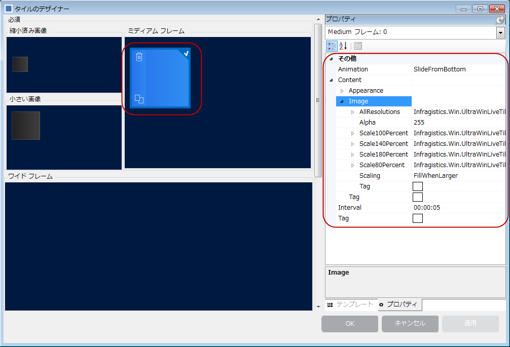

4. link:{ApiPlatform}win.ultrawinlivetileview{ApiVersion}~infragistics.win.ultrawinlivetileview.multiresolutiontileimageset~allresolutions.html[AllResolutions] プロパティを開き、画像プロパティをクリックします。画像ソースから画像を添付するための楕円形のボタン (`…`) が使用可能になります。

link:{ApiPlatform}win.ultrawinlivetileview{ApiVersion}~infragistics.win.ultrawinlivetileview.multiresolutionpropertyset`1~scale80percent.html[Scale80Percent] と同様に、 link:{ApiPlatform}win.ultrawinlivetileview{ApiVersion}~infragistics.win.ultrawinlivetileview.multiresolutionpropertyset`1~scale100percent.html[Scale100Percent]、 link:{ApiPlatform}win.ultrawinlivetileview{ApiVersion}~infragistics.win.ultrawinlivetileview.multiresolutionpropertyset`1~scale140percent.html[Scale140Percent] と link:{ApiPlatform}win.ultrawinlivetileview{ApiVersion}~infragistics.win.ultrawinlivetileview.multiresolutionpropertyset`1~scale180percent.html[Scale180Percent] を設定し、タイル画像がどのスケール ビューでも正しく表示されるようにします。

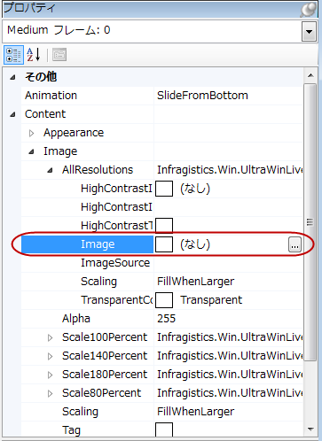

前述の手順をワイド フレームやラージ フレームでも繰り返し、画像を小サイズのビューや縮小ビューに対して追加します。

image::images/Adding_WinLiveTileView_Using_the_Designer_18.png[]

5.デザイナー ウィンドウで [ *適用* ] ボタンをクリックし、タイルの設定を保存します。次に  *OK*  をクリックして、デザイナー ウィンドウを閉じます。結果を検証するアプリケーションを実行して、小、ワイド、ラージ、および縮小ビューのサイズ変更を確認します (オプション)。

image::images/Adding_WinLiveTileView_Using_the_Designer_19.png[]

[[_Ref366271158]]
== アニメーション有りのライブ タイルの追加

=== アニメーション有りのライブ タイルの追加

アニメーション有りのライブ タイルを追加する手順は、<<_Ref366261059,ライブ タイルの追加>>の手順と同じです。コレクションにフレームを追加する手順が唯一異なります。

<<_Ref366261059,ライブ タイルの追加>>から を繰り返し、アニメーションを表示するフレームを *ミディアム フレーム* のコレクションに追加します。デフォルトで、アニメーションはライブ タイルに複数のフレームがある場合に実行されます。

以下のスクリーンショットを確認してください。それぞれ異なるコンテンツを持つ 2 つのフレームが表示されています。2 番目のフレームを追加し、すぐに保存 ( *OK*  をクリック) してください。デザイナー ウィンドウにアニメーションが表示されます。アニメーションは即座に適用されます。

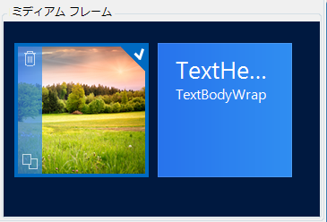

以下のスクリーンショットに示すように、プロパティを使用してフレームを追加する方法もあります。

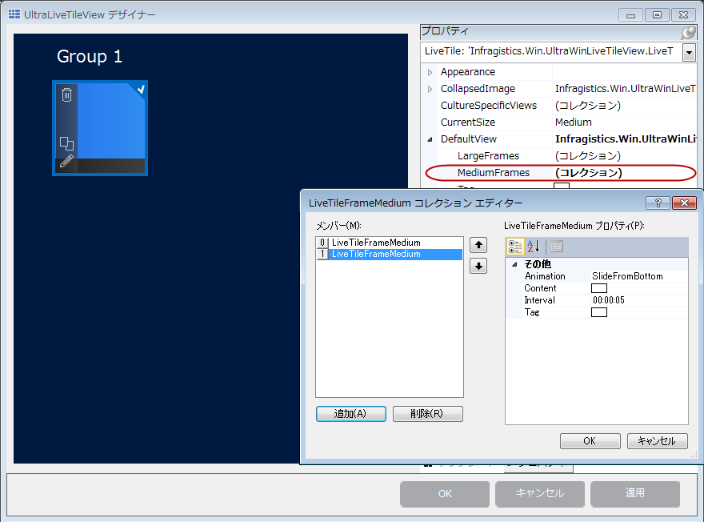

アニメーション機能の主なプロパティは、下の矢印で示す link:{ApiPlatform}win.ultrawinlivetileview{ApiVersion}~infragistics.win.ultrawinlivetileview.livetileframe`1~animation.html[アニメーション]と link:{ApiPlatform}win.ultrawinlivetileview{ApiVersion}~infragistics.win.ultrawinlivetileview.livetileframe`1~interval.html[サイクル間隔]です。デフォルトでは、サイクル間隔は 5 秒で、以下のアニメーションのオプションが選択できます。

* link:{ApiPlatform}win.ultrawinlivetileview{ApiVersion}~infragistics.win.ultrawinlivetileview.tileframeanimation.html[SlideFromTop]

* link:{ApiPlatform}win.ultrawinlivetileview{ApiVersion}~infragistics.win.ultrawinlivetileview.tileframeanimation.html[SlideFromLeft]

* link:{ApiPlatform}win.ultrawinlivetileview{ApiVersion}~infragistics.win.ultrawinlivetileview.tileframeanimation.html[SlideFromRight]

* link:{ApiPlatform}win.ultrawinlivetileview{ApiVersion}~infragistics.win.ultrawinlivetileview.tileframeanimation.html[SlideFromBottom] (デフォルト)

* link:{ApiPlatform}win.ultrawinlivetileview{ApiVersion}~infragistics.win.ultrawinlivetileview.tileframeanimation.html[Fade]

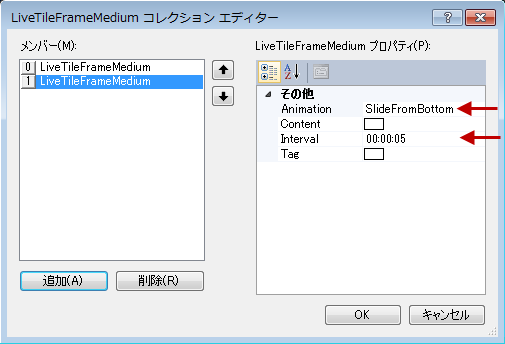

[[_Ref366271169]]
== 関連コンテンツ

=== トピック

このトピックの追加情報については、以下のトピックも合わせてご参照ください。

[options="header", cols="a,a"]
|====
|トピック|目的

| link:winlivetileview-adding-winlivetileview-in-code-behind.html[コード ビハインドでの WinLiveTileView の追加]
|このトピックでは、 _UltraLiveTileView_ コントロールやタイルをコード ビハインドで追加する方法を示します。

| link:winlivetileview.html[WinLiveTileView]
|このグループのトピックでは、最新の _UltraLivetileView_ コントロールについて、使用および設定する手順を含めて紹介します。このコントロールは、Microsoft Windows 8 オペレーティング システムのスタート画面のタイルと類似しています。

|====