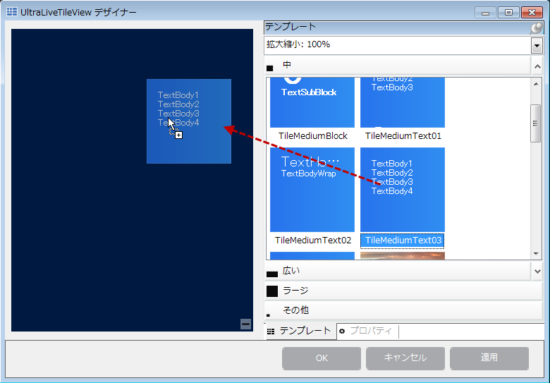
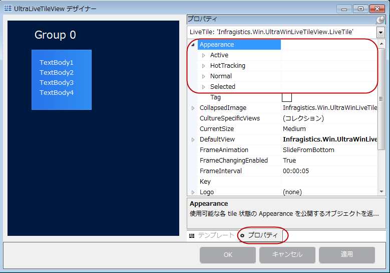
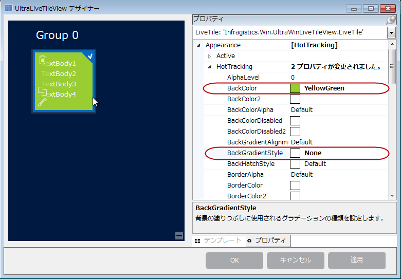
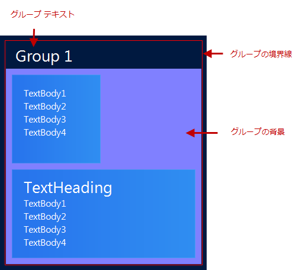
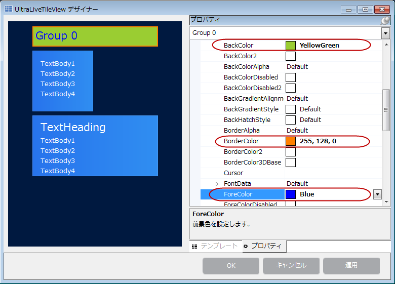
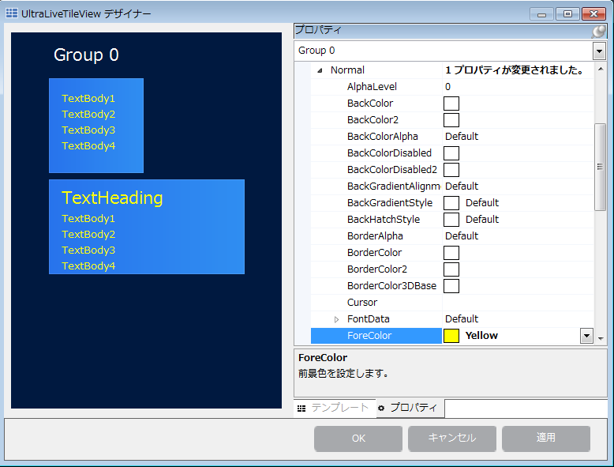

////

|metadata|
{
    "name": "winlivetileview-styling-winlivetileview",
    "controlName": [],
    "tags": [],
    "guid": "89c86f37-6b79-4117-b168-e74418ddc9a2",  
    "buildFlags": [],
    "createdOn": "2013-09-15T23:24:56.264524Z"
}
|metadata|
////

= WinLiveTileView のスタイル設定

== トピックの概要

=== 目的

このトピックでは、デザイナーを使用してコード ビハインドや  _AppStylist_   で、 _WinLiveTileView_™ コントロールのスタイルを設定する方法を示します。

[[_Ref366515165]]

=== 前提条件

このトピックを理解するためには、以下のトピックを理解しておく必要があります。

[options="header", cols="a,a"]
|====
|トピック|目的

| link:winlivetileview-adding-winlivetileview-using-the-designer.html[デザイナーを使用した WinLiveTileView の追加]
|このトピックでは、デザイナー インターフェイスを使用して link:{ApiPlatform}win.ultrawinlivetileview{ApiVersion}~infragistics.win.ultrawinlivetileview.ultralivetileview_members.html[UltraLiveTileView] コントロールやタイルを追加する方法を示します。

|====

=== このトピックの内容

このトピックは、以下のセクションで構成されます。

* <<_Ref366530222,概要>>
* <<_Ref366530234, _WinLiveTileView_   のスタイル設定>>
** <<_Ref366530253,タイルのスタイル設定>>
** <<_Ref366530260,コード例>>

* <<_Ref366530268,グループのスタイル設定>>
** <<_Ref366530288,グループの外観>>
** <<_Ref366530299,グループのテキスト外観>>
** <<_Ref366530350,グループのタイル外観>>

** <<_Ref366530365, _AppStylist_   を使用した  _WinLiveTileView_   のスタイル設定>>

* <<_Ref366530400,関連コンテンツ>>

[[_Ref366530222]]
== 概要

=== 概要

_WinLiveTileView_   コントロールは、タイルおよびその他の視覚要素の外観をスタイル設定する方法を提供します。

_WinLiveTileView_   は  _AppStylist_   もサポートしているため、必要なスタイルで各要素のスタイル設定ライブラリ ファイルを作成し、 _WinLiveTileView_   コントロールのテーマ ファイルとして保存できます。

[[_Ref366530234]]
== _WinLiveTileView_   のスタイル設定

[[_Ref366530253]]

=== タイルのスタイル設定

_WinLiveTileView_   デザイナーを使用する前に、<<_Ref366515165,前提条件>> セクションを参照してください。タイルを作成するためにデザイナーを使用する方法は前提条件です。

_WinLiveTileView_   のデザイナーを開き、コントロール レイアウトにミディアム タイルを追加します。

タイルを選択し、 *プロパティ*  タブをクリックし、プロパティ グリッドの Appearance プロパティを展開します。

各タイルは 4 つの `Appearance` プロパティを公開します。

[options="header", cols="a,a"]
|====
|プロパティ|説明

|`Active`
|タイルがキーボード ナビゲーションによりタイルがアクティブな場合。 *Ctrl* キーを押し、矢印キーを使用します。

|`HotTracking`
|マウス ポインターをタイルの上に移動する場合。

|`Normal`
|タイルのユーザー操作なしの通常状態。

|`Selected`
|タイルの右上コーナーにチェックマークがある選択状態の場合。

|====

以下の画像は、HotTracking の外観設定を表示します。

.注:
[NOTE]
====
実線色を使用する場合、`BackGradientStyle` を無効にし、`BackColor` のみを設定するか、`BackGradientStyle` に両方の必要があるため、`BackColor` および `BackColor2` の両方を設定します。
====

[[_Ref366530260]]

=== コード例

以下のコード例は、コード ビハインドでグループおよびタイルへの参照を取得し、タイルの背景色をスタイルする方法を紹介します。

*C# の場合:*

[source,csharp]
----
LiveTile liveTile = (LiveTile)ultraLiveTileView1.Groups[“Group 1”].Tiles[“mediumTile1”];
liveTile.Appearance.HotTracking.BackColor = Color.YellowGreen;
liveTile.Appearance.HotTracking.BackGradientStyle = GradientStyle.None;
----

*Visual Basic の場合:*

[source,vb]
----
Dim liveTile As LiveTile = DirectCast(ultraLiveTileView1.Groups(“Group 1”).Tiles(“mediumTile1”), LiveTile)
liveTile.Appearance.HotTracking.BackColor = Color.YellowGreen
liveTile.Appearance.HotTracking.BackGradientStyle = GradientStyle.None
----

[[_Ref366530268]]
== グループのスタイル設定

[[_Ref366530288]]

=== グループの外観

_WinLiveTileView_   グループは、タイル コレクションのプロパティを公開し、グループ内のすべてのタイルのスタイルを設定する機能も提供します。

=== コード例

以下のコード例は、コード ビハインドで指定したキーのグループへの参照を取得し、グループの外観 (`Border` および `BackColor`) をスタイルする方法を紹介します。

*C# の場合:*

[source,csharp]
----
TileGroup tileGroup = (TileGroup) ultraLiveTileView1.Groups["Group 1"];
tileGroup.Appearance.Normal.BorderColor = Color.Red;
tileGroup.Appearance.Normal.BackGradientStyle = GradientStyle.None;
tileGroup.Appearance.Normal.BackColor = Color.FromArgb(128, 128, 255);
----

*Visual Basic の場合:*

[source,vb]
----
Dim tileGroup As TileGroup = DirectCast(ultraLiveTileView1.Groups("Group 1"), TileGroup)
tileGroup.Appearance.Normal.BorderColor = Color.Red
tileGroup.Appearance.Normal.BackGradientStyle = GradientStyle.None
tileGroup.Appearance.Normal.BackColor = Color.FromArgb(128, 128, 255)
----

[[_Ref366530299]]

=== グループのテキスト外観

以下のコード例は、コード ビハインドで指定したキーのグループへの参照を取得し、グループのテキスト外観 (`Border` および `BackColor`) をスタイルする方法を紹介します。

=== コード例

以下のコード例は、コード ビハインドで指定したキーのグループへの参照を取得し、グループのテキスト外観 (`Border`、`ForeColor`、および `BackColor`) をスタイルする方法を紹介します。

*C# の場合:*

[source,csharp]
----
TileGroup tileGroup = ultraLiveTileView1.Groups["Group 1"];
tileGroup.TextAreaAppearance.Normal.BackColor = Color.YellowGreen;
tileGroup.TextAreaAppearance.Normal.BorderColor = Color.Orange;
tileGroup.TextAreaAppearance.Normal.ForeColor = Color.Blue;
----

*Visual Basic の場合:*

[source,vb]
----
Dim tileGroup As TileGroup = ultraLiveTileView1.Groups("Group 1")
tileGroup.TextAreaAppearance.Normal.BackColor = Color.YellowGreen
tileGroup.TextAreaAppearance.Normal.BorderColor = Color.Orange
tileGroup.TextAreaAppearance.Normal.ForeColor = Color.Blue
----

[[_Ref366530350]]

=== グループのタイル外観

グループはタイルのコレクションを含みます。グループのタイル外観プロパティの設定を変更すると、グループのすべてのタイルに影響します。

=== コード例

以下のコード例は、コード ビハインドで指定したキーのグループへの参照を取得し、グループのタイル外観 (`ForeColor`) をスタイルする方法を紹介します。この設定はグループ内のすべてのタイルに適用されます。

*C# の場合:*

[source,csharp]
----
TileGroup tileGroup = ultraLiveTileView1.Groups["Group 1"];
tileGroup.TileAppearance.Normal.ForeColor = Color.Yellow;
----

*Visual Basic の場合:*

[source,vb]
----
Dim tileGroup As TileGroup = ultraLiveTileView1.Groups("Group 1")
tileGroup.TileAppearance.Normal.ForeColor = Color.Yellow
----

[[_Ref366530365]]
== _AppStylist_   を使用した  _WinLiveTileView_   のスタイル設定

=== AppStylist を使用した WinLiveTileView のスタイル設定

_WinLiveTileView_   コンポーネントは、さまざまなスタイル オプションを提供する _AppStylist_   をサポートしています。スタイル設定オプションでは、例えば定義済のスタイル設定ライブラリ ファイルの 1 つを使用することも、異なる外観のために既存のテンプレートをカスタマイズすることも、さらに _AppStylist_   を使用して独自のライブラリ ファイルを作成することも可能です。

詳細は、 _AppStylist_   を使用した `LiveTileView` またはその他の  _{ProductName}_   コントロール全般のスタイル ライブラリ ファイルの作成方法を説明する、 link:styling-guide-setting-up-your-application-for-styling.html[スタイリングのためのアプリケーション設定]のトピックを参照してください。

[[_Ref366530400]]
== 関連コンテンツ

=== トピック

このトピックの追加情報については、以下のトピックも合わせてご参照ください。

[options="header", cols="a,a"]
|====
|トピック|目的

| link:winlivetileview.html[WinLiveTileView]
|このグループのトピックでは、最新の _WinLiveTileView_ コントロールについて、使用および設定する手順を含めて紹介します。このコントロールは、Microsoft Windows 8 オペレーティング システムのスタート画面のタイルと類似しています。

|====