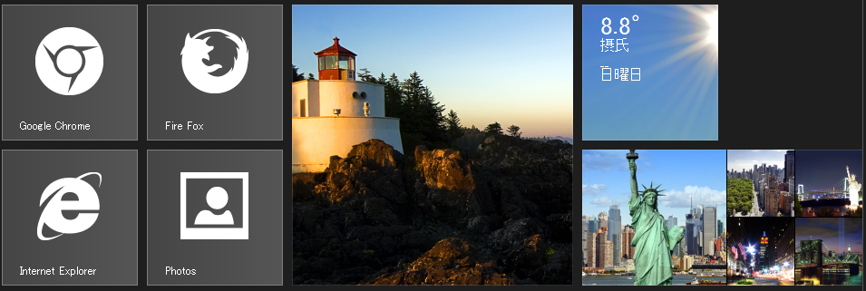
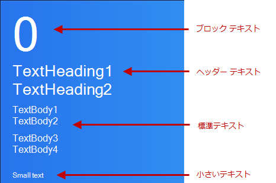

////

|metadata|
{
    "name": "winlivetileview-winlivetileview-control",
    "controlName": [],
    "tags": [],
    "guid": "89d6bdcd-9ab2-4fdf-be27-5257b84e68ea",  
    "buildFlags": [],
    "createdOn": "2013-09-15T23:48:01.9921205Z"
}
|metadata|
////

= WinLiveTileView コントロール

== トピックの概要

=== 目的

このトピックは、新しい link:{ApiPlatform}win.ultrawinlivetileview{ApiVersion}~infragistics.win.ultrawinlivetileview.ultralivetileview_members.html[UltraLiveTileView]™ コントロールでタッチ操作が完全にサポートされた静的およびライブ タイルの概要について、その動作も含めて紹介します。

=== 前提条件

このトピックをより理解するために、以下のトピックを参照することをお勧めします。

[options="header", cols="a,a"]
|====
|トピック|目的

| link:http://msdn.microsoft.com/ja-jp/library/windows/apps/hh779724.aspx[タイルおよびタイル通知の概要] (MSDN)
|このトピックは、アプリケーションの表示や起動を行うスタート画面のアプリケーション タイルについての概念と用語を説明します。

| link:http://msdn.microsoft.com/ja-jp/library/windows/apps/hh761491.aspx#live_tiles[タイル テンプレートのカタログ] (MSDN)
|このトピックは、各XML コンテンツの画像の例を使用して、タイル通知で使用できるタイル テンプレートのリストを示します。

|====

=== このトピックの内容

このトピックは、以下のセクションで構成されます。

* はじめに
* <<_Ref366493137, _WinLiveTileView_   要素>>
** <<_Ref366218516,タイル グループ>>
** <<_Ref366218533,グループ名>>
** <<_Ref366218541,アプリケーション バー>>
** <<_Ref366218550,縮小ボタン>>

* <<_Ref366218563,タイル テンプレート>>
** <<_Ref366218575,タイル サイズ>>
** <<_Ref366218587,タイル スケール>>
** <<_Ref366218597,タイル テキスト サイズ>>
** <<_Ref366218605,タイル ロゴ>>
** <<_Ref366493194,タイル バッジ>>
** <<_Ref366218627,バッジ通知を送信するコード例>>

* <<_Ref366218635,関連コンテンツ>>

== はじめに

=== WinLiveTileView の概要

_WinLiveTileView_   コントロールは、パン、ズーム、長押しなどのタッチ ジェスチャを完全にサポートする、Microsoft Windows 8 のスタート画面の _ルック アンド フィール_  をエミュレートします。

Windows 8 は特に、幅広いピクセル密度を使用してアプリケーションを視覚的で魅力的に表示させることに、重点を置いています。さらに _WinLiveTileView_   は、開発者のベスト プラクティスを向上させ、開発を容易にするメカニズムを提供します。

通常 1 平方インチまたはワイド タイルで1インチ×2インチの領域にコンテンツを表示させる、各種テキストと画像の組み合わせを含む、50 以上のタイル テンプレートがあります。タイル テンプレートは同じように見えながら、決して同じではありません。

次のスクリーンショットは、 _WinLiveTileView_   コントロールを使用した例を示しています。

[[_Ref366218505]]
[[_Ref366493137]]
== _WinLiveTileView_   要素

[[_Ref366218516]]

=== タイル グループ

タイル グループの場合、1 つのグループから他のグループに複数のタイルをドラッグ アンド ドロップできます。グループにタイルが 1 つも含まれていない空のグループは非表示となり、グループ名や外観も表示されません。タイル

image::images/WinLiveTileView_Control_2.png[]

[[_Ref366218533]]

=== グループ名

グループはタイルのコンテナーです。`Text` プロパティで設定されたグループ名が表示されます。カスタム モードの場合、グループ名を変更できます。

たとえば、グループ名またはコントロール レイアウトを右クリックすると、グループ名要素がカスタマイズできる [ *カスタマイズ* ] ボタンが表示されます。タイルをチェック マーク (右クリック) で選択する方法でも、[ *カスタマイズ* ] ボタンを表示することができます。

image::images/WinLiveTileView_Control_3.png[]

[[_Ref366218541]]

=== アプリケーション バー

1 つ以上のタイルを選択すると、コントロールの下部からアプリケーション バーがスライドアウトします。

.注:
[NOTE]
====
チェック マーク (右クリック) で選択したタイルを、コントロールの link:{ApiPlatform}win.ultrawinlivetileview{ApiVersion}~infragistics.win.ultrawinlivetileview.ultralivetileview~selectedtiles.html[SelectedTiles] コレクションに追加します。
====

アプリケーション バーには、ユーザー操作に応じてアイコンが表示されます。例:

1.静的タイルをチェック マーク (右クリック) で選択すると、 *サイズ変更* アイコンが表示され選択したタイルのサイズを変更できます。

2.複数のタイルをチェック マーク (右クリック) で選択すると、 *選択のクリア* アイコンも表示され、タイルの選択をすべてクリアできます。

3.ライブ タイルをチェック マーク (右クリック) で選択すると、 *ライブ タイルをオンにする* アイコンが表示され、選択したライブ タイルのアニメーションのオンとオフを切り替えることができます。

4.デフォルトでは、[ *カスタマイズ* ] ボタンはすべての選択をクリアし、アプリケーション バーを非表示にします。グループ名のカスタマイズするためにグループ名要素を右クリックした場合も、このボタンが表示されます。

.注:
[NOTE]
====
[ *カスタマイズ* ] ボタンは、すべてのボタンを削除または置換することができます。
====

image::images/WinLiveTileView_Control_4.png[]

[[_Ref366218550]]

=== 縮小ボタン

縮小ボタンは、タイルを含むすべてのグループの全体を縮小/展開します。複数のグループの一部が表示されていない場合に、全体を展開しスクロールして検索するよりも、ビューを縮小してから対象のグループをクリックして展開すると、簡単に検索することができます。

image::images/WinLiveTileView_Control_5.png[]

縮小されたビュー

image::images/WinLiveTileView_Control_6.png[]

[[_Ref366218563]]
== タイル テンプレート

[[_Ref366218575]]

=== タイル サイズ

タイルには、`小`、`中`、`ワイド`および`大`のサイズと幅広いテンプレートがあります。タイルの実際のピクセルは、タイルを表示する画面の解像度やサイズにより異なります。

[options="header", cols="a,a,a"]
|====
|タイル|スクリーンショット|ピクセル単位のサイズ

|小
|image::images/WinLiveTileView_Control_7.png[]
|70 × 70

|中
|image::images/WinLiveTileView_Control_8.png[]
|150 × 150

|ワイド
|image::images/WinLiveTileView_Control_9.png[]
|310 × 150

|大
|image::images/WinLiveTileView_Control_10.png[]
|310 × 310

|====

[[_Ref366218587]]

=== タイル スケール

Windows 8 では、以下の 4 種類からより近いスケールを使用して画面の解像度決定します。低解像度の場合は 120 X 120 または 248 X 120、高解像度の場合は 270 X 270 または 558 X 270 を選択し、画質に影響を及ぼすことなく、どのタイルも同じように表示します。

[options="header", cols="a,a,a,a,a,a,a"]
|====
|画面の解像度|スケール|小|中|ワイド|大|スペース

|低解像度 (1366 以下)
|80%
|56 × 56
|120 × 120
|248 × 120
|248 × 248
|8 ピクセル

|標準 (1366 × 768)
|100%
|70 × 70
|150 × 150
|310 × 150
|310 × 310
|10 ピクセル

|高解像度 (1920 × 1080)
|140%
|98 × 98
|210 × 210
|434 × 210
|434 × 434
|14 ピクセル

|Quad XGA (2048 × 1536)
|180%
|126 × 126
|270 × 270
|558 × 270
|558 × 558
|18 ピクセル

|====

_WinLiveTileView_   は、前述の 4 種類の解像度を識別する列挙体をキーとして画像プロパティを公開する類似のメカニズムを提供します。コントロールは、画面の解像度を識別して解像度に応じた画像を使用するように設計されています。代わりに、開発者は特別な画像を指定しない解像度の画面用にスケールされた、解像度に依存しない画像を設定することができます。

[options="header", cols="a,a,a"]
|====
|スケール|ミディアム タイル|プロパティ

|80%
|image::images/WinLiveTileView_Control_11.png[]
| link:{ApiPlatform}win.ultrawinlivetileview{ApiVersion}~infragistics.win.ultrawinlivetileview.multiresolutionpropertyset`1~scale80percent.html[Scale80Percent]

|100%
|image::images/WinLiveTileView_Control_12.png[]
| link:{ApiPlatform}win.ultrawinlivetileview{ApiVersion}~infragistics.win.ultrawinlivetileview.multiresolutionpropertyset`1~scale100percent.html[Scale100Percent]

|140%
|image::images/WinLiveTileView_Control_13.png[]
| link:{ApiPlatform}win.ultrawinlivetileview{ApiVersion}~infragistics.win.ultrawinlivetileview.multiresolutionpropertyset`1~scale140percent.html[Scale140Percent]

|180%
|image::images/WinLiveTileView_Control_14.png[]
| link:{ApiPlatform}win.ultrawinlivetileview{ApiVersion}~infragistics.win.ultrawinlivetileview.multiresolutionpropertyset`1~scale180percent.html[Scale180Percent]

|====

.注:
[NOTE]
====
ハイコントラストのカラー スキームのプロパティが公開されている link:{ApiPlatform}win.ultrawinlivetileview{ApiVersion}~infragistics.win.ultrawinlivetileview.ultralivetileview_members.html[UltraLiveTileView] では、ハイコントラスト モードを実行する際に異なる画像を設定することができます。コントロールは画面の解像度からスケールを決定するのと同様に、ハイコントラスト モードが実行されているかどうかに応じて、適切な画像セットを使用します。
====

[[_Ref366218597]]

=== タイル テキスト サイズ

タイルは、サイズの降順に`ブロック`、`見出し`、`標準`、`小`の 4 種類のテキスト サイズをサポートしています。

.注:
[NOTE]
====
デフォルトでは、小のテキストはタイルに表示されません。ライブ タイルでは、タイルに小のテキストを設定できる「ロゴ」と呼ばれるプロパティが公開されています。
====

[[_Ref366218605]]

=== タイル ロゴ

ライブ タイルでは、たとえば短い名前やタイルの左下隅に表示される小さいアイコンに使用する、「ロゴ」と呼ばれるプロパティが公開されています。

image::images/WinLiveTileView_Control_16.png[]

image::images/WinLiveTileView_Control_17.png[]

`_tile.Logo.ShortName` `= "IG";`

`_tile.Logo.Image.Image` `= // your image`

[[_Ref366493194]]

=== タイル バッジ

「バッジ」は、タイルの右下隅に表示される小さな情報アイコンで、アラームや警告など注意を促すために使用されます。

以下のコード例は、バッジ通知を新しいメッセ―ジのアイコンと同時に既存のタイルに送信し、5 秒間表示します。

*C# の場合:*

[source,csharp]
----
_tile.SendBadgeNotification(TileBadgeGlyph.NewMessage, TimeSpan.FromSeconds(5));
----

*Visual Basic の場合:*

[source,vb]
----
_tile.SendBadgeNotification(TileBadgeGlyph.NewMessage, TimeSpan.FromSeconds(5))
----

image::images/WinLiveTileView_Control_18.png[]

[[_Ref366218627]]

=== バッジ通知を送信するコード例

バッジ送信通知の実装に使用する完全なコード例

*C# の場合:*

[source,csharp]
----
private TileGroup _tileGroup;
// グループを追加
private void Form1Load(object sender, EventArgs e)
{
    _tileGroup = ultraLiveTileView1.Groups.Add("Group1");
    AddlLiveTile();
}
// バッジ通知を送信
private void UltraButton1Click(object sender, EventArgs e)
{
    var tile = (LiveTile)_tileGroup.Tiles["W1"];
    if (tile == null)
        return;
    _tile.SendBadgeNotification(TileBadgeGlyph.NewMessage, TimeSpan.FromSeconds(5));
}
// ライブ タイルの追加
public void AddlLiveTile()
{
    _tile = _tileGroup.Tiles.AddLiveTile("W1");
    _tile.CurrentSize = TileSize.Wide;
    _tileView = _tile.DefaultView;
    LiveTileFrameWide frame = _tileView.WideFrames.Add();
    var content = new TileWideImage();
    content.Image.AllResolutions.Image = // 画像のパス
    frame.Content = content;
}
----

*Visual Basic の場合:*

[source,vb]
----
Private _tileGroup As TileGroup
' グループを追加
Private Sub Form1Load(sender As Object, e As EventArgs)
      _tileGroup = ultraLiveTileView1.Groups.Add("Group1")
      AddlLiveTile()
End Sub
' バッジ通知を送信
Private Sub UltraButton1Click(sender As Object, e As EventArgs)
      Dim tile = DirectCast(_tileGroup.Tiles("W1"), LiveTile)
      If tile Is Nothing Then
            Return
      End If
      _tile.SendBadgeNotification(TileBadgeGlyph.NewMessage, TimeSpan.FromSeconds(5))
End Sub
' ライブ タイルの追加
Public Sub AddlLiveTile()
      _tile = _tileGroup.Tiles.AddLiveTile(“W1”)
      _tile.CurrentSize = TileSize.Wide
      _tileView = _tile.DefaultView
      Dim frame As LiveTileFrameWide = _tileView.WideFrames.Add()
      Dim content = New TileWideImage()
      content.Image.AllResolutions.Image = ‘ your image path
      frame.Content = content
End Sub
----

[[_Ref366218635]]
== 関連コンテンツ

=== トピック

このトピックの追加情報については、以下のトピックも合わせてご参照ください。

[options="header", cols="a,a"]
|====
|トピック|目的

| link:winlivetileview-using-winlivetileview.html[WinLiveTileView の使用]
|このグループのトピックでは、最新の _UltraLiveTileView_ コントロールについて、デザイナーやコード ビハインドを使用して各タイルを作成および設定する方法の手順を含めて紹介します。

| link:winlivetileview-styling-winlivetileview.html[WinLiveTileView のスタイル設定]
|このトピックでは、デザイナーを使用してコード ビハインドや _AppStylist_ で、 _UltraLiveTileView_ コントロールのスタイルを設定する方法を示します。

| link:winlivetileview-winlivetileview-localization.html[WinLiveTileView のローカライズ]
|このトピックでは、 _UltraLiveTileView_ のローカライズの設定方法を示します。

|====