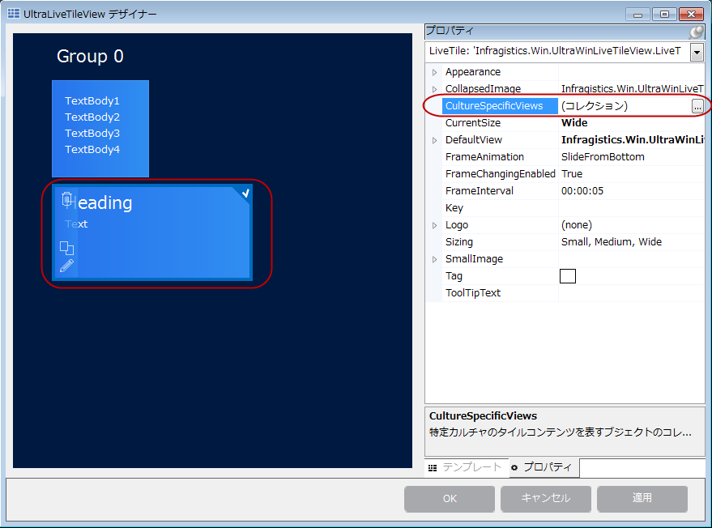
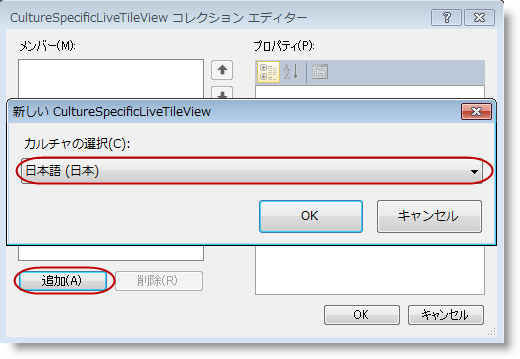
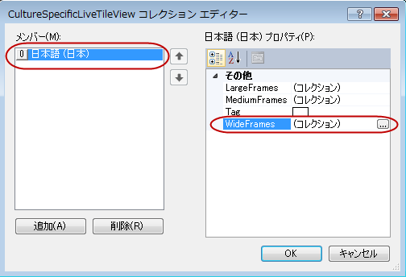
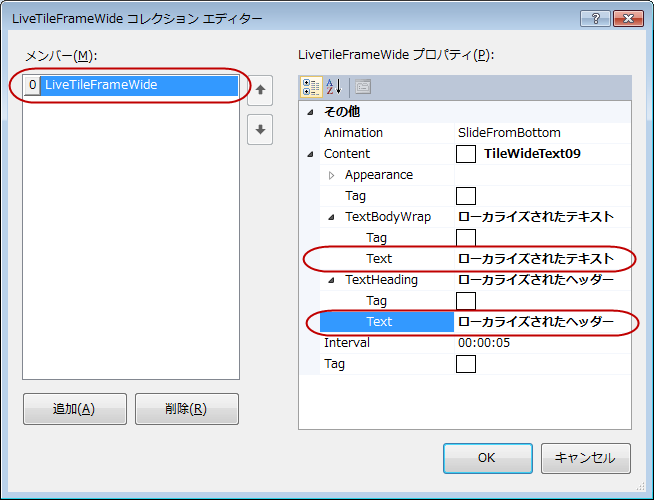
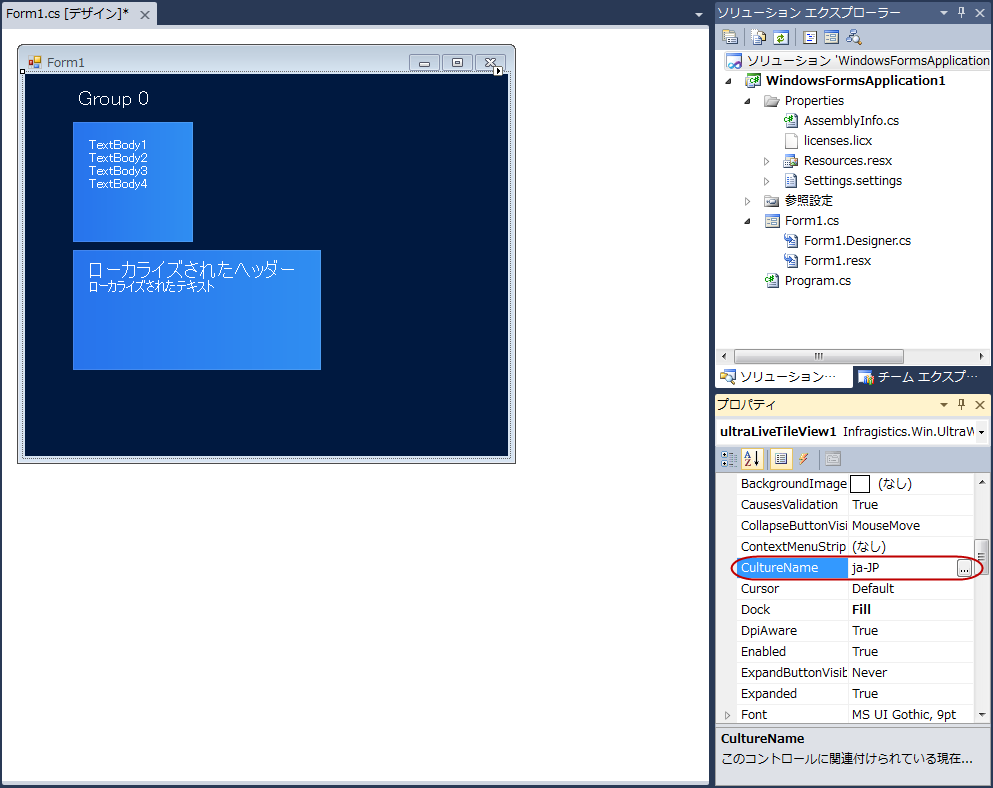

////

|metadata|
{
    "name": "winlivetileview-winlivetileview-localization",
    "controlName": [],
    "tags": [],
    "guid": "97884b1f-6792-45e2-a7ab-a36b526a8e5c",  
    "buildFlags": [],
    "createdOn": "2013-09-15T23:23:58.6147596Z"
}
|metadata|
////

= WinLiveTileView のローカライズ

== トピックの概要

=== 目的

このトピックでは、 _WinLiveTileView_™ のローカライズの設定方法を示します。

=== このトピックの内容

このトピックは、以下のセクションで構成されます。

* <<_Ref366569641,概要>>
* <<_Ref366569648,デザイナーを使用したローカライズ設定>>
** <<_Ref366569670,はじめに>>
** <<_Ref366569677,手順>>

* <<_Ref366569683,コード ビハインドを使用したローカライズ設定>>
** <<_Ref366569689,コード例>>

* <<_Ref366365606,関連コンテンツ>>

[[_Ref366569641]]
== 概要

=== 概要

Windows 8 タイル パラダイムのもう 1 つの主要な特徴はローカライズへの対応です。Windows 8 タイル通知の XML スキーマは、「`lang`」という属性を認識し、言語コードを割り当てることができます。これにより、タイルのテキストを表示する言語が制御されます。たとえば、ある文字列に「`fr-FR`」、また別の文字列に「`ja-JP`」と設定すると、それぞれフランス語と日本語で表示されます。

Windows 8 ではこの手法が画像にも適用され、各画像を異なる言語で表示できます。

_WinLiveTileView_   では、同様のメカニズムが、適用言語への参照を含むタイル コンテンツを保存しているキー指定したコレクションにより提供されています。これにより、タイル コンテンツのローカライズを簡単に、かつ直感的に設定でき、各言語向けのリソース ファイルを個別に管理する必要がありません。

[[_Ref366569648]]
== デザイナーを使用したローカライズ設定

[[_Ref366569670]]

=== はじめに

ローカライズを設定するには、各言語別にビューを作成し、ライブ タイルの link:{ApiPlatform}win.ultrawinlivetileview{ApiVersion}~infragistics.win.ultrawinlivetileview.livetile~culturespecificviews.html[CultureSpecificViews] コレクションに追加する必要があります。このコレクションでは、カルチャ名がキーになります。 link:{ApiPlatform}win.ultrawinlivetileview{ApiVersion}~infragistics.win.ultrawinlivetileview.ultralivetileview_members.html[UltraLiveTileView] は現在のカルチャに対するこのテーブルを読み取り、適切なテキストや画像を表示します。

以下のセクションでは、カルチャに固有なテキストの設定をステップ順に示します。

[[_Ref366569677]]

=== 手順

1.タイルをクリックし、 *プロパティ*  グリッドを使用して link:{ApiPlatform}win.ultrawinlivetileview{ApiVersion}~infragistics.win.ultrawinlivetileview.livetile~culturespecificviews.html[CultureSpecificViews] を選択します。

2.`CultureSpecificView` により表示された別のダイアログ ウィンドウで、利用できるローカライズ用カルチャのドロップダウン リストからカルチャ コードを追加します。

3.カルチャ コードを選択して追加すると、同時にフレームも追加される必要があります。ライブ タイルには、`ミディアム`、`ワイド`、`ラージ`の各フレームを追加することができます。この例ではワイド フレームを使用しています。テンプレートに応じてフレームのコンテンツには、テキストや画像、またはその両方が含まれます。

4.フレームは、ローカライズ以外のコンテンツと同じ方法で追加できます。カルチャに固有なコードをローカル カルチャに一致させる作業のみが唯一異なる作業です。この例では、日本語カルチャを表す「`ja-JP`」や角括弧内のテキスト […] を、それぞれ説明のために使用しています。

5.ここまでの作業で`カルチャ固有`の設定が完了しましたが、以下のスクリーンショットに示すように、タイル上のテキストがまだローカライズされていません。これは現在のカルチャが英語の状態で、日本語コード「`ja-JP`」と一致していないからです。

6.現在の link:{ApiPlatform}win.ultrawinlivetileview{ApiVersion}~infragistics.win.ultrawinlivetileview.culturespecificlivetileview~culturename.html[カルチャ名]を「`ja-JP`」に変更する、またはコンピュータのロケール設定を使用してカルチャを変更すると、表示が日本語になります。

[[_Ref366365518]]
[[_Ref366569683]]
== コード ビハインドを使用したローカライズ設定

[[_Ref366569689]]

=== コード例

以下のコード例は、コード ビハインドによるローカライズ設定を示します。

*C# の場合:*

[source,csharp]
----
// 既存のタイルを参照しインスタンスを作成
LiveTile liveTile = (LiveTile)ultraLiveTileView1.Groups["Group 1"].Tiles["wideTile1"];
// カルチャ固有のタイル ビューのインスタンスを作成
CultureSpecificLiveTileView cultureSpecificLiveTile = new CultureSpecificLiveTileView("ja-JP");
// カルチャ固有のビューをタイルのコレクションに追加
liveTile.CultureSpecificViews.Add(cultureSpecificLiveTile);
// フレームを作成しタイルのコレクションに追加
LiveTileFrameWide frame = cultureSpecificLiveTile.WideFrames.Add();
// コンテンツ (テンプレート) を作成しローカライズのテキストを設定
TileWideText09 content = new TileWideText09();
content.TextHeading.Text = "[Localized Heading]";
content.TextBodyWrap.Text = "[Localized Text]";
// コンテンツをフレームに追加
frame.Content = content;
// 現在のカルチャ名を日本語カルチャ「ja-JP」に変更
ultraLiveTileView1.CultureName = "ja-JP";
----

*Visual Basic の場合:*

[source,vb]
----
' 既存のタイルを参照しインスタンスを作成
Dim liveTile As LiveTile = DirectCast(ultraLiveTileView1.Groups("Group 1").Tiles("wideTile1"), LiveTile)
' カルチャ固有のタイル ビューのインスタンスを作成
Dim cultureSpecificLiveTile As New CultureSpecificLiveTileView("ja-JP")
' カルチャ固有のビューをタイルのコレクションに追加
liveTile.CultureSpecificViews.Add(cultureSpecificLiveTile)
' フレームを作成しタイルのコレクションに追加
Dim frame As LiveTileFrameWide = cultureSpecificLiveTile.WideFrames.Add()
' コンテンツ (テンプレート) を作成しローカライズのテキストを設定
Dim content As New TileWideText09()
content.TextHeading.Text = "[Localized Heading]"
content.TextBodyWrap.Text = "[Localized Text]"
' コンテンツをフレームに追加
frame.Content = content
' 現在のカルチャ名を日本語カルチャ「ja-JP」に変更
ultraLiveTileView1.CultureName = "ja-JP"
----

結果を検証するアプリケーションを実行します (オプション)。

[[_Ref366365606]]
== 関連コンテンツ

=== トピック

このトピックの追加情報については、以下のトピックも合わせてご参照ください。

[options="header", cols="a,a"]
|====
|トピック|目的

| link:winlivetileview.html[WinLiveTileView]
|このグループのトピックでは、最新の _WinLivetileView_ コントロールについて、使用および設定する手順を含めて紹介します。このコントロールは、Microsoft Windows 8 オペレーティング システムのスタート画面のタイルと類似しています。

|====