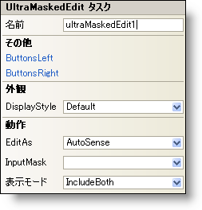

////

|metadata|
{
    "name": "winmaskededit-smart-tag",
    "controlName": ["WinMaskedEdit"],
    "tags": ["Getting Started"],
    "guid": "{DDD628A2-1EC0-4FAC-A7AF-D4FC7F92022A}",  
    "buildFlags": [],
    "createdOn": "2005-11-11T00:00:00Z"
}
|metadata|
////

= WinMaskedEdit スマート タグ

Visual Studio 2005（.NET Framework 2.0）では、それぞれの {ProductName} コントロール/コンポーネントが固有のスマート タグを備えています。 コントロール/コンポーネントを単に選択すると、Smart Tag のアンカーが表示されます。このアンカーをクリックするとポップアップ パネルが表示され、そこからコントロール/コンポーネントの最もよく使用するプロパティや設定にすばやく簡単にアクセスできます。

WinMaskedEdit スマート タグには、以下のセクションと共にコントロールの名前が含まれます。

* 外観 -- コントロールの外観やルック アンド フィールに関連する一般的なタスクがあります。
* 動作 -- フォーム上でのコントロールの動作を制御するプロパティに簡単にアクセスできます。
* その他 -- コントロールの全体的な外観やパフォーマンスを拡張する各種オプションがあります。

各セクションの項目（たとえば、フィールド、ドロップダウン リスト、チェックボックス）およびプロパティ グリッドの項目の対応するプロパティの説明については以下を参照してください。

[options="header", cols="a,a,a"]
|====
|外観|説明|対応するプロパティ

|表示スタイル
|WinMaskedEdit のスタイルを、Office 2000、Office XP、Office 2003、Visual Studio 2005、Office 2007 に似たスタイルに変更します。
| link:{ApiPlatform}win.ultrawinmaskededit{ApiVersion}~infragistics.win.ultrawinmaskededit.ultramaskededit~displaystyle.html[DisplayStyle]

|====

[options="header", cols="a,a,a"]
|====
|動作|説明|対応するプロパティ

|表示モード
|コントロールが編集モードでないときのマスクの適用方法を指定します。
| link:{ApiPlatform}win.ultrawinmaskededit{ApiVersion}~infragistics.win.ultrawinmaskededit.ultramaskededit~displaymode.html[DisplayMode]

|編集形式
|使用するマスクのタイプを指定します。通貨、日付、整数、倍精度数などから選択できます。AutoSense を選択すると、ユーザーの入力に基づいてマスクのタイプが自動的に決定されます。
| link:{ApiPlatform}win.ultrawinmaskededit{ApiVersion}~infragistics.win.ultrawinmaskededit.ultramaskededit~editas.html[EditAs]

|入力マスク
|エディタによって使用される入力マスクを設定します。
| link:{ApiPlatform}win.ultrawinmaskededit{ApiVersion}~infragistics.win.ultrawinmaskededit.ultramaskededit~inputmask.html[InputMask]

|====

[options="header", cols="a,a,a"]
|====
|その他|説明|対応するプロパティ

|左ボタン
|省略（...）ボタンをクリックすると、ButtonsLeft コレクションが開きます。これはエディタの左側に配置できるカスタム ボタンのコレクションです。
| link:{ApiPlatform}win{ApiVersion}~infragistics.win.ultrawineditors.editorbuttoncontrolbase~buttonsleft.html[ButtonsLeft]

|右ボタン
|省略（...）ボタンをクリックすると、ButtonsRight コレクションが開きます。これはエディタの右側に配置できるカスタム ボタンのコレクションです。
| link:{ApiPlatform}win{ApiVersion}~infragistics.win.ultrawineditors.editorbuttoncontrolbase~buttonsright.html[ButtonsRight]

|====