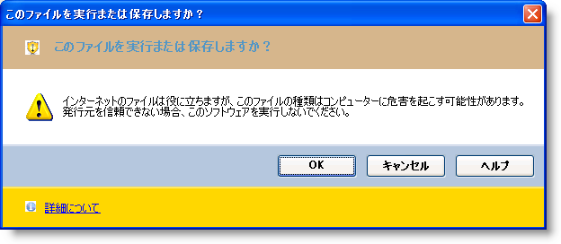

////
|metadata|
{
    "name": "winmessageboxmanager-working-with-winmessageboxmanager",
    "controlName": ["WinMessageBoxManager"],
    "tags": ["Getting Started","How Do I"],
    "guid": "{3A575438-9E26-452C-A3CD-43441B41699A}",
    "buildFlags": [],
    "createdOn": "0001-01-01T00:00:00Z"
}
|metadata|
////

= WinMessageBoxManager の操作

WinMessageBoxManager™ コンポーネントは、ユーザーに通知および指示するためのテキスト、ボタン、記号を含むことができるメッセージ ボックスを表示するために使用できます。 ヘッダー、コンテンツ領域、フッターなどの MessageBoxManager の各セクションをフォーマットできます。

以下の例のコードは、このコンポーネントで使用可能なカスタマイズ オプションを示します。

このトピックはコンポーネント トレイに UltraMessageBoxManager コンポーネントと ImageList をドロップしてあることが前提となります。 たとえば、ImageList はセキュリティ警告アイコンと情報アイコンの 2 つのサンプル画像で生成されます。 ボタンをフォームにドロップして、Button の Click Event 内に以下のコードを記述します。

*Visual Basic の場合：*
[source,vb]
----
Dim messageinfo As New UltraMessageBoxInfo()
messageinfo.Style = MessageBoxStyle.Vista 
messageinfo.Buttons = MessageBoxButtons.OKCancel 
messageinfo.Icon = MessageBoxIcon.Warning
' デフォルトで選択される Button を設定します。
messageinfo.DefaultButton = MessageBoxDefaultButton.Button1 
messageinfo.ButtonAppearance.FontData.Bold = DefaultableBoolean.True
messageinfo.ButtonAreaAppearance.BackColor = Color.LightSteelBlue
' キャプション 
Dim captionmsg As String = "このファイルを実行または保存しますか？"
messageinfo.Caption = captionmsg 
' ヘッダー 
messageinfo.HeaderAppearance.BackColor = Color.Tan 
messageinfo.HeaderAppearance.Image = Me.imageList1.Images(0) 
Dim headermsg As String = " このファイルを実行または保存しますか？"
messageinfo.Header = headermsg 
' コンテンツ領域 
Dim contentmsg As String = "インターネットのファイルは役に立ちますが、このファイルの種類はコンピューターに危害を起こす可能性があります。 発行元を信頼できない場合、このソフトウェアを実行しないでください。"
messageinfo.TextFormatted = contentmsg 
' ヘルプ ボタン 
messageinfo.ShowHelpButton = DefaultableBoolean.[True] 
Dim helpmsg As String = " http://jp.infragistics.com"
Dim helpinfo As New HelpInfo(helpmsg, HelpNavigator.Index)
messageinfo.HelpInfo = helpinfo 
' フッター 
messageinfo.FooterAppearance.BackColor = Color.Gold 
messageinfo.HeaderAppearance.Image = Me.imageList1.Images(1) 
Dim footermsg As String = " <a href = 'jp.infragistics.com'>詳細について</a>"
messageinfo.FooterFormatted = footermsg 
' ボタンを右に配置します。 
Me.ultraMessageBoxManager1.ButtonAlignment = HAlign.Right 
Me.ultraMessageBoxManager1.ShowMessageBox(messageinfo)
----

*C# の場合：*
[source,cs]
----
UltraMessageBoxInfo messageinfo = new UltraMessageBoxInfo();
messageinfo.Style = MessageBoxStyle.Vista;
messageinfo.Buttons = MessageBoxButtons.OKCancel;
messageinfo.Icon = MessageBoxIcon.Warning;
// デフォルトで選択される Button を設定します。
messageinfo.DefaultButton = MessageBoxDefaultButton.Button1;
messageinfo.ButtonAppearance.FontData.Bold = DefaultableBoolean.True;
messageinfo.ButtonAreaAppearance.BackColor = Color.LightSteelBlue;
// キャプション
string captionmsg = "このファイルを実行または保存しますか？";
messageinfo.Caption = captionmsg;
// ヘッダー
messageinfo.HeaderAppearance.BackColor = Color.Tan;
messageinfo.HeaderAppearance.Image = this.imageList1.Images[0];
string headermsg = " このファイルを実行または保存しますか？";
messageinfo.Header = headermsg;
// コンテンツ領域
string contentmsg = " インターネットのファイルは役に立ちますが、このファイルの種類はコンピューターに危害を起こす可能性があります。 発行元を信頼できない場合、このソフトウェアを実行しないでください。";
messageinfo.TextFormatted = contentmsg;
// ヘルプ ボタン
messageinfo.ShowHelpButton = DefaultableBoolean.True;
string helpmsg = "http://jp.infragistics.com";
HelpInfo helpinfo = new HelpInfo(helpmsg, HelpNavigator.Index);
messageinfo.HelpInfo = helpinfo;
// フッター
messageinfo.FooterAppearance.BackColor = Color.Gold;
messageinfo.HeaderAppearance.Image = this.imageList1.Images[1];
string footermsg = " <a href ='jp.infragistics.com'>詳細について</a>";
messageinfo.FooterFormatted = footermsg;
// ボタンを右に配置します。
this.ultraMessageBoxManager1.ButtonAlignment = HAlign.Right;
this.ultraMessageBoxManager1.ShowMessageBox(messageinfo);
----

