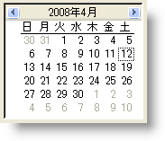

////

|metadata|
{
    "name": "winmonthviewmulti-about-winmonthviewmulti",
    "controlName": ["WinMonthViewMulti"],
    "tags": ["Getting Started"],
    "guid": "{DB10D99F-3E65-4D28-BA32-A17E4DC8F970}",  
    "buildFlags": [],
    "createdOn": "0001-01-01T00:00:00Z"
}
|metadata|
////

= WinMonthViewMulti について

WinMonthViewMulti コントロールは、一度に数ヶ月間を表示します。以下に WinMonthViewMulti で使用できる機能の一部について説明します。

* 表示 -- エンド ユーザーが複数の月にまたがって、予約、メモ、オーナー、その他の項目を表示することを可能にします。
* 外観のサポート -- アルファ ブレンディング、グラデーション、画像などを含め、外観が完全にサポートされます。外観には、コントロール レベルで設定できるものと、WinCalendarLook コンポーネントを使用して設定するものとがあります。
* 組み込みテーマ - WinCalendarLook コンポーネントにより、標準、Office 2003、Visual Studio 2005、Office 2007 のテーマをサポートします。

