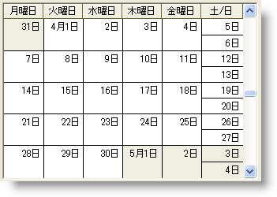

////

|metadata|
{
    "name": "winmonthviewsingle-about-winmonthviewsingle",
    "controlName": ["WinMonthViewSingle"],
    "tags": ["Getting Started"],
    "guid": "{9FFEC56E-B788-4FB2-B0C6-CD3393E42331}",  
    "buildFlags": [],
    "createdOn": "0001-01-01T00:00:00Z"
}
|metadata|
////

= WinMonthViewSingle について

WinMonthViewSingle コントロールは、一度に 1 ヶ月間のみを表示します。以下に、WinMonthViewSingle で使用できる機能のいくつかを示します。

* 表示 -- エンド ユーザーは 1 ヶ月間の予約、メモ、オーナー、その他の項目を表示できます。
* 追加/更新/削除 -- エンド ユーザーは WinCalendarInfo コンポーネントを使用して予約、メモ、オーナー、その他の項目を追加、更新、削除することを可能にします。
* 外観のサポート -- アルファ ブレンディング、グラデーション、画像などを含め、外観が完全にサポートされます。外観には、コントロール レベルで設定できるものと、WinCalendarLook コンポーネントを使用して設定するものとがあります。
* 組み込みテーマ - WinCalendarLook コンポーネントにより、標準、Office 2003、Visual Studio 2005、Office 2007 のテーマをサポートします。

