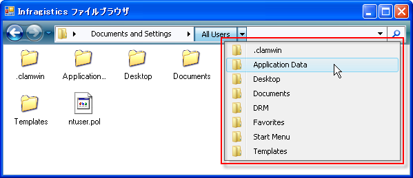
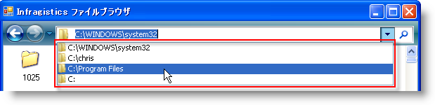

////

|metadata|
{
    "name": "winnavigationbar-about-winnavigationbar",
    "controlName": ["WinNavigationBar"],
    "tags": ["Getting Started","Navigation"],
    "guid": "{C2BC0E5F-5D9A-4371-93BF-6BB9F701B185}",  
    "buildFlags": [],
    "createdOn": "0001-01-01T00:00:00Z"
}
|metadata|
////

= WinNavigationBar について

WinNavigationBar™ はブレッドクラム コントロールのように動作するナビゲーション コントロールで、コントロールがどのような階層的データにバインドされていてもその階層をユーザーが移動した跡を追跡します。WinNavigationBar は、WinTree™ などのツリー タイプのコントロールとも非常に似ています。Location を表す各ボタンは、ツリーのノードとして考えることができます。ボタンをクリックすると、ドロップダウン リストに位置の子すべてを見ることができます。

== Locations

WinNavigationBar にとっての link:{ApiPlatform}win.misc{ApiVersion}~infragistics.win.misc.ultranavigationbarlocation.html[Locations] は WinTree にとっての link:{ApiPlatform}win.ultrawintree{ApiVersion}~infragistics.win.ultrawintree.ultratreenode.html[Nodes] と同じです。いつでも取得されるパスを表示するだけのフラットなツリーとして WinNavigationBar を考えることができます。WinNavigationBar の各位置には、 link:{ApiPlatform}win.misc{ApiVersion}~infragistics.win.misc.navigationbarlocationscollection.html[Locations] の固有のコレクションが含まれ、ノードのような階層的な構造をコントロールに提供します。

link:{ApiPlatform}win.misc{ApiVersion}~infragistics.win.misc.ultranavigationbarrootlocation.html[ルート位置]はもうひとつの位置ですが、WinNavigationBar コントロールごとに存在できるルート位置はひとつだけです。ルート位置は最上位の位置で、その他の位置の子の位置ではありません。

image::images/WinNavigationBar_About_WinNavigationBar_02.png[]

== Previous Locations

link:{ApiPlatform}win.misc{ApiVersion}~infragistics.win.misc.navigationbarpreviouslocationscollection.html[Previous Locations] コレクションは、ユーザーが訪れる各位置を追跡します。WinNavigationBar は、それぞれの訪問した位置を位置のカスタム コレクションに追加することで、これを達成します。このコレクションは、コントロールの右のドロップダウン ボタンからエンド ユーザーに公開されます。ドロップダウン ボタンをクリックすると、すべての過去に訪問した位置のフル パスを含むドロップダウン リストが表示されます。

== アクション ボタン

WinNavigationBar によってその右側にカスタム ボタンを追加できます。 link:{ApiPlatform}win.misc{ApiVersion}~infragistics.win.misc.ultranavigationbaractionbutton.html[アクション ボタン]の支援を得て、アプリケーションにお気に入りの位置を追加したり、ファイル システムの WinNavigationBar の表示をリフレッシュしたり、特定の位置を検索できます。

image::images/WinNavigationBar_About_WinNavigationBar_04.png[]