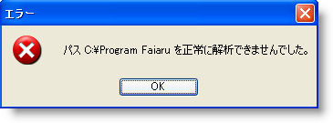
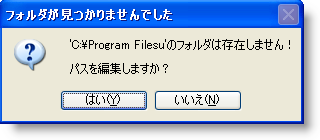

////

|metadata|
{
    "name": "winnavigationbar-handle-a-navigation-path-parsing-error",
    "controlName": ["WinNavigationBar"],
    "tags": ["Navigation"],
    "guid": "{D04659DE-792F-4E02-9BDD-0FA15DF1A9EC}",  
    "buildFlags": [],
    "createdOn": "0001-01-01T00:00:00Z"
}
|metadata|
////

= ナビゲーション パス解析エラーを処理

エンド ユーザーが存在しないパスにナビゲートを試みる場合があります。この場合、 link:{ApiPlatform}win.misc{ApiVersion}~infragistics.win.misc.ultranavigationbar~navigationpathparseerror_ev.html[NavigationPathParsingError] イベントが発生します。デフォルトでは、このイベントが発生すると、エンド ユーザーがナビゲートした特定のパスを解析できなかったというメッセージがダイアログ ボックスに表示します。エンド ユーザーが [OK] をクリックすると、WinNavigationBar™ は最後に解析が成功した位置に戻り、編集モードを終了します。以下のスクリーンショットは、デフォルトの解析エラー ダイアログ ボックスです。

NavigationPathParsingError のイベント引数から、この特定のエラーの複数の機能にアクセスし、アプリケーションの必要に合わせて変更することができます。たとえば、標準のダイアログ ボックスが表示されないようにして、ユーザー固有のカスタム ダイアログ ボックスを作成することができます。WinNavigationBar を編集モードのままにしておくかどうかを決定することができます。エンド ユーザーに有効な位置に入力することを求める必要がある場合に役立ちます。イベント引数によって、エラーのキャプションおよびテキスト、そして正しく解析できなかったパスにもアクセスできます。

以下のコードは、上記のスクリーンショットのようにデフォルトの解析エラー ダイアログ ボックスを変更します。

*Visual Basic の場合：*

----
Imports Infragistics.Win.Misc.UltraWinNavigationBar
Private Sub UltraNavigationBar1_NavigationPathParseError( _
  ByVal sender As System.Object, _
  ByVal e As NavigationPathParseErrorEventArgs) _
  Handles UltraNavigationBar1.NavigationPathParseError
    e.DisplayErrorMessage = False
    Dim result As System.Windows.Forms.DialogResult = MessageBox.Show _
    ( _
        "The folder '" + e.Path + "' doesn't exist!" _
        + "\n\n" + "Would you like to edit the path?", _
        "Folder Not Found", _
        MessageBoxButtons.YesNo, _
        MessageBoxIcon.Question _
    )
    If result = System.Windows.Forms.DialogResult.Yes Then
        e.StayInEditMode = True
    ElseIf result = System.Windows.Forms.DialogResult.No Then
        e.StayInEditMode = False
    End If
End Sub
----

*C# の場合：*

----
using Infragistics.Win.Misc.UltraWinNavigationBar;
private void ultraNavigationBar1_NavigationPathParseError
  (object sender, NavigationPathParseErrorEventArgs e)
{
	e.DisplayErrorMessage = false;
	DialogResult result = MessageBox.Show
	(
		"The folder '" + e.Path + "' doesn't exist!" 
		+ "\n\n" + "Would you like to edit the path?", 
		"Folder Not Found", 
		MessageBoxButtons.YesNo, 
		MessageBoxIcon.Question
	);
	if (result == DialogResult.Yes)
		e.StayInEditMode = true;
	else if (result == DialogResult.No)
		e.StayInEditMode = false;
}
----