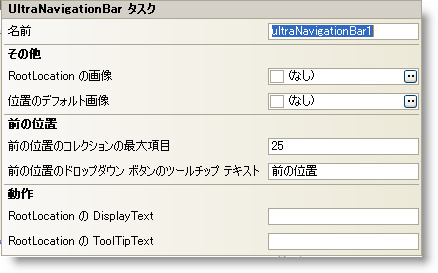

////

|metadata|
{
    "name": "winnavigationbar-smart-tag",
    "controlName": ["WinNavigationBar"],
    "tags": ["Getting Started","Navigation"],
    "guid": "{E278E4CB-B09F-4384-8AAD-73655A792265}",  
    "buildFlags": [],
    "createdOn": "0001-01-01T00:00:00Z"
}
|metadata|
////

= WinNavigationBar スマート タグ

Visual Studio 2005（.NET Framework 2.0）では、{ProductName} コントロール/コンポーネントがそれぞれ固有のスマート タグを備えています。コントロールやコンポーネントを選択するだけで、スマート タグのアンカーが表示されます。このアンカーをクリックするとポップアップ パネルが表示され、そこからコントロール/コンポーネントの最もよく使うプロパティや設定にすばやく簡単にアクセスできます。

WinNavigationBar™ スマート タグには、以下のセクションと共にコントロールの名前が含まれます。

* 動作 -- フォーム上でのコントロールの動作を制御するプロパティに簡単にアクセスできます。
* その他 -- 位置およびルート位置に対する画像を処理するプロパティへの簡単なアクセスを提供します。
* 前の位置 -- 前の位置のコレクションに影響を及ぼす共通のプロパティへの素早いアクセスを提供します。

各セクションの項目（フィールド、ドロップダウン リスト、チェックボックスなど）の説明と、各項目が対応するプロパティ グリッドのプロパティについては、以下の表を参照してください。

[options="header", cols="a,a,a"]
|====
|動作|説明|対応するプロパティ

|RootLocation の DisplayText
|WinNavigationBar が編集モードでない場合、ブレッドクラムに表示されるテキストを変更します。
|pick:[win-forms="link:{ApiPlatform}win.misc{ApiVersion}~infragistics.win.misc.ultranavigationbarlocation~displaytext.html[DisplayText]"] 

|RootLocation の ToolTipText
|ルートの位置のツールチップ テキストを設定します（これは link:winformattedlinklabel-formatting-text-and-hyperlinks.html[フォーマットされたテキスト]が可能）。
|pick:[win-forms="link:{ApiPlatform}win.misc{ApiVersion}~infragistics.win.misc.ultranavigationbarlocation~tooltiptext.html[ToolTipText]"] 

|====

[options="header", cols="a,a,a"]
|====
|その他|説明|対応するプロパティ

|位置のデフォルト画像
|設定されると、各位置の画像は選択した画像で表示します。
|pick:[win-forms="link:{ApiPlatform}win{ApiVersion}~infragistics.win.appearance~image.html[Image]"] 

|RootLocation の画像
|設定されると、ルートの位置の画像は選択した画像で表示されます。
|pick:[win-forms="link:{ApiPlatform}win{ApiVersion}~infragistics.win.appearance~image.html[Image]"] 

|====

[options="header", cols="a,a,a"]
|====
|データ|説明|対応するプロパティ

|前の位置のコレクションの最大項目
|前の位置のコレクションに保存するために、位置の最大数を設定します。
|pick:[win-forms="link:{ApiPlatform}win.misc{ApiVersion}~infragistics.win.misc.ultranavigationbarpreviouslocationssettings~maximumitems.html[MaximumItems]"] 

|前の位置のドロップダウン ボタンのツールチップ テキスト
|前の位置のドロップダウン ボタン ツールチップ テキストを設定します（これはフォーマットされたテキストが可能）。
|pick:[win-forms="link:{ApiPlatform}win.misc{ApiVersion}~infragistics.win.misc.ultranavigationbarpreviouslocationssettings~dropdownbuttontooltiptext.html[DropDownButtonToolTipText]"] 

|====