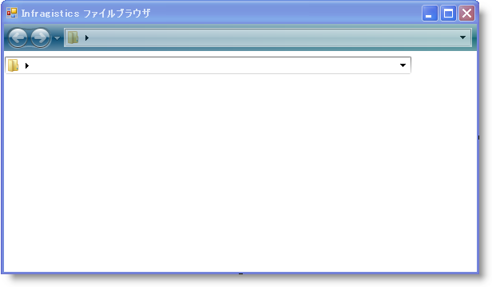

////

|metadata|
{
    "name": "winnavigationbar-using-winnavigationbar-with-the-navigation-toolbar",
    "controlName": ["WinNavigationBar"],
    "tags": ["How Do I","Navigation"],
    "guid": "{FCB08AD2-23D8-4C3A-81EF-95F97DE21744}",  
    "buildFlags": [],
    "createdOn": "0001-01-01T00:00:00Z"
}
|metadata|
////

= ナビゲーション ツールバーで WinNavigationBar を使用

== 始める前に

このヘルプ トピックは link:winnavigationbar-browsing-the-file-system-with-winnavigationbar.html[「WinNavigationBar でファイル システムを参照」]トピックに基づいて構築されています。詳細はこのトピックを参照してください。

「WinNavigationBar でファイル システムを参照」トピックでは、使用しているシステムでフォルダ構造をナビゲートするために WinNavigationBar™ を設定する方法を学びました。ナビゲーション ツールバーは、ナビゲーション構造を念頭に置いて開発されたので、これらの 2 つのコントロールを一緒に使用することのみが論理的のように思われます。

WinNavigationBar コントロールは、エンド ユーザーが位置を変更後に発生する link:{ApiPlatform}win.misc{ApiVersion}~infragistics.win.misc.ultranavigationbar~selectedlocationchanged_ev.html[SelectedLocationChanged] イベントを公開します。WinNavigationBar は位置が有効である場合に限りこのイベントを発生します。したがってこれは、新しい位置をナビゲーション ツールバーのナビゲーション履歴に追加することでナビゲーション ツールバーを更新するために最適な場所です。 link:{ApiPlatform}win.misc{ApiVersion}~infragistics.win.misc.ultranavigationbar~navigateto.html[NavigateTo] メソッドを呼び出すだけでナビゲーション履歴に項目を追加することができます。エンド ユーザーがナビゲーション ツールバーの履歴をナビゲートする時に WinNavigationBar を更新するには、WinToolbarsManager™ の link:{ApiPlatform}win.ultrawintoolbars{ApiVersion}~infragistics.win.ultrawintoolbars.ultratoolbarsmanager~afternavigation_ev.html[AfterNavigation] イベントを使用することができます。このイベントは [戻る] または [次へ] ボタンをクリックしてエンド ユーザーがナビゲート後、またはコードをプログラムでナビゲートする時に発生します。AfterNavigation イベントでは、2 つのコントロールを同期する WinNavigationBar の NavigateTo メソッドを呼び出すことができます。

各コントロールそれぞれの NavigateTo メソッドを呼び出す時に、そのコントロールに基づいて SelectedLocationChanged イベントと AfterNavigation イベントのいずれかが発生することを理解することが大切です。NavigateTo メソッドを呼び出す前にこれらのイベントを無効にする必要があります。そうでなければ、アプリケーションが無限ループに陥ります。

== 達成すること

この詳細なガイドは、WinNavigationBar と Navigation ツールバーを同期できる方法を示します。ナビゲーション ツールバーは、WinNavigationBar コントロールでエンド ユーザーが訪問する項目の履歴を記録します。エンド ユーザーが WinNavigationBar で新しい位置を訪問すると、その位置がナビゲーション ツールバーの履歴に追加されます。ナビゲーション ツールバーのナビゲーション履歴をエンド ユーザーがナビゲートすると、WinNavigationBar はナビゲーション履歴の現在の項目で更新されます。

== 次の手順を実行します

[start=1]
. *ナビゲーション ツールバーをフォームに追加します。*

.. デザインビューで、Visual Studio ツールボックスで link:{ApiPlatform}win.ultrawintoolbars{ApiVersion}~infragistics.win.ultrawintoolbars.ultratoolbarsmanager.html[UltraToolbarsManager] を指定してダブルクリックします。ダイアログ ボックスが表示します。 -- [はい] をクリックしてダイアログ ボックスを閉じます。ultraToolbarsManager1 コンポーネントがコンポーネント トレイに追加されます。
.. ultraToolbarsManager1 コンポーネントが選択されたままの状態で、[プロパティ] ウィンドウで link:{ApiPlatform}win.ultrawintoolbars{ApiVersion}~infragistics.win.ultrawintoolbars.navigationtoolbar.html[NavigationToolbar] オブジェクトを指定して Visible プロパティを True に設定します。ナビゲーション ツールバーがフォームの上部に表示します。
.. ナビゲーション ツールバーで、[新しいツールを挿入] をクリックして、表示されるポップアップ メニューから [新しいツールを挿入] をクリックします。[新しいツール] ダイアログ ボックスが表示します。
.. [新しいツール] ダイアログ ボックスで、[ツール タイプ] を [コントロール コンテナ] に変更して [追加] をクリックします。ControlContainerTool がナビゲーション ツールバーに追加されます。
.. [閉じる] をクリックして [新しいツール] ダイアログ ボックスを閉じます。
.. ナビゲーション ツールバーで [コントロール未設定] を右クリックします。表示されるポップアップ メニューで [コントロール] の上にマウスを移動して、フライアウト メニューから ultraNavigationBar1 を選択します。 link:{ApiPlatform}win.ultrawintoolbars{ApiVersion}~infragistics.win.ultrawintoolbars.controlcontainertool.html[ControlContainerTool] は WinNavigationBar コントロールをホストしています。
.. ultraToolbarsManager1 を選択したままの状態の [プロパティ] ウィンドウで、ControlContainerTool1 の link:{ApiPlatform}win.ultrawintoolbars{ApiVersion}~infragistics.win.ultrawintoolbars.sharedprops~spring.html[Spring] プロパティを True に設定し、 link:{ApiPlatform}win.ultrawintoolbars{ApiVersion}~infragistics.win.ultrawintoolbars.toolbarsettings~fillentirerow.html[ToolbarSettings.FillEntireRow] プロパティを True に設定します。
.. デザイナで ultraNavigationBar1 を選択し、[プロパティ] ウィンドウで Dock プロパティを [なし] に設定します。
.. フォームの幅を少なくとも 600 ピクセルに変更すると、WinNavigationBar コントロールの見栄えを少しよくすることができます。

フォームは以下のスクリーンショットのようになります。WinListView 上に表示される余分な WinNavigationBar コントロールについては心配いりません。このプロジェクトを実行すると表示されなくなります。

[start=2]
. *ナビゲーション履歴に選択した位置を追加します。*

「WinNavigationBar でファイル システムを参照」 トピックで手順を実行した場合、SelectedLocationChanged イベントは既に処理済みのはずです。LoadFilesAndFolders メソッドを呼び出した後に、ナビゲーション ツールバーの NavigateTo メソッドを呼び出したい場合があります。ただし、NavigateTo メソッドを呼び出すと、AfterNavigation メソッドが発生し、そのイベントでコードを実行します。このように無限ループがスタートします。NavigateTo を呼び出す前に AfterNavigation イベントを無効にする必要があり、次にこのメソッドを呼び出したら再び有効にできます。LoadFilesAndFolders メソッドの呼び出し後に SelectedLocationChanged イベントに以下のコードを追加します。

*Visual Basic の場合：*

----
' AfterNavigation イベントを無効にすると
' コードの次の行の間に発生しません。
Me.UltraToolbarsManager1.EventManager.SetEnabled _
  (Infragistics.Win.UltraWinToolbars.ToolbarEventIds.AfterNavigation, False)
' NavigationToolbar が変更したばかりの位置の 
' フル パスにナビゲートするようにします。 
Me.UltraToolbarsManager1.NavigationToolbar.NavigateTo _
  (e.SelectedLocation.GetFullPath _
  (Infragistics.Win.Misc.FullPathFormat.EditMode), Nothing)
' AfterNavigation イベントを再び有効にすると、エンド ユーザーは
' ナビゲーション ツールバーでナビゲートできます。
Me.UltraToolbarsManager1.EventManager.SetEnabled _
  (Infragistics.Win.UltraWinToolbars.ToolbarEventIds.AfterNavigation, True)
----

*C# の場合：*

----
// AfterNavigation イベントを無効にすると
// コードの次の行の間に発生しません。
this.ultraToolbarsManager1.EventManager.SetEnabled
	(Infragistics.Win.UltraWinToolbars.ToolbarEventIds.AfterNavigation, 
	false);
// NavigationToolbar が変更したばかりの位置の 
// フル パスにナビゲートするようにします。 
this.ultraToolbarsManager1.NavigationToolbar.NavigateTo
	(e.SelectedLocation.GetFullPath
		(Infragistics.Win.Misc.FullPathFormat.EditMode), null);
// AfterNavigation イベントを再び有効にすると、エンド ユーザーは
// ナビゲーション ツールバーでナビゲートできます。
this.ultraToolbarsManager1.EventManager.SetEnabled
	(Infragistics.Win.UltraWinToolbars.ToolbarEventIds.AfterNavigation, 
	true);
----

[start=3]
. *エンド ユーザーがナビゲーション履歴をナビゲートする時に WinNavigationBar を同期します。*

エンド ユーザーがナビゲーション ツールバーのナビゲーション履歴をナビゲートする場合、AfterNavigation イベントが呼び出されます。このイベントでは、WinNavigationBar の位置を更新する必要があります。これを行うには、WinNavigationBar の NavigateTo メソッドを呼び出し、ナビゲーション ツールバーの link:{ApiPlatform}win.ultrawintoolbars{ApiVersion}~infragistics.win.ultrawintoolbars.afternavigationeventargs~currentitem.html[現在の項目]を link:{ApiPlatform}win.ultrawintoolbars{ApiVersion}~infragistics.win.ultrawintoolbars.afternavigationeventargs.html[EventArgs] から渡します。繰り返しますが、ナビゲーションが発生の原因となるため SelectedLocationChanged イベントを無効にする必要があります。C# を使用する場合は [プロパティ] ウィンドウの光っているボルト、または Visual Basic を使用する場合はコード ビューの上のドロップダウン ボックスによって、AfterNavigation イベントを作成します。以下のコードを AfterNavigation イベントに追加します。

*Visual Basic の場合：*

----
Private Sub UltraToolbarsManager1_AfterNavigation(ByVal sender As Object, _
  ByVal e As Infragistics.Win.UltraWinToolbars.AfterNavigationEventArgs) _
  Handles UltraToolbarsManager1.AfterNavigation
' SelectedLocationChanged イベントを無効にします。以下の
' NavigateTo メソッドを呼び出すと、通常は
' SelectedLocationChanged イベントを発生させ、
' NavigationToolbar の NavigateTo メソッドを呼び出すと
' このイベントを再び起動します。
    Me.UltraNavigationBar1.EventManager.Disable _
      (UltraNavigationBarEventIds.SelectedLocationChanged)
' エンド ユーザーが [戻る] または [次へ] ボタンをクリックすると、
' WinNavigationBar は関連付けられたパスにナビゲートします。
    Me.UltraNavigationBar1.NavigateTo(e.CurrentItem.Text, True)
' SelectedLocationChanged を再び有効にすると、エンド ユーザーは
' WinNavigationBar で再びナビゲートできます。
    Me.UltraNavigationBar1.EventManager.Enable _
      (UltraNavigationBarEventIds.SelectedLocationChanged)
End Sub
----

*C# の場合：*

----
private void ultraToolbarsManager1_AfterNavigation
	(object sender, 
	Infragistics.Win.UltraWinToolbars.AfterNavigationEventArgs e)
{
	// SelectedLocationChanged イベントを無効にします。以下の
	// NavigateTo メソッドを呼び出すと、通常は
	// SelectedLocationChanged イベントを発生させ、
	// NavigationToolbar の NavigateTo メソッドを呼び出すと
	// このイベントを再び起動します。
	this.ultraNavigationBar1.EventManager.Disable
		(UltraNavigationBarEventIds.SelectedLocationChanged);
	// エンド ユーザーが [戻る] または [次へ] ボタンをクリックすると、
	// WinNavigationBar は関連付けられたパスにナビゲートします。
	this.ultraNavigationBar1.NavigateTo(e.CurrentItem.Text, true);
	// SelectedLocationChanged を再び有効にすると、エンド ユーザーは
	// WinNavigationBar で再びナビゲートできます。
	this.ultraNavigationBar1.EventManager.Enable
		(UltraNavigationBarEventIds.SelectedLocationChanged);
}
----

[start=4]
. *アプリケーションを実行します。*

アプリケーションを実行すると、ナビゲーション ツールバー内に WinNavigationBar コントロールが表示されます。WinNavigationBar で複数の位置にナビゲートします。ナビゲーション ツールバーの [次へ] ボタンの右にあるドロップダウン ボタンをクリックします。リストにユーザーが訪問した位置が示されます。ここで、ナビゲーション ツールバーでナビゲーション履歴をナビゲートします。WinNavigationBar コントロールは、その履歴からの項目で更新されます。

image::images/WinNavigationBar_Using_WinNavigationBar_with_the_Navigation_Toolbar_02.png[]