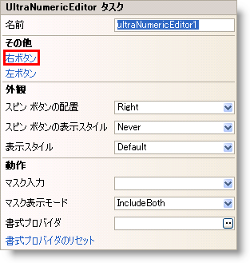
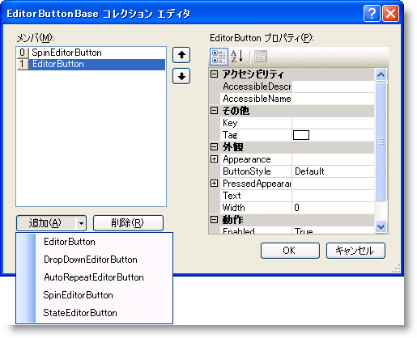

////
|metadata|
{
    "name": "winnumericeditor-custom-buttons-and-events",
    "controlName": ["WinNumericEditor"],
    "tags": ["Events","How Do I"],
    "guid": "{162E4F86-3EAA-4C0A-80D2-31B28F93ED1B}",
    "buildFlags": [],
    "createdOn": "2009-08-12T14:19:16Z"
}
|metadata|
////

= カスタム ボタンおよびイベント

EditorButton、DropDownEditorButton、AutoRepeatEditorButton、SpinEditorButton、および StateEditorButton のような WinNumericEditor™ コントロールでさまざまなカスタム ボタンを使用できます。 これらのボタンはコントロールの左または右のいずれかに追加可能で、これらのボタンに対応するイベントがあります。

このトピックは、SpinEditorButton オブジェクトと EditorButton オブジェクトの link:{ApiPlatform}win{ApiVersion}~infragistics.win.ultrawineditors.editorbuttoncontrolbase~editorspinbuttonclick_ev.html[EditorSpinButtonClick] イベントと link:{ApiPlatform}win{ApiVersion}~infragistics.win.ultrawineditors.editorbuttoncontrolbase~editorbuttonclick_ev.html[EditorButtonClick] イベントを使用する方法を示します。

== 以下の手順を実行します。

1. Microsoft® Visual Studio® ツールボックスから、UltraNumericEditor コントロールをフォームにドラッグ アンド ドロップします。

2. コントロールのスマートタグをクリックして、Buttons Right ボタンをクリックして NumericEditor の右にカスタム ボタンを追加します。 これによって [EditorButtonBase コレクション エディター] ダイアログ ウィンドウが表示します。

3. [追加] ボタンをクリックして、ドロップダウン リストから SpinEditorButton と EditorButton も選択します。 [OK] ボタンをクリックしてダイアログを閉じます。

5. SpinEditorButton オブジェクトと EditorButton オブジェクトの以下のイベントを処理します。

*Visual Basic の場合：*
[source,vb]
----
Private Sub ultraNumericEditor1_EditorSpinButtonClick(ByVal sender As Object, ByVal e As Infragistics.Win.UltraWinEditors.SpinButtonClickEventArgs) Handles ultraNumericEditor1.EditorSpinButtonClick

    Dim ed As UltraNumericEditor = TryCast(sender, UltraNumericEditor)
    Dim theVal As Integer = CInt(ed.Value)
    If e.ButtonType = SpinButtonItem.NextItem AndAlso theVal < 10 Then
       theVal += 1
       ed.Value = theVal
    ElseIf e.ButtonType = SpinButtonItem.PreviousItem AndAlso theVal > 0 Then

       theVal -= 1
       ed.Value = theVal
    Else
       MessageBox.Show("You cannot increment any more")
    End If

End Sub

Private Sub ultraNumericEditor1_EditorButtonClick(ByVal sender As Object, ByVal e As Infragistics.Win.UltraWinEditors.EditorButtonEventArgs) Handles ultraNumericEditor1.EditorButtonClick
    System.Diagnostics.Debug.WriteLine(e.Context.ToString())
End Sub
----

*C# の場合：*
[source,csharp]
----
private void ultraNumericEditor1_EditorSpinButtonClick(object sender, Infragistics.Win.UltraWinEditors.SpinButtonClickEventArgs e)
{
    UltraNumericEditor ed = sender as UltraNumericEditor;
     int theVal = (int)ed.Value;
    if (e.ButtonType == SpinButtonItem.NextItem &&  theVal < 10)
       {
         theVal += 1;
         ed.Value = theVal;
        }
    else if (e.ButtonType == SpinButtonItem.PreviousItem && theVal >0)
      {
         theVal -= 1;
         ed.Value = theVal;
       }
    else
     {
        MessageBox.Show("You cannot increment any more");
      }
}

private void ultraNumericEditor1_EditorButtonClick(object sender, Infragistics.Win.UltraWinEditors.EditorButtonEventArgs e)
{
   System.Diagnostics.Debug.WriteLine(e.Context.ToString());
}
----