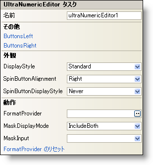

////

|metadata|
{
    "name": "winnumericeditor-smart-tag",
    "controlName": ["WinNumericEditor"],
    "tags": ["Getting Started"],
    "guid": "{3B410ED3-D598-4219-81DC-F72C78AF3BC0}",  
    "buildFlags": [],
    "createdOn": "2005-09-11T00:00:00Z"
}
|metadata|
////

= WinNumericEditor スマート タグ

Visual Studio 2005（.NET Framework 2.0）では、それぞれの {ProductName} コントロール/コンポーネントが固有のスマート タグを備えています。 コントロール/コンポーネントを単に選択すると、Smart Tag のアンカーが表示されます。このアンカーをクリックするとポップアップ パネルが表示され、そこからコントロール/コンポーネントの最もよく使用するプロパティや設定にすばやく簡単にアクセスできます。

WinNumericEditor スマート タグには、以下のセクションと共にコントロールの名前が含まれます。

* 外観 -- コントロールの外観やルック アンド フィールに関連する一般的なタスクがあります。
* 動作 -- フォーム上でのコントロールの動作を制御するプロパティに簡単にアクセスできます。
* その他 -- コントロールの全体的な外観やパフォーマンスを拡張する各種オプションがあります。

各セクションの項目（たとえば、フィールド、ドロップダウン リスト、チェックボックス）およびプロパティ グリッドの項目の対応するプロパティの説明については以下を参照してください。

[options="header", cols="a,a,a"]
|====
|外観|説明|対応するプロパティ

|表示スタイル
|WinNumericEditor のスタイルを、Office 2000、Office XP、Office 2003、Visual Studio 2005、Office 2007 に似たスタイルに変更します。
| link:{ApiPlatform}win.ultrawineditors{ApiVersion}~infragistics.win.ultrawineditors.texteditorcontrolbase~displaystyle.html[DisplayStyle]

|スピン ボタンの配置
|SpinButtonDisplayStyle プロパティが Always に設定されている場合、スピン ボタンはデフォルトでエディタの右側に表示されます。これを変更するには、このドロップダウンから "Left" を選択します。
| link:{ApiPlatform}win.ultrawineditors{ApiVersion}~infragistics.win.ultrawineditors.ultranumericeditorbase~spinbuttonalignment.html[SpinButtonAlignment]

|スピン ボタンの表示スタイル
|このオプションを Always に設定すると、スピン ボタンが表示されます。OnMouseEnter に設定すると、ユーザーが Enter キーを押したときにスピン ボタンが表示されます。
| link:{ApiPlatform}win.ultrawineditors{ApiVersion}~infragistics.win.ultrawineditors.ultranumericeditorbase~spinbuttondisplaystyle.html[SpinButtonDisplayStyle]

|====

[options="header", cols="a,a,a"]
|====
|動作|説明|対応するプロパティ

|書式プロバイダ
|省略（...）ボタンをクリックして書式プロバイダを選択します。書式プロバイダとは、エディタの書式設定の制御に使用する、その地域の特定の言語のことです。
| link:{ApiPlatform}win.ultrawineditors{ApiVersion}~infragistics.win.ultrawineditors.ultranumericeditorbase~formatprovider.html[FormatProvider]

|マスク表示モード
|エディタがコントロールのテキストをマスクする方法を選択するためにドロップダウンを使用します。
| link:{ApiPlatform}win.ultrawineditors{ApiVersion}~infragistics.win.ultrawineditors.ultranumericeditorbase~maskdisplaymode.html[MaskDisplayMode]

|マスク入力
|エディタによって使用される入力マスクを設定します。
| link:{ApiPlatform}win.ultrawineditors{ApiVersion}~infragistics.win.ultrawineditors.ultranumericeditor~maskinput.html[MaskInput]

|書式プロバイダのリセット
|このオプションをクリックすると書式プロバイダがクリアされ、選択していた特定の言語が取り消されます。
|なし

|====

[options="header", cols="a,a,a"]
|====
|その他|説明|対応するプロパティ

|左ボタン
|省略（...）ボタンをクリックすると、ButtonsLeft コレクションが開きます。これはエディタの左側に配置できるカスタム ボタンのコレクションです。
| link:{ApiPlatform}win{ApiVersion}~infragistics.win.ultrawineditors.editorbuttoncontrolbase~buttonsleft.html[ButtonsLeft]

|右ボタン
|省略（...）ボタンをクリックすると、ButtonsRight コレクションが開きます。これはエディタの右側に配置できるカスタム ボタンのコレクションです。
| link:{ApiPlatform}win{ApiVersion}~infragistics.win.ultrawineditors.editorbuttoncontrolbase~buttonsright.html[ButtonsRight]

|====