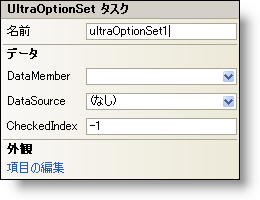

////

|metadata|
{
    "name": "winoptionset-smart-tag",
    "controlName": ["WinOptionSet"],
    "tags": ["API","Design Environment"],
    "guid": "{0A305E5F-DA25-411E-8C8C-B8AFC2895C8B}",  
    "buildFlags": [],
    "createdOn": "2005-09-11T00:00:00Z"
}
|metadata|
////

= WinOptionSet スマート タグ

Visual Studio 2005（.NET Framework 2.0）では、それぞれの {ProductName} コントロール/コンポーネントが固有のスマート タグを備えています。 コントロール/コンポーネントを単に選択すると、Smart Tag のアンカーが表示されます。このアンカーをクリックするとポップアップ パネルが表示され、そこからコントロール/コンポーネントの最もよく使用するプロパティや設定にすばやく簡単にアクセスできます。

WinOptionSet スマート タグには、以下のセクションと共にコントロールの名前が含まれます。

* 外観 -- コントロールの外観やルック アンド フィールに関連する一般的なタスクがあります。
* データ -- コントロールが使用している基になるデータ（データ ソースやデータ メンバなど）を参照します。

各セクションの項目（たとえば、フィールド、ドロップダウン リスト、チェックボックス）およびプロパティ グリッドの項目の対応するプロパティの説明については以下を参照してください。

[options="header", cols="a,a,a"]
|====
|外観|説明|対応するプロパティ

|項目の編集
|WinOptionSet は、選択できる項目がひとつだけのラジオ ボタンのグループと同じように機能します。[項目の編集] をクリックすると Items コレクションが開き、そこでオプション セットの選択肢を編集できます。
| link:{ApiPlatform}win.ultrawineditors{ApiVersion}~infragistics.win.ultrawineditors.ultraoptionset~items.html[Items]

|====

[options="header", cols="a,a,a"]
|====
|データ|説明|対応するプロパティ

|データ メンバ
|有効なデータ ソースを選択した後、このドロップダウンから使用可能なすべてのデータ メンバを選択できます。
| link:{ApiPlatform}win.ultrawineditors{ApiVersion}~infragistics.win.ultrawineditors.ultraoptionset~datamember.html[DataMember]

|データ ソース
|ドロップダウンをクリックすると、プロジェクトで使用可能なすべてのデータ ソースが表示されます。データ ソースがまだ設定されていない場合は、[プロジェクト データ ソースの追加...] を選択してデータ ソースを作成できます。
| link:{ApiPlatform}win.ultrawineditors{ApiVersion}~infragistics.win.ultrawineditors.ultraoptionset~datasource.html[DataSource]

|チェックされたインデックス
|選択されている項目のインデックスを設定します。
| link:{ApiPlatform}win.ultrawineditors{ApiVersion}~infragistics.win.ultrawineditors.ultraoptionset~checkedindex.html[CheckedIndex]

|====