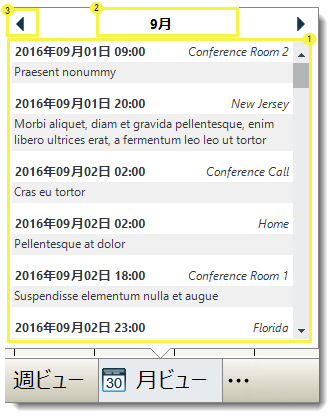

= WinPeekPopup について

WinPeekPopup™ は、スタイル設定されたポップアップ ウィンドウに任意の Windows Forms コントロールを表示できる Windows Forms コンポーネントです。

プレビュー ウィンドウは次のように構成されています:

. Content — プレビュー ウィンドウに割り当てられたコントロール。プレビュー ウィンドウが表示する UI の一部を表示します。コンテンツ コントロールは link:{ApiPlatform}win.misc{ApiVersion}~infragistics.win.misc.ultrapeekpopup~content.html[Content]  プロパティに割り当てられます。

* Content プロパティ
[source, csharp]
ultraPeekPopup1.Content = ultraButton1;

+
link:{ApiPlatform}win.misc{ApiVersion}~infragistics.win.misc.ultrapeekpopup.html[UltraPeekPopup] プレビュー ウィンドウが表示されるには、`Content` プロパティが最小要件です。キャプションまたはキャプション ボタンを使用せずにプレビュー ウィンドウを表示できますが、Content プロパティが設定されていない場合は表示されません。

. Caption—プレビュー ウィンドウの上部に表示されるテキストを指定します。これは link:{ApiPlatform}win.misc{ApiVersion}~infragistics.win.misc.ultrapeekpopup~caption.html[Caption] プロパティで設定します。

. Left/Right CaptionButtons -- プレビュー ウィンドウの上部にプレビュー キャプション ボタンを表示し機能性を拡張します。 link:{ApiPlatform}win.misc{ApiVersion}~infragistics.win.misc.ultrapeekpopup~captionbuttonsleft.html[CaptionButtonsLeft] および link:{ApiPlatform}win.misc{ApiVersion}~infragistics.win.misc.ultrapeekpopup~captionbuttonsright.html[CaptionButtonsRight] コレクションが `UltraPeekPopup` オブジェクトから直接公開されています。このコレクションに追加されたすべての link:{ApiPlatform}win{ApiVersion}~infragistics.win.ultrawineditors.editorbutton.html[EditorButtons] がプレビュー ウィンドウの上部に表示されます。
+
以下では左のコレクションにボタンを追加するコード例を挙げています。
[source, csharp]
ultraPeekPopup1.CaptionButtonsRight.Add(captionButton);