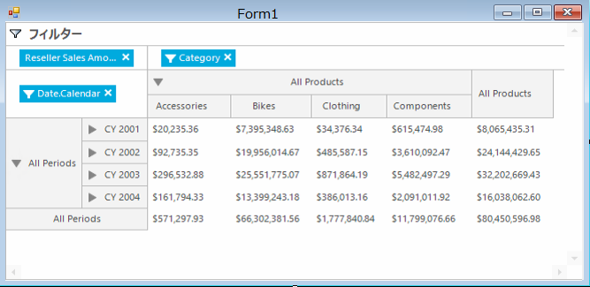

////
|metadata|
{
    "name": "winpivotgrid-using-adomd",
    "controlName": [],
    "tags": [],
    "guid": "9ac27182-3d54-437b-b68d-436ac0f0fa67",
    "buildFlags": [],
    "createdOn": "2014-09-12T02:12:30.8814189Z"
}
|metadata|
////

= ADOMD の使用

== トピックの概要

=== 目的

このトピックでは、ADOMD データ ソースと ADOMD プロバイダーを使用した  _WinPivotGrid_™ データ バインディングを説明します。

=== アプリケーションの要件

アプリケーションが  *.Net Framework 4*  に基づいて作成されたことを確認してください。 *.Net Framework 4 クライアント プロファイル*  は必要な  _System.Web.Extensions_   を含みません。

=== このトピックの内容

このトピックは、以下のセクションで構成されます。

* <<_Ref381022270,ADOMD の使用>>

** <<_Ref398230705,プレビュー>>
** <<_Ref398230657,要件>>
** <<_Ref381022287,ADOMD 設定>>
** <<_Ref398230733,コード>>
** <<_Ref398236798,MdxDataSelector の追加>>

* <<_Ref381022312,関連コンテンツ>>

[[_Ref381022270]]
== ADOMD の使用

[[_Ref398230705]]

=== プレビュー

以下のスクリーンショットは、ADOMD データ バインディング例の結果のプレビューです。

[[_Ref398230657]]

=== 要件

この手順を実行するには、以下が必要です。

[options="header", cols="a,a"]
|====
|要件のカテゴリ|要件の一覧

|アセンブリ
|{ApiPlatform}Olap.Core.v{ProductVersion} 

{ApiPlatform}Olap.DataSource.v{ProductVersion} 

{ApiPlatform}Olap.DataProvider.Adomd.v{ProductVersion} 

{ApiPlatform}Olap.DataSource.Mdx.v{ProductVersion} 

{ApiPlatform}Shared.v{ProductVersion} 

{ApiPlatform}Win.UltraWinPivotGrid.v{ProductVersion} 

{ApiPlatform}Win.v{ProductVersion}

|Using/Imports
|アプリケーション フォームに以下の _Using/Imports_ ステートメントを追加します。 

Infragistics.Olap.Adomd

|====

[[_Ref381022287]]

=== ADOMD 設定

ADOMD データ プロバイダーは、サーバーのデータにアクセスするために link:{ApiPlatform}olap.dataprovider.adomd{ApiVersion}~infragistics.olap.adomd.adomdinitialsettings~connectionstring.html[ConnectionString] プロパティを使用する接続が必須です。

以下の表は、 link:{ApiPlatform}olap.dataprovider.adomd{ApiVersion}~infragistics.olap.adomd.adomdinitialsettings_members.html[AdomdInitialSettings] オブジェクトを使用し、サーバーのデータへの接続を設定するために必要なパラメーターをリストします。認証およびセキュリティのためのオプション パラメーターがありますが、ここには含まれていません。以下のバインディング コード例はこの設定を使用します。

[options="header", cols="a,a"]
|====
|パラメーター|説明

| _provider_ 
|Analysis Services の SQL Server データ プロバイダーが必要な接続で使用されます (現在のバージョンで *オプション* です)。指定したバージョンが必要な場合、このパラメーターを指定する必要があります。 

`"provider=MSOLAP.4;"`

| _data source_ 
|サーバー インスタンスを指定します ( *必須* )。 

`"data source=http://sampledata.infragistics.com/olap/msmdpump.dll;"`

|====

接続文字列を設定し、キューブのディメンション (行、列、メジャー) を含め、以下の設定を構成する必要があります。

[options="header", cols="a,a"]
|====
|パラメーター|説明

| _catalog_ 
|Analysis Services データベース名を指定します ( *必須* )。 

`Catalog = "Adventure Works DW Standard Edition"`

| _cube_ 
|キューブ名 ( *必須* )。 

`Cube = "Adventure Works"`

| _Rows_ 
|行のディメンション。 

`Rows = "[日付].[カレンダー]"`

| _Columns_ 
|列のディメンション。 

`Columns = "[製品].[カテゴリ] "`

| _Measures_ 
|メジャーのディメンション。 

`Measures = "[メジャー].[リセラー販売高]"`

|====

==== 関連リソース:

* link:http://msdn.microsoft.com/en-us/library/dn140245.aspx[接続文字列プロパティ (Analysis Services)]

[[_Ref398230733]]

=== コード

ADOMD データ プロバイダーは、XML for Analysis プロトコルを使用して Microsoft SQL Server Analysis Services にデータを送信します。以下のコード例では、ADOMD を使用してデータを送信するためにピボット グリッドを構成する方法を紹介します。

.注:
[NOTE]
====
このトピックは Infragistics サンプル データを使用します。
====

この例は Infragistics OLAP サーバーからのデータを使用します。

*C# の場合:*

[source,csharp]
----
AdomdInitialSettings settings = new AdomdInitialSettings();
StringBuilder sb = new StringBuilder();
sb.Append("provider=MSOLAP.4;");
sb.Append("data source=http://sampledata.infragistics.com/olap/msmdpump.dll;");
sb.Append("catalog=\"Adventure Works DW Standard Edition\";");
sb.Append("cube=\"Adventure Works\";");
options.ConnectionString = sb.ToString();
settings.Catalog = "Adventure Works DW Standard Edition";
settings.Cube = "Adventure Works";
settings.Rows = "[Date].[Calendar]";
settings.Columns = "[Product].[Category] ";
settings.Measures = "[Measures].[Reseller Sales Amount]";
AdomdDataSource adomdDs = new AdomdDataSource(settings);
ultraPivotGrid1.DataSource = adomdDs;
----

*Visual Basic の場合:*

[source,vb]
----
Dim settings As New AdomdInitialSettings()
Dim sb As New StringBuilder()
sb.Append("provider=MSOLAP.4;")
sb.Append("data source=http://sampledata.infragistics.com/olap/msmdpump.dll;")
sb.Append("catalog=""Adventure Works DW Standard Edition"";")
sb.Append("cube=""Adventure Works"";")
settings.ConnectionString = sb.ToString()
settings.Catalog = "Adventure Works DW Standard Edition"
settings.Cube = "Adventure Works"
settings.Rows = "[Date].[Calendar]"
settings.Columns = "[Product].[Category] "
settings.Measures = "[Measures].[Reseller Sales Amount]"
Dim adomdDs As New AdomdDataSource(settings)
ultraPivotGrid1.DataSource = adomdDs
----

[[_Ref398236798]]

include::winpivotgrid-adding-mdxdataselector.ja-JP.adoc[]

[[_Ref381022312]]
== 関連コンテンツ

=== トピック

このトピックの追加情報については、以下のトピックも合わせてご参照ください。

[options="header", cols="a,a"]
|====
|トピック|目的

| link:winpivotgrid.html[WinPivotGrid]
|このセクションは、Infragistics® Windows Forms® の _WinPivotGrid_™ コントロールについてのトピックを含みます。

| link:winpivotgrid-using-xmla.html[XMLA の使用]
|このトピックでは、XMLA データ ソースと XMLA データ プロバイダーを使用した _WinPivotGrid_™ データ バインディングを紹介します。

| link:winpivotgrid-using-flatdatasource.html[FlatDataSource の使用]
|このトピックでは、FlatDataSource クラスを使用して _WinPivotGrid_™ で _IEnumerable_ データを表示する方法を紹介します。

| link:winpivotgrid-glossary.html[用語集]
|このセクションは、ピボット グリッドのトピックでよく使用される用語を説明します。

|====