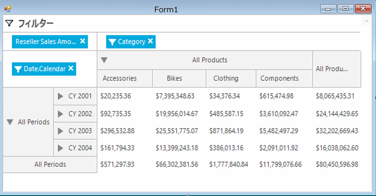

////
|metadata|
{
    "name": "winpivotgrid-using-xmla",
    "controlName": [],
    "tags": [],
    "guid": "92b6f0b7-e773-4e5c-b79e-57c382f8ce49",
    "buildFlags": [],
    "createdOn": "2014-09-12T01:55:23.6634189Z"
}
|metadata|
////

= XMLA の使用

== トピックの概要

=== 目的

このトピックでは、XMLA データ ソースと XMLA データ プロバイダーへの  _WinPivotGrid_™ データ バインディングを説明します。

=== アプリケーションの要件

Windows Forms プロジェクトを開始します。

アプリケーションが  *.Net Framework 4*  に基づいて作成されたことを確認してください。 *.Net Framework 4 クライアント プロファイル*  は必要な  _System.Web.Extensions_   を含みません。

=== このトピックの内容

このトピックは、以下のセクションで構成されます。

* <<_Ref381022240,XMLA の使用>>

** <<_Ref398230515,プレビュー>>
** <<_Ref398230523,要件>>
** <<_Ref381022255,XMLA 設定>>
** <<_Ref381022262,コード>>

* <<_Ref398233342,MdxDataSelector の追加>>
* <<_Ref381022312,関連コンテンツ>>

[[_Ref381022240]]
== XMLA の使用

[[_Ref398230515]]

=== プレビュー

以下のスクリーンショットは、XMLA データ バインディング例の結果のプレビューです。

[[_Ref398230523]]

=== 要件

この手順を実行するには、以下が必要です。

[options="header", cols="a,a"]
|====
|要件のカテゴリ|要件の一覧

|アセンブリ
|{ApiPlatform}Olap.Core.v{ProductVersion} 

{ApiPlatform}Olap.DataSource.v{ProductVersion} 

{ApiPlatform}Olap.DataSource.Xmla.v{ProductVersion} 

{ApiPlatform}Olap.DataSource.Mdx.v{ProductVersion} 

{ApiPlatform}Shared.v{ProductVersion} 

{ApiPlatform}Win.UltraWinPivotGrid.v{ProductVersion} 

{ApiPlatform}Win.v{ProductVersion}

|Using/Imports
|アプリケーション フォームに以下の _Using/Imports_ ステートメントを追加します。 

Infragistics.Olap.Xmla

|====

[[_Ref381022255]]

=== XMLA 設定

XMLA 設定では、キューブのディメンション (行、列、メジャー) を含め以下の構成が必要です。後述のバインディング コード例はこの設定を使用します。

[options="header", cols="a,a"]
|====
|パラメーター|説明

|ServerUrl
|サーバー インスタンスを指定します ( *必須* )。 

`ServerUrl = "http://sampledata.infragistics.com/olap``/msmdpump.dll"`

| _catalog_ 
|Analysis Services データベース名を指定します ( *必須* )。 

`Catalog = "Adventure Works DW Standard Edition"`

| _cube_ 
|キューブ名 ( *必須* )。 

`Cube = "Adventure Works"`

| _Rows_ 
|行のディメンション。 

`Rows = "[日付].[カレンダー]"`

| _Columns_ 
|列のディメンション。 

`Columns = "[製品].[カテゴリ] "`

| _Measures_ 
|メジャーのディメンション。 

`Measures = "[メジャー].[リセラー販売高]"`

|====

[[_Ref381022262]]

=== コード

web 上の規格の多次元データ ソースにアクセスするために使用されます。XMLA は Microsoft SQL Server Analysis Services のネイティブ プロトコルです。

.注:
[NOTE]
====
このトピックは Infragistics サンプル データを使用します。
====

この例は Infragistics OLAP サーバーからのデータを使用します。

*C# の場合:*

[source,csharp]
----
XmlaInitialSettings settings = new XmlaInitialSettings
{
    ServerUrl = "http://sampledata.infragistics.com/olap/msmdpump.dll",
    Catalog = "Adventure Works DW Standard Edition",
    Cube = "Adventure Works",
    Rows = "[Date].[Calendar]",
    Columns = "[Product].[Category]",
    Measures = "[Measures].[Reseller Sales Amount]"
};
XmlaDataSource xmlaDs = new XmlaDataSource(settings);
ultraPivotGrid1.DataSource = xmlaDs;
----

*Visual Basic の場合:*

[source,vb]
----
Dim settings As New XmlaInitialSettings() With { _
      .ServerUrl = "http://sampledata.infragistics.com/olap/msmdpump.dll", _
      .Catalog = "Adventure Works DW Standard Edition", _
      .Cube = "Adventure Works", _
      .Rows = "[Date].[Calendar]", _
      .Columns = "[Product].[Category]", _
      .Measures = "[Measures].[Reseller Sales Amount]" _
}
Dim xmlaDs As New XmlaDataSource(settings)
ultraPivotGrid1.DataSource = xmlaDs
----

[[_Ref398233342]]

include::winpivotgrid-adding-mdxdataselector.ja-JP.adoc[]

[[_Ref381022312]]
== 関連コンテンツ

=== トピック

このトピックの追加情報については、以下のトピックも合わせてご参照ください。

[options="header", cols="a,a"]
|====
|トピック|目的

| link:winpivotgrid.html[WinPivotGrid]
|このセクションは、Infragistics® Windows Forms® の _WinPivotGrid_™ コントロールについてのトピックを含みます。

| link:winpivotgrid-using-adomd.html[ADOMD の使用]
|このトピックでは、ADOMD データ ソースと ADOMD データ プロバイダーへの _WinPivotGrid_™ データ バインディングを紹介します。

| link:winpivotgrid-using-flatdatasource.html[FlatDataSource の使用]
|このトピックでは、FlatDataSource クラスを使用して _WinPivotGrid_™ で _IEnumerable_ データを表示する方法を紹介します。

| link:winpivotgrid-glossary.html[用語集]
|このセクションは、ピボット グリッドのトピックでよく使用される用語を説明します。

|====