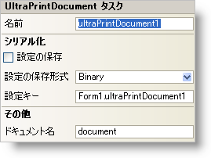

////

|metadata|
{
    "name": "winprintdocument-smart-tag",
    "controlName": ["WinPrintDocument"],
    "tags": ["API","Design Environment","Printing"],
    "guid": "{DBD45B88-8AEA-4B37-A0CA-41EE4B7C59FA}",  
    "buildFlags": [],
    "createdOn": "2005-11-11T00:00:00Z"
}
|metadata|
////

= WinPrintDocument スマート タグ

Visual Studio 2005（.NET Framework 2.0）では、それぞれの {ProductName} コントロール/コンポーネントが固有のスマート タグを備えています。 コントロール/コンポーネントを単に選択すると、Smart Tag のアンカーが表示されます。このアンカーをクリックするとポップアップ パネルが表示され、そこからコントロール/コンポーネントの最もよく使用するプロパティや設定にすばやく簡単にアクセスできます。

WinPrintDocument スマート タグには、コンポーネントの名前と次のセクションがあります。

* その他 -- コントロールの全体的な外観やパフォーマンスを拡張する各種オプションがあります。
* シリアル化 -- Visual Studio 2005 で新しく追加された IPersistComponentSettings インタフェースで使用されるプロパティにすばやくアクセスできます。

各セクションの項目（たとえば、フィールド、ドロップダウン リスト、チェックボックス）およびプロパティ グリッドの項目の対応するプロパティの説明については以下を参照してください。

[options="header", cols="a,a,a"]
|====
|その他|説明|対応するプロパティ

|ドキュメント名
|ユーザーに表示されるドキュメントの名前を入力します。
|DocumentName

|====

[options="header", cols="a,a,a"]
|====
|シリアル化|説明|対応するプロパティ

|設定の保存
|このチェックボックスを選択すると、コンポーネントのプロパティ設定がアプリケーションの設定と共に自動的にロード/保存されます。
| link:{ApiPlatform}win{ApiVersion}~infragistics.win.printing.ultraprintdocument~savesettings.html[SaveSettings]

|設定の保存形式
|コンポーネントの設定をバイナリ形式と XML 形式のどちらで保存するかを選択します。
| link:{ApiPlatform}win{ApiVersion}~infragistics.win.printing.ultraprintdocument~savesettingsformat.html[SaveSettingsFormat]

|設定キー
|ロード/保存する設定値を一意に識別するための設定キーを指定できます。デフォルトで Visual Studio 2005 は、格納側のフォーム/コントロールの名前とコンポーネントの名前に基づいて設定キーの値が設定されます。
| link:{ApiPlatform}win{ApiVersion}~infragistics.win.printing.ultraprintdocument~settingskey.html[SettingsKey]

|====