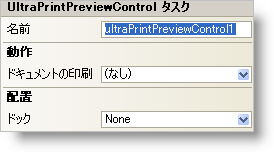

////

|metadata|
{
    "name": "winprintpreview-smart-tag",
    "controlName": ["WinPrintPreviewControl"],
    "tags": ["API","Design Environment","Printing"],
    "guid": "{03F33784-C6D9-4A78-889A-DCD51CC9EF2C}",  
    "buildFlags": [],
    "createdOn": "2005-07-11T00:00:00Z"
}
|metadata|
////

= WinPrintPreview スマート タグ

Visual Studio 2005（.NET Framework 2.0）では、それぞれの {ProductName} コントロール/コンポーネントが固有のスマート タグを備えています。 コントロール/コンポーネントを単に選択すると、Smart Tag のアンカーが表示されます。このアンカーをクリックするとポップアップ パネルが表示され、そこからコントロール/コンポーネントの最もよく使用するプロパティや設定にすばやく簡単にアクセスできます。

WinPrintPreview スマート タグには、以下のセクションと共にコントロールの名前が含まれます。

* 動作 -- フォーム上でのコントロールの動作を制御するプロパティに簡単にアクセスできます。
* レイアウト -- コントロールをフォームのどこに、どのように配置するかを指定するプロパティがあります。

各セクションの項目（たとえば、フィールド、ドロップダウン リスト、チェックボックス）およびプロパティ グリッドの項目の対応するプロパティの説明については以下を参照してください。

[options="header", cols="a,a,a"]
|====
|動作|説明|対応するプロパティ

|ドキュメントの印刷
|PrintDocument コンポーネントをコンポーネント トレイにドロップした後、ドロップダウン リストから PrintDocument コンポーネントを選択できます。
| link:{ApiPlatform}win.misc{ApiVersion}~infragistics.win.printing.ultraprintpreviewcontrol~document.html[Document]

|====

[options="header", cols="a,a,a"]
|====
|レイアウト|説明|対応するプロパティ

|ドッキング
|コントロールを上、右、下、左、全体のどこにドッキングするか、またはどこにもドッキングしないかを選択します。
|Dock

|====