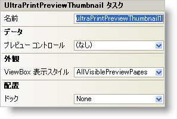

////

|metadata|
{
    "name": "winprintpreviewthumbnail-smart-tag",
    "controlName": ["WinPrintPreviewThumbnail"],
    "tags": ["Getting Started"],
    "guid": "{7CB00471-D1BF-48E3-80E8-1EF0FBE0A981}",  
    "buildFlags": [],
    "createdOn": "2005-07-11T00:00:00Z"
}
|metadata|
////

= WinPrintPreviewThumbnail スマート タグ

Visual Studio 2005（.NET Framework 2.0）では、それぞれの {ProductName} コントロール/コンポーネントが固有のスマート タグを備えています。 コントロール/コンポーネントを単に選択すると、Smart Tag のアンカーが表示されます。このアンカーをクリックするとポップアップ パネルが表示され、そこからコントロール/コンポーネントの最もよく使用するプロパティや設定にすばやく簡単にアクセスできます。

WinPrintPreviewThumbnail スマート タグには、以下のセクションと共にコントロールの名前が含まれます。

* 外観 -- コントロールの外観やルック アンド フィールに関連する一般的なタスクがあります。
* データ -- コントロールが使用している基になるデータ（データ ソースやデータ メンバなど）を参照します。
* レイアウト -- コントロールをフォームのどこに、どのように配置するかを指定するプロパティがあります。

各セクションの項目（たとえば、フィールド、ドロップダウン リスト、チェックボックス）およびプロパティ グリッドの項目の対応するプロパティの説明については以下を参照してください。

[options="header", cols="a,a,a"]
|====
|外観|説明|対応するプロパティ

|ViewBox 表示スタイル
|ビュー ボックスとは、現在 PrintPreview コントロールに表示されている部分を示す、サムネール上の赤いボックスのことです。ビュー ボックスにすべてのプレビュー ページを表示するか、または現在のプレビュー ページのみを表示するかをドロップダウンリストから選択します。あるいは、ビュー ボックスを表示しないように指定することもできます。
| link:{ApiPlatform}win.misc{ApiVersion}~infragistics.win.printing.ultraprintpreviewthumbnail~viewboxdisplaystyle.html[ViewBoxDisplayStyle]

|====

[options="header", cols="a,a,a"]
|====
|データ|説明|対応するプロパティ

|プレビュー コントロール
|フォームにドロップされている PrintPreview コントロールをドロップダウン リストから選択します。選択した PrintPreview コントロールのプレビュー ページがサムネールに表示されます。
| link:{ApiPlatform}win.misc{ApiVersion}~infragistics.win.printing.ultraprintpreviewthumbnail~previewcontrol.html[PreviewControl]

|====

[options="header", cols="a,a,a"]
|====
|レイアウト|説明|対応するプロパティ

|ドッキング
|コントロールを上、右、下、左、全体のどこにドッキングするか、またはどこにもドッキングしないかを選択します。
|Dock

|====