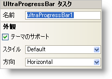

////

|metadata|
{
    "name": "winprogressbar-smart-tag",
    "controlName": ["WinProgressBar"],
    "tags": ["API","Design Environment"],
    "guid": "{FF3EE56B-0F47-47CC-978B-C4D87D99A8A7}",  
    "buildFlags": [],
    "createdOn": "0001-01-01T00:00:00Z"
}
|metadata|
////

= WinProgressBar スマート タグ

Visual Studio 2005（.NET Framework 2.0）では、それぞれの {ProductName} コントロール/コンポーネントが固有のスマート タグを備えています。 コントロール/コンポーネントを単に選択すると、Smart Tag のアンカーが表示されます。このアンカーをクリックするとポップアップ パネルが表示され、そこからコントロール/コンポーネントの最もよく使用するプロパティや設定にすばやく簡単にアクセスできます。

WinProgressBar スマート タグには、以下のセクションと共にコントロールの名前が含まれます。

* 外観 -- コントロールの外観やルック アンド フィールに関連する一般的なタスクがあります。

各セクションの項目（たとえば、フィールド、ドロップダウン リスト、チェックボックス）およびプロパティ グリッドの項目の対応するプロパティの説明については以下を参照してください。

[options="header", cols="a,a,a"]
|====
|外観|説明|対応するプロパティ

|テーマのサポート
|このチェックボックスを選択すると、Microsoft の基本的な OS テーマ（Windows クラシック テーマまたは Windows XP テーマ）がサポートされます。
| link:{ApiPlatform}win{ApiVersion}~infragistics.win.ultracontrolbase~supportthemes.html[SupportThemes]

|方向
|ドロップダウン ボックスから水平または水平を選択して、プログレスバーにテキストを水平または垂直に表示します。
| link:{ApiPlatform}win{ApiVersion}~infragistics.win.ultrawinprogressbar.ultraprogressbar~orientation.html[Orientation]

|スタイル
|WinProgressBar のスタイルを Continuous、Segmented、または SegmentedPartial に変更できます。[テーマのサポート] チェックボックスが選択されている場合、この設定は無視されます。
| link:{ApiPlatform}win{ApiVersion}~infragistics.win.ultrawinprogressbar.ultraprogressbar~style.html[Style]

|====