////

|metadata|
{
    "name": "winradialmenu-adding-radial-menu-using-the-designer",
    "controlName": [],
    "tags": [],
    "guid": "3d6229a9-f7d4-43f9-a68d-fd6245db8f4e",  
    "buildFlags": [],
    "createdOn": "2013-09-15T22:08:58.0357091Z"
}
|metadata|
////

= デザイナーを使用したラジアル メニューの追加

== トピックの概要

=== 目的

このトピックは、コンポーネントのデザイナーを使用した  _WinRadialMenu_™ ツールの追加についての概要を説明します。

=== 前提条件

このトピックを理解するためには、以下のトピックを理解しておく必要があります。

[options="header", cols="a,a"]
|====
|トピック|目的

| link:winradialmenu.html[WinRadialMenu]
|このトピックは、Microsoft の OneNote MX 2013 ラジアル メニューと同様のタッチ操作を完全にサポートする、Windows Forms 用の 2013 Infragistics _WinRadialMenu_ コンポーネントを紹介します。

|====

=== このトピックの内容

このトピックは、以下のセクションで構成されます。

* <<_Ref365798779,概要>>
* <<_Ref365798788,ツールの追加>>
** <<_Ref365798799, _WinRadialMenu_   をフォームに追加>>
** <<_Ref365798806,RadialMenuTool の追加>>
** <<_Ref365798820,RadialMenuColorTool の追加>>
** <<_Ref365798832,RadialMenuNumericTool の追加>>
** <<_Ref365798844,RadialMenuListTool の追加>>

* <<_Ref365798854,関連コンテンツ>>

[[_Ref365798779]]
== 概要

=== 概要

このトピックでは、コンポーネントのデザイナーにより  _WinRadialMenu_™ ツールを追加する方法を学習します。

[[_Ref365798788]]
== ツールの追加

[[_Ref365798799]]

=== WinRadialMenu をフォームに追加

_WinRadialMenu_   コンポーネントはフォームのデザイナーを使用して追加する、またはコードに直接追加できます。いずれの方法も、アプリケーション実行時にコンポーネントを表示するために、引数としてフォームを指定位置で取得する  _Show_   メソッドのオーバーロードを呼び出す必要があります。

デザイナーを使用した  _WinRadialMenu_   の追加

1.新しい Windows Forms プロジェクトを作成します。

2.ツールボックスから link:{ApiPlatform}win.ultrawinradialmenu{ApiVersion}~infragistics.win.ultrawinradialmenu.ultraradialmenu_members.html[UltraRadialMenu] コンポーネントをフォームに追加します。

image::images/Adding_Radial_Menu_Tool_Using_the_Designer_1.png[]

[start=3]
3.コンポーネント上でラジアル メニューのスマート タグ (以下で概説します) を使用してコンポーネントのタスク ダイアログ ウィンドウを表示し、`UltraRadialMenu` のリンクをクリックしてデザイナー ウィンドウを開きます。

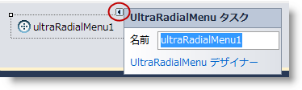

または、コンポーネントを`右クリック`してデザイナー ウィンドウを開き、コンテキスト メニューから [ *ラジアル メニュー デザイナー* ] を選択します。

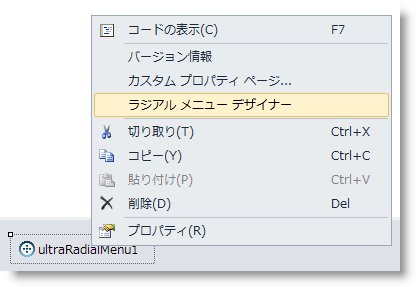

デザイナー ウィンドウ

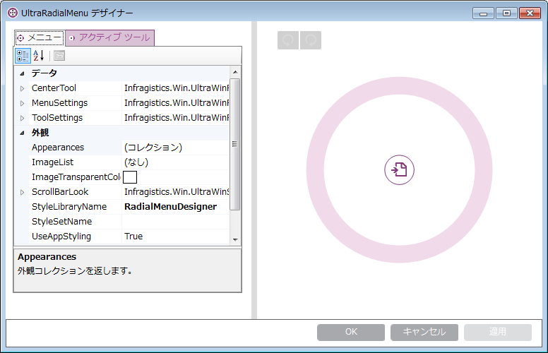

[start=4]
4.マウスをラジアル メニューに移動し、新しいツールを追加する「新しいツール」ウェッジを有効にします。

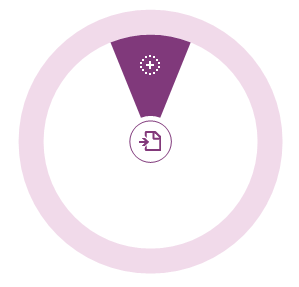

[[_Ref365798806]]

=== RadialMenuTool の追加

link:{ApiPlatform}win.ultrawinradialmenu{ApiVersion}~infragistics.win.ultrawinradialmenu.radialmenutool_members.html[RadialMenuTool] は、すべてのツール タイプの基本クラスです。ボタン ツールは特にコピー、貼り付け、元に戻す、やり直し、太字、斜体のようなツールを表現する link:{ApiPlatform}win.ultrawinradialmenu{ApiVersion}~infragistics.win.ultrawinradialmenu.radialmenutool_members.html[RadialMenuTool] タイプのツールです。トピックのこのセクションでは、コンポーネントのデザイナーを使用してボタン ツールをラジアル メニューに追加することができます。

1.以下のダイアログを表示するメニューで、[ *新しいツール* ] をクリックします。

2.[ *ツールの種類* ] ドロップダウンでボタン ツールを選択します。

3.「 *テキスト* 」 (ツール名) を入力します。

4.[ *画像の編集...* ] ボタンをクリックし画像ソースに移動すると、ツールのアイコンが追加されます。

.注:
[NOTE]
====
ラジアル メニュー ツールの標準画像サイズは 22x22 ピクセルです。このサイズは、必須ではなく推奨サイズです。
====

[start=5]
5.[追加] をクリックします。

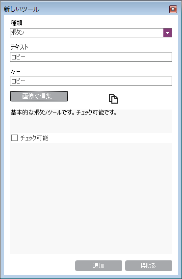

[[_Ref365798820]]

=== RadialMenuColorTool の追加

ダイアログ ウィンドウのオプションは選択したツール タイプにより異なり、ツール タイプに最適なプロパティ設定を可能にします。

ツール タイプの [カラー] を選択して、テキストおよびキーを供給します。[カラー] ツールとして、組み込みの`OneNoteMX style` で有効に設定された`塗りつぶし`、`フォント`、および`強調表示`の 3 つのカラー ツールがデフォルトで用意されています。このツール タイプにはすでに適切なツール アイコンが含まれていますが、[`画像の編集...`] ボタンで変更できます。

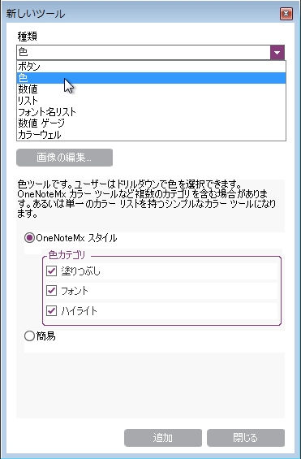

追加した [カラー] ツールです。[OK] をクリックしてデザイナーを閉じます。追加の設定は、オプションでアプリケーションを実行して検証できます。

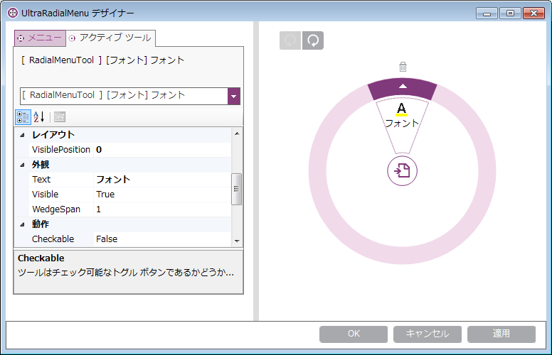

デザイナーでは 2 つの回転ボタンを使用して、ツールを中央ボタンを中心に回転できます。各ツールは、表示された [削除] ボタンを使用して削除できます。

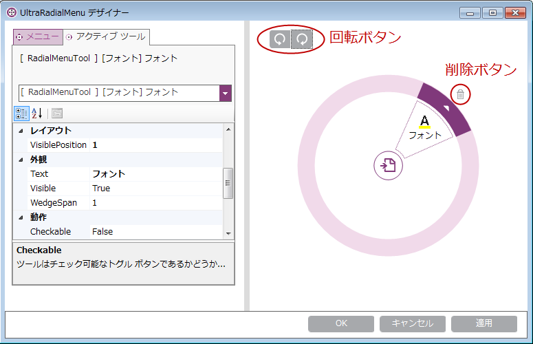

[[_Ref365798832]]

=== RadialMenuNumericTool の追加

数値ツールには数値が必要です。デザイン ダイアログは、数値ゲージ ツールを使用した最初の数値セットを供給します。このトピックでは、数値ツールを使用して表示するフォント サイズを設定します。

メニューの任意の位置を選択し、「新しいツール」ウェッジをクリックして数値ツールを作成します。ダイアログ ウィンドウが表示されます。

ドロップダウンを使用して「数値ツール」を選択します。数値ツールの共通プロパティの一部を入力する設定ダイアログ ウィンドウが表示されます。

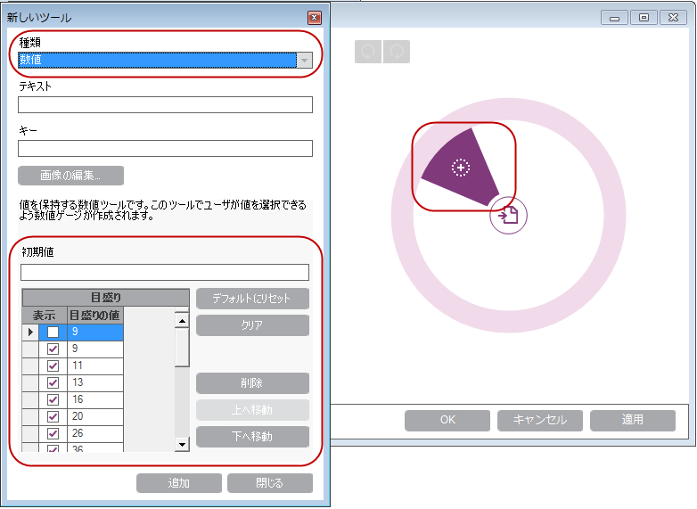

[テキスト] フィールドに入力し、画像をツールに追加します。ダイアログに表示されたデフォルト値に基づき初期値を追加する、または値を編集して、[追加] をクリックします。

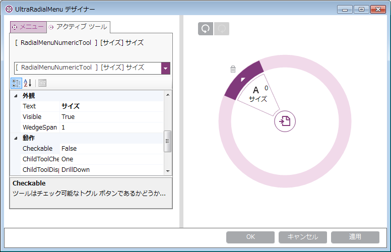

ここで、フォント サイズの数値ツールを追加します。ドリルダウン ボタンをクリックすると、前述の手順で作成した数値のコレクションを表す数値ゲージ ツールが表示されます。

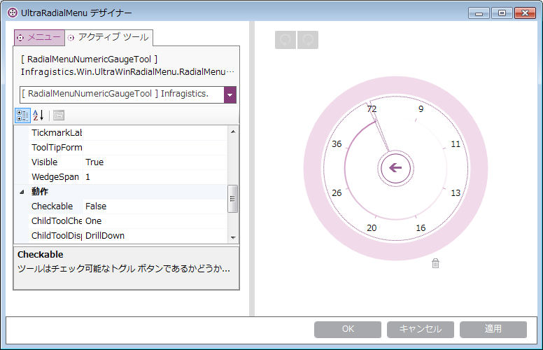

[OK] をクリックしてデザイナーを閉じ、結果を検証するアプリケーションを実行します (オプション)。

[[_Ref365798844]]

=== RadialMenuListTool の追加

リスト ツールは、項目のリストをドロップダウン リストとして作成します。子ツールを含まず、コレクションの項目のみを表示します。

「新しいツール」ウェッジをクリックし、ドロップダウンを使用して「リスト ツール」を選択します。[リスト項目の編集...] ボタンが有効になり、項目のリストが作成できるようになります。

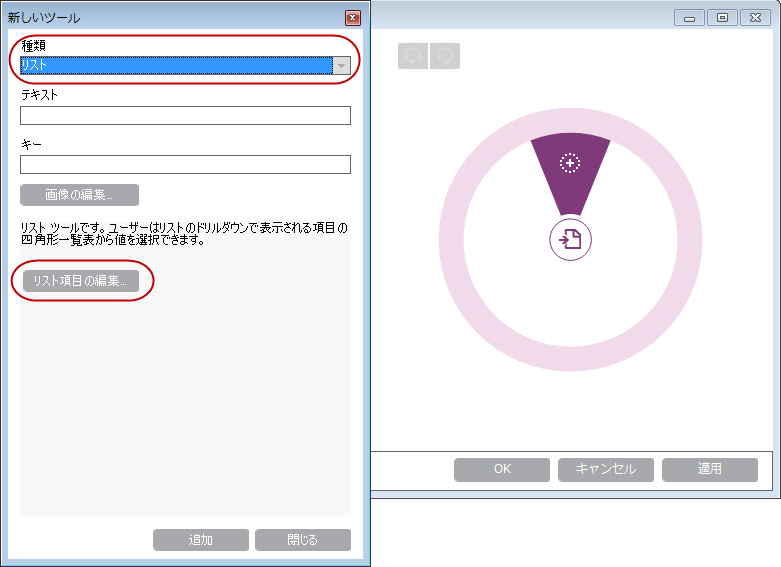

ここで、リスト ツールが追加されます。ドリルダウン ボタンをクリックすると、前述の手順で作成した項目のリストが表示されます。

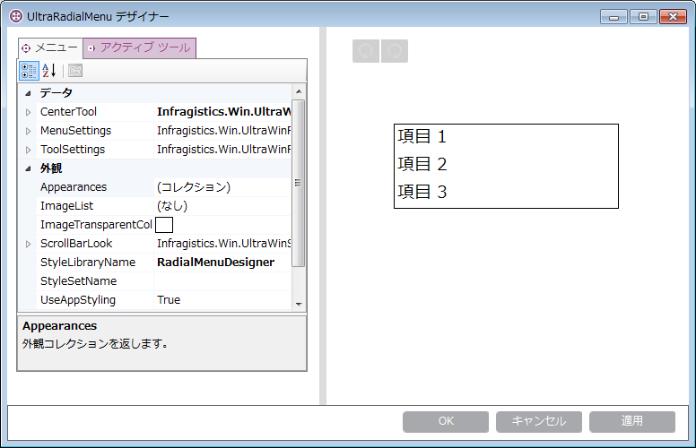

[OK] をクリックしてデザイナーを閉じ、結果を検証するアプリケーションを実行します。

[[_Ref365798854]]
== 関連コンテンツ

=== トピック

このトピックの追加情報については、以下のトピックも合わせてご参照ください。

[options="header", cols="a,a"]
|====
|トピック|目的

| link:winradialmenu-adding-radial-menu-using-the-code-behind.html[コード ビハインドを使用したラジアル メニューの追加]
|このトピックは、コード ビハインドを使用した _UltraRadialMenu_ ツールの追加についての概要を説明します。

|====