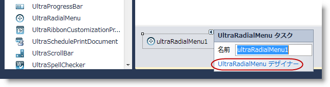
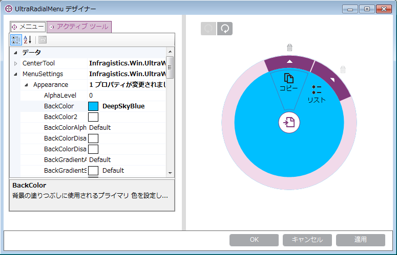
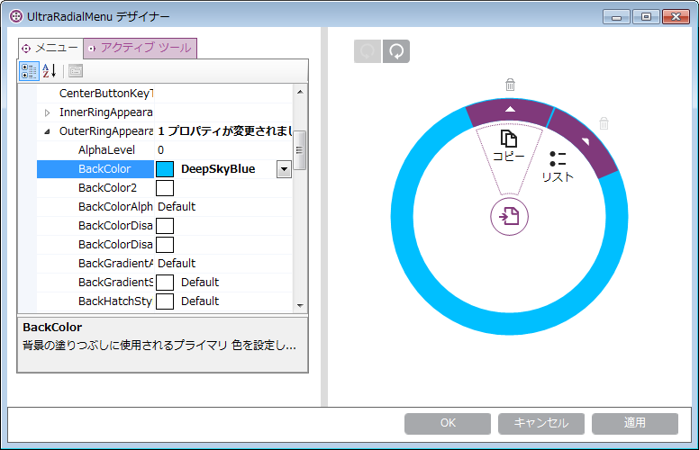
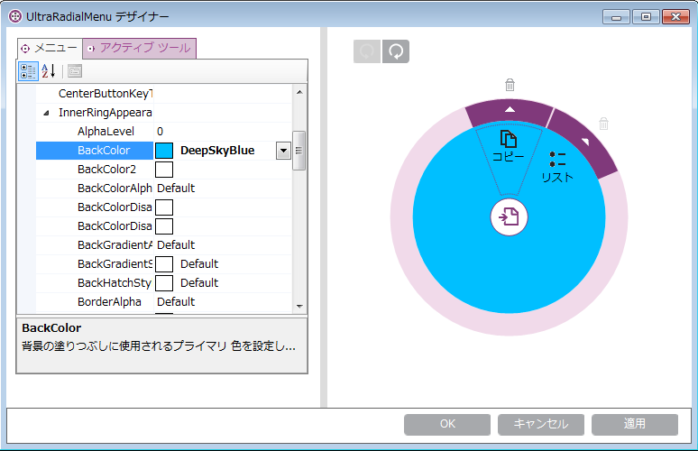
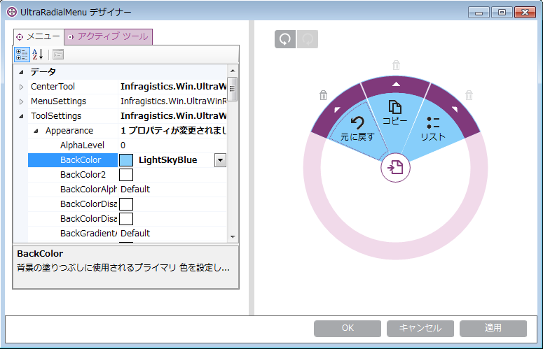
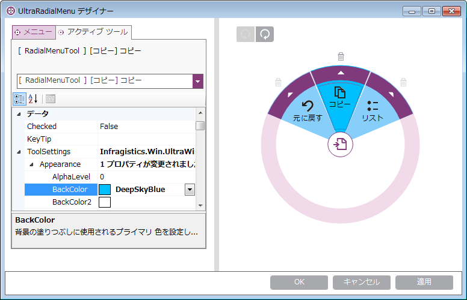
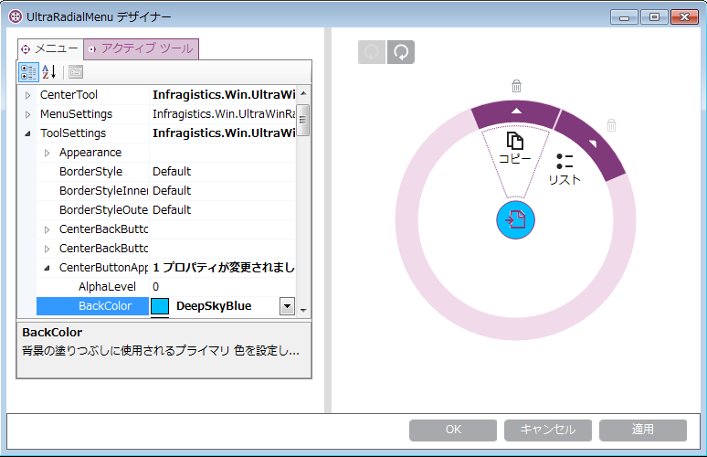
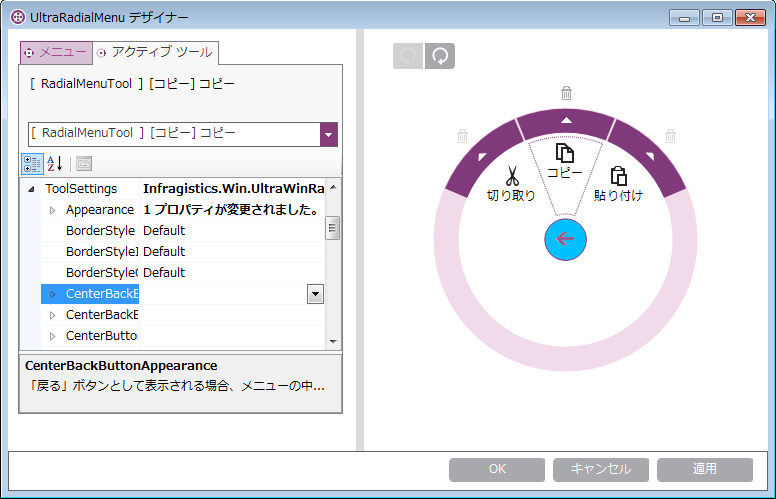
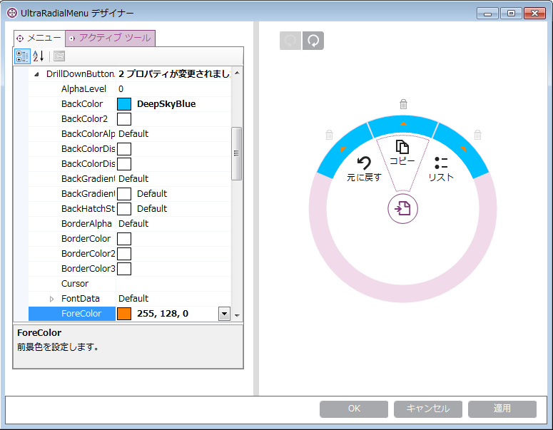

////

|metadata|
{
    "name": "winradialmenu-styling-considerations",
    "controlName": [],
    "tags": [],
    "guid": "d83add34-2904-4958-b200-645fe7526534",  
    "buildFlags": [],
    "createdOn": "2013-09-15T22:12:13.4982534Z"
}
|metadata|
////

= スタイル設定に関する考慮事項

== トピックの概要

=== 目的

このトピックでは、 link:{ApiPlatform}win.ultrawinradialmenu{ApiVersion}~infragistics.win.ultrawinradialmenu.ultraradialmenu_members.html[UltraRadialMenu]™ コンポーネントの視覚要素を示し、Infragistics  _AppStyling_   Framework を使用して別の要素をスタイル設定する方法を説明します。

=== 前提条件

このトピックを理解するためには、以下のトピックを理解しておく必要があります。

[options="header", cols="a,a"]
|====
|トピック|目的

| link:winradialmenu.html[WinRadialMenu]
|このトピックは、Microsoft の OneNote MX 2013 ラジアル メニューと同様のタッチ操作を完全にサポートする、Windows Forms 用の 2013 Infragistics _WinRadialMenu_ コンポーネントを紹介します。

|====

=== このトピックの内容

このトピックは、以下のセクションで構成されます。

* <<_Ref364618680,はじめに>>
* <<_Ref364618690, _WinRadialMenu_   のスタイル設定>>
** <<_Ref364618720,AppStylist を使用した  _WinRadialMenu_   のスタイル設定>>
** <<_Ref364618793,プロパティ設定を使用した  _WinRadialMenu_   のスタイル設定>>

* <<_Ref367035763,MenuSettings>>
** <<_Ref364618815,Appearance>>
** <<_Ref364618825,OuterRingAppearance>>
** <<_Ref364618835,InnerRingAppearance>>

* <<_Ref364618996,ToolSettings>>
** <<_Ref364859460,RadialMenu の ToolSettings による外観>>
** <<_Ref364859473,Tool の ToolSettings による外観>>
** <<_Ref364618857,CenterButtonAppearance>>
** <<_Ref364618906,CenterBackButtonAppearance>>
** <<_Ref364619038,DrillDownButtonAppearance>>

* <<_Ref364619047,関連コンテンツ>>

[[_Ref364618680]]
== はじめに

=== はじめに

_WinRadialMenu_   コンポーネントは、視覚要素の外観をスタイル設定するさまざまな方法を提供します。各要素には、プロパティの設定で外観を変更する外観プロパティが含まれています。 _WinRadialMenu_   は  _AppStylist_   もサポートしているため、希望するスタイルで各要素のスタイル設定ライブラリ ファイルを作成し、ラジアル メニュー コンポーネントのテーマ ファイルとして保存できます。

[[_Ref364618690]]
== _WinRadialMenu_   のスタイル設定

[[_Ref364618720]]

=== AppStylist を使用した WinRadialMenu のスタイル設定

link:{ApiPlatform}win.ultrawinradialmenu{ApiVersion}~infragistics.win.ultrawinradialmenu.ultraradialmenu_members.html[UltraRadialMenu] コンポーネントは、さまざまなスタイル オプションを提供する _AppStylist_   をサポートしています。スタイル設定オプションでは、例えば定義済のスタイル設定ライブラリ ファイルの 1 つを使用することも、異なるルック アンド フィールのために既存のテンプレートをカスタマイズすることも、さらに _AppStylist_   を使用して独自のライブラリ ファイルを作成することもできます。

詳細は、 を使用したラジアル メニューまたはその他の  _{ProductName}_   コントロール全般のスタイル ライブラリ ファイルの作成方法を説明する、 link:styling-guide-setting-up-your-application-for-styling.html[スタイル設定を行う場合のユーザー アプリケーションの設定]のトピックを参照してください。

[[_Ref364618793]]

=== プロパティ設定を使用した WinRadialMenu のスタイル設定

ラジアル メニュー コンポーネントの要素をスタイル設定するには、いくつかの方法があります。1) フォームのデザイナーを使用する。2) コード ビハインドを使用して、コンポーネントの外観プロパティを設定する。

コンポーネントをフォームにドロップして、フォームの一番下のコンポーネント トレイに配置します。次に、 *UltraRadialMenu デザイナー*  リンクを使用して、デザイン タイム ダイアログ ウィンドウを開きます。

[[_Ref367035763]]
== MenuSettings

[[_Ref364618815]]

=== 外観

link:{ApiPlatform}win.ultrawinradialmenu{ApiVersion}~infragistics.win.ultrawinradialmenu.menusettings_members.html[MenuSettings] はツールではなく、メニューに直接作用するプロパティを持つオブジェクトです。MenuSettings を使用してラジアル メニューの外観を設計します。

以下のスクリーンショットに示すデザイン タイム ダイアログ ウィンドウで link:{ApiPlatform}win.ultrawinradialmenu{ApiVersion}~infragistics.win.ultrawinradialmenu.menusettings_members.html[MenuSettings] プロパティを設定してラジアル メニューの外観をカスタマイズできます。

MenuSettings で設定した同じ外観をコード ビハインドで設定することもできます。例:

*C# の場合:*

[source,csharp]
----
ultraRadialMenu1.MenuSettings.Appearance.BackColor = Color.DeepSkyBlue;
----

*Visual Basic の場合:*

[source,vb]
----
ultraRadialMenu1.MenuSettings.Appearance.BackColor = Color.DeepSkyBlue
----

[[_Ref364618825]]

=== OuterRingAppearance

ラジアル メニュー コンポーネントの link:{ApiPlatform}win.ultrawinradialmenu{ApiVersion}~infragistics.win.ultrawinradialmenu.menusettings~outerringappearance.html[OuterRingAppearance] のデザイン タイム設定の表示

コード ビハインドの例:

*C# の場合:*

[source,csharp]
----
ultraRadialMenu1.MenuSettings.OuterRingAppearance.BackColor = Color.DeepSkyBlue;
----

*Visual Basic の場合:*

[source,vb]
----
ultraRadialMenu1.MenuSettings.OuterRingAppearance.BackColor = Color.DeepSkyBlue
----

[[_Ref364618835]]

=== InnerRingAppearance

ラジアル メニュー コンポーネントの link:{ApiPlatform}win.ultrawinradialmenu{ApiVersion}~infragistics.win.ultrawinradialmenu.menusettings~innerringappearance.html[InnerRingAppearance] のデザイン タイム設定の表示

コード ビハインドの例:

*C# の場合:*

[source,csharp]
----
ultraRadialMenu1.MenuSettings.InnerRingAppearance.BackColor = Color.DeepSkyBlue;
----

*Visual Basic の場合:*

[source,vb]
----
ultraRadialMenu1.MenuSettings.InnerRingAppearance.BackColor = Color.DeepSkyBlue
----

[[_Ref364618996]]
== ToolSettings

[[_Ref364618845]]

=== RadialMenu の ToolSettings による外観

_RadialMenu_   とツールの両方に link:{ApiPlatform}win.ultrawinradialmenu{ApiVersion}~infragistics.win.ultrawinradialmenu.toolsettings_members.html[ToolSettings] プロパティがあります。例えば、

* _RadialMenu_   では、 link:{ApiPlatform}win.ultrawinradialmenu{ApiVersion}~infragistics.win.ultrawinradialmenu.toolsettings_members.html[ToolSettings] プロパティがすべてのツールに影響を及ぼします。

* 各ツールに影響を及ぼすツールでは、 link:{ApiPlatform}win.ultrawinradialmenu{ApiVersion}~infragistics.win.ultrawinradialmenu.toolsettings_members.html[ToolSettings] プロパティが  _RadialMenu_   による設定をオーバーライドできます。

_RadialMenu_   の link:{ApiPlatform}win.ultrawinradialmenu{ApiVersion}~infragistics.win.ultrawinradialmenu.toolsettings_members.html[ToolSettings] のデザイン タイム設定の表示。この表示は、メニューのすべてのツールに適用されます。

コード ビハインドの例：

*C# の場合:*

[source,csharp]
----
ultraRadialMenu1.ToolSettings.Appearance.BackColor = Color.LightSkyBlue;
----

*Visual Basic の場合:*

[source,vb]
----
ultraRadialMenu1.ToolSettings.Appearance.BackColor = Color.LightSkyBlue
----

[[_Ref364859473]]

=== Tool の ToolSettings による外観

Copy ツールのみの link:{ApiPlatform}win.ultrawinradialmenu{ApiVersion}~infragistics.win.ultrawinradialmenu.toolsettings_members.html[ToolSettings] のデザイン タイム設定の表示。この表示は _RadialMenu_   による設定をオーバーライドします。

コード ビハインドの例：

*C# の場合:*

[source,csharp]
----
ultraRadialMenu1.CenterTool.Tools["Copy"].ToolSettings.Appearance.BackColor = Color.DeepSkyBlue;
----

*Visual Basic の場合:*

[source,vb]
----
ultraRadialMenu1.CenterTool.Tools("Copy").ToolSettings.Appearance.BackColor = Color.DeepSkyBlue
----

[[_Ref364618857]]

=== CenterButtonAppearance

ラジアル メニューの link:{ApiPlatform}win.ultrawinradialmenu{ApiVersion}~infragistics.win.ultrawinradialmenu.toolsettings~centerbuttonappearance.html[CenterButtonAppearance] のデザイン タイム設定の表示この表示は、サブメニューの中心の [戻る] ボタンではなく、常に中央ボタンに影響します。

コード ビハインドの例：

*C# の場合:*

[source,csharp]
----
ultraRadialMenu1.ToolSettings.CenterButtonAppearance.BackColor = Color.DeepSkyBlue;
----

*Visual Basic の場合:*

[source,vb]
----
ultraRadialMenu1.ToolSettings.CenterButtonAppearance.BackColor = Color.DeepSkyBlue
----

[[_Ref364618906]]

=== CenterBackButtonAppearance

ラジアル メニューの link:{ApiPlatform}win.ultrawinradialmenu{ApiVersion}~infragistics.win.ultrawinradialmenu.toolsettings~centerbackbuttonappearance.html[CenterBackButtonAppearance] のデザイン タイム設定の表示この表示は、サブメニューに [戻る] ボタンとして表示された場合に、中央ボタンに影響します。

[[_Ref364619038]]

=== DrillDownButtonAppearance

`ForeColor` の設定による、ラジアル メニュー ツールの link:{ApiPlatform}win.ultrawinradialmenu{ApiVersion}~infragistics.win.ultrawinradialmenu.toolsettings~drilldownbuttonappearance.html[DrillDownButtonAppearance] のデザイン タイム設定の表示

コード ビハインドの例：

*C# の場合:*

[source,csharp]
----
ultraRadialMenu1.ToolSettings.DrillDownButtonAppearance.BackColor = Color.DeepSkyBlue;
ultraRadialMenu1.ToolSettings.DrillDownButtonAppearance.ForeColor = Color.Orange;
----

*Visual Basic の場合:*

[source,vb]
----
ultraRadialMenu1.ToolSettings.DrillDownButtonAppearance.BackColor = Color.DeepSkyBlue
ultraRadialMenu1.ToolSettings.DrillDownButtonAppearance.ForeColor = Color.Orange
----

[[_Ref364619047]]
== 関連コンテンツ

=== トピック

以下のトピックでは、このトピックに関連する追加情報を提供しています。

[options="header", cols="a,a"]
|====
|トピック|目的

| link:winradialmenu-winradialmenu-tools.html[WinRadialMenu のツール]
|このグループのトピックでは、コンポーネントのデザイナーまたはコード ビハインドを使用して、ラジアル メニューのツールを追加する方法を説明します。

| link:winradialmenu.html[WinRadialMenu]
|このセクションには、 _WinRadialMenu_ コンポーネントを使用する方法についての特定のヘルプ トピックのリストが含まれています。

|====