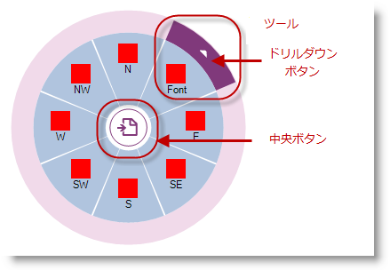

////

|metadata|
{
    "name": "winradialmenu-winradialmenu-component",
    "controlName": [],
    "tags": [],
    "guid": "4e0d74c3-5909-4f80-bb64-c538500d0eef",  
    "buildFlags": [],
    "createdOn": "2013-09-15T21:50:06.7245893Z"
}
|metadata|
////

= WinRadialMenu コンポーネント

== トピックの概要

=== 目的

このトピックは、Microsoft の OneNote MX 2013 ラジアル メニューと同様のタッチ操作を完全にサポートする、Windows Forms 用の 2013 Infragistics  _WinRadialMenu™_   コンポーネントを紹介します。

=== このトピックの内容

このトピックは、以下のセクションで構成されます。

* <<_Ref364619164,概要>>
* <<_Ref364619169,用語>>
** <<_Ref364619179,中央ボタン>>
** <<_Ref364619190,中央ツール>>
** <<_Ref364619198,内部リング>>
** <<_Ref364619214,外部リング>>
** <<_Ref364619222,ウェッジ>>
** <<_Ref364619234,ツール>>

* <<_Ref364619307,関連コンテンツ>>

[[_Ref364619164]]
== 概要

=== 概要

_WinRadialMenu_   コンポーネントは外観および機能をカスタマイズできる点が、マイクロソフトの  _OneNote MX 2013_   ラジアル メニューに類似しています。コンポーネントのデザインは、ツール内部でツールおよびツール コレクションがツリー構造になっています。

異なる機能や設定のアプリケーションで複数の  _WinRadialMenu_   コンポーネントを表示でき、タッチ対応画面での *マウス* 、 *キーボード* 、および *タッチ* の操作をサポートします。

以下のコード例は、コンポーネントをフォームに追加した後に  _WinRadialMenu_   を表示する方法を示しています。最初に含まれているのは中央ボタンのみです。

*C# の場合:*

[source,csharp]
----
ultraRadialMenu1.Show(this, new Point(Bounds.Right, Bounds.Top));
----

*Visual Basic の場合:*

[source,vb]
----
ultraRadialMenu1.Show(Me, New Point(Bounds.Right, Bounds.Top))
----

image::images/WinRadialMenu_Component_1.png[]

[[_Ref364619169]]
== 用語

[[_Ref364619179]]

=== 中央ボタン

メニューの展開および折りたたみに使用する中央ボタンは、常にラジアル メニューの中央あります。折りたたんだ状態の場合は、ボタンのみが表示されます。メニューやサブメニューを展開して表示すると、中央ボタンの外観は中央ツールによって決定されます。

[options="header", cols="a,a"]
|====
|説明|中央ボタン

|「展開」および「折りたたみ」機能を持つ中央ボタンのメイン メニューでのデフォルトの外観
|image::images/WinRadialMenu_Component_2.png[]

|「戻る」機能を持つ中央ボタンのサブメニューでのデフォルトの外観
|image::images/WinRadialMenu_Component_3.png[]

|====

[[_Ref364619190]]

=== 中央ツール

ラジアル メニューの中央に位置する中央ボタンを中央ツールとして使用して中央ボタンの外観および動作を決定し、中央ツールの子孫ツールをウェッジとして中央ボタンの周辺に配置します。中央ツールが親のルート ツールの場合、中央ボタンをクリックするとメニューを展開または折りたたみます。中央ツールに親のツールがある場合は「戻る」ボタンとして動作し、前のツール セットのメニューに戻ります。

[[_Ref364619198]]

=== 内部リング

内部リングは以下の図で白色で描画され、外部リングと中央ボタンの間の領域になります。内部リングは、ウェッジのコンテナーとして機能し中央ツールの子孫ツールを示します。

[[_Ref364619214]]

=== 外部リング

以下の図のピンクで描画された外部リングは、 _WinRadialMenu_   の一番外側のリングでツールおよびドリルダウン ボタンが表示される領域です。以下のスクリーンショットは外部リングと内部リングを示しています。

[[_Ref364619222]]

=== ウェッジ

「ウェッジ」はラジアル メニューの円形状のセグメントで、ツールを含む場合と含まない場合があります。 _WinRadialMenu_   はデフォルトで、羅針図上の 8 つの基本方位である N、NE、E、SE、S、SW、W、NW と同様の 8 個のウェッジを表示します。デフォルトでは、最初のウェッジが常に上にあり ( _VisiblePosition_   = 0)、その後のウェッジが時計方向に追加されていきます。

以下のスクリーンショットは、定義されたウェッジの 2 つの異なるビューと、ウェッジが占めるツールの数に基づくコンポーネントの動作を示しています。説明のためにウェッジを彩色していますが、デフォルトのウェッジの背景は白色です。

[options="header", cols="a,a"]
|====
|8 つのツールがある 8 個のウェッジ|4 つのツールがある 8 個のウェッジ

|image::images/WinRadialMenu_Component_4.png[]
|image::images/WinRadialMenu_Component_5.png[]

|====

.注:
[NOTE]
====
ウェッジの数は、コンポーネント上のみで変更でき、ツールに基づいて変化しません。例:
====

`ultraRadialMenu1.MenuSettings.WedgeCount = 4;`

==== 重要:

link:{ApiPlatform}win.ultrawinradialmenu{ApiVersion}~infragistics.win.ultrawinradialmenu.menusettings~wedgecount.html[WedgeCount] の link:{ApiPlatform}win.ultrawinradialmenu{ApiVersion}~infragistics.win.ultrawinradialmenu.menusettings_members.html[MenuSettings] は、コンポーネントに対してのみに存在しツールに対しては存在しません。 link:{ApiPlatform}win.ultrawinradialmenu{ApiVersion}~infragistics.win.ultrawinradialmenu.menusettings~wedgecount.html[WedgeCount] を異なる数に設定すると、サブメニューのウェッジ数にも影響します。

[[_Ref364619234]]

=== ツール

ツールは、ツール タイプを表示するためにウェッジ内に配置することができるオブジェクトです。中央ボタンもツールと考えることができます。

メイン メニューの中央に位置する中央ボタンで、ラジアル メニューを展開したり折りたたんだりします。折りたたまれたビューでは、常に中央ボタンのみが表示されます。

ツールの端に表示された各ツールのドリルダウン ボタンは、子ツールを含むそのツールのサブメニューを開くために使用できます。子ツールのないツールにはドリルダウン ボタンは表示されません。

.注:
[NOTE]
====
ツールのツールチップは、ツールのテキスト プロパティを使用してラジアル メニューの上に表示されます。ツールのテキスト プロパティに何もない場合、ツールチップは明示的に指定されない限りブランクになります。
====

親メニューに戻るための [戻る] ボタンが中央にある、子ツールのセットを表示するサブメニュー

image::images/WinRadialMenu_Component_7.png[]

[[_Ref364619307]]
== 関連コンテンツ

=== トピック

このトピックの追加情報については、以下のトピックも合わせてご参照ください。

[options="header", cols="a,a"]
|====
|トピック|目的

| link:winradialmenu.html[WinRadialMenu]
|このセクションには、 _WinRadialMenu_ コンポーネントについてのヘルプ トピックが含まれています。

|====