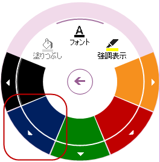
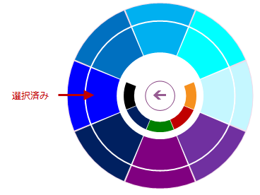
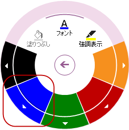
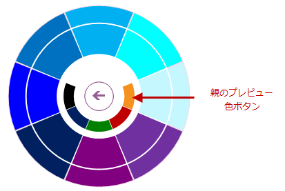

////
|metadata|
{
    "name": "winradialmenu-winradialmenu-events",
    "controlName": [],
    "tags": [],
    "guid": "78470b1a-d23d-426d-b599-c44eedfbfb07",
    "buildFlags": [],
    "createdOn": "2013-09-15T21:55:19.9259063Z"
}
|metadata|
////

= WinRadialMenu のイベント

== トピックの概要

=== 目的

このトピックでは、 _WinRadialMenu_   _™_   コンポーネントの一般的なイベントの概要を提供します。

[[_Ref365461034]]
== イベントの概要

[options="header", cols="a,a,a"]
|====
|イベント名|説明|キャンセル可能

| link:{ApiPlatform}win.ultrawinradialmenu{ApiVersion}~infragistics.win.ultrawinradialmenu.ultraradialmenu~toolclick_ev.html[ToolClick]
|ツールがクリックされたときに、このイベントが発生します。
|いいえ

| link:{ApiPlatform}win.ultrawinradialmenu{ApiVersion}~infragistics.win.ultrawinradialmenu.ultraradialmenu~toolcolorchanged_ev.html[ToolColorChanged]
|このイベントは以下の操作を実行したときに発生します。 

. カラー選択がユーザー インターフェイス (UI) から変更された場合 (フォント ツールがドキュメントのスタイル設定のカラー ツールを公開など)。カラーの選択により、このイベントが発生します。 
+
. 以下のコードを実行して、カラー プロパティがコード ビハインドから変更された場合。 
+
*C# の場合:*
+
[source,csharp]
var cTool = (RadialMenuColorTool)ultraRadialMenu1.CenterTool.Tools["Color"].Tools["Fill"]; 
if (cTool != null)  cTool.Color = Color.BlueViolet; 
+
. ColorWell ツールの選択が変更された場合。 

.注: 
[NOTE] 
各 `ColorWell` ツールには `ColorWell` の子コレクションが含まれ、カラーの変更が連鎖的に伝達されます。たとえば、子の `ColorWell` ツールの選択が変更された場合、親の `ColorWell` ツールのカラーが変更されます。 

以下のスクリーンショットのステップで、より分かりやすく示しています。 

親の `ColorWell` ツールの`青`のカラー ツールは複数段階の網掛けで構成され、`ColorWell` ツールの子コレクションにドリル ダウンします。 

 

`ColorWell` ツールの子コレクションで異なる網掛けの`青`が選択されると、この選択 (下図) により選択したツールでイベントが発生し、ツールの親へと連鎖的に伝達されます。 

 

選択が(上図) 子の `ColorWell`で行われた後、親メニューに戻り、親メニューで変更されたカラーが表示されます。 

|いいえ

| link:{ApiPlatform}win.ultrawinradialmenu{ApiVersion}~infragistics.win.ultrawinradialmenu.ultraradialmenu~toolcheckedchanging_ev.html[ToolCheckedChanging]
|ユーザー インターフェイス (UI) からチェック可能なツールの「チェック」と「チェック解除」の状態を切り替えると、このイベントが発生します。ツールの link:{ApiPlatform}win.ultrawinradialmenu{ApiVersion}~infragistics.win.ultrawinradialmenu.radialmenutool~checkable.html[Checkable] プロパティで無効 (`false`) を設定し、このイベントが発生しないようにします。 

以下のように、コード ビハインドでツールの Checked プロパティを変更した場合も、このイベントが発生します。 

*C# の場合:*

[source,csharp]
 
RadialMenuTool tool = ultraRadialMenu1.CenterTool.Tools["Copy"]; 
if (tool != null)  tool.Checked = true; 

|はい

| link:{ApiPlatform}win.ultrawinradialmenu{ApiVersion}~infragistics.win.ultrawinradialmenu.ultraradialmenu~toolcheckedchanged_ev.html[ToolCheckedChanged]
|変更をコミットするために UI から link:{ApiPlatform}win.ultrawinradialmenu{ApiVersion}~infragistics.win.ultrawinradialmenu.ultraradialmenu~toolcheckedchanging_ev.html[ToolCheckedChanging] イベントを実行すると、チェック可能なツールでこのイベントが発生します。 

link:{ApiPlatform}win.ultrawinradialmenu{ApiVersion}~infragistics.win.ultrawinradialmenu.ultraradialmenu~toolcheckedchanging_ev.html[ToolCheckedChanging] イベントがキャンセルされた場合、このイベントは発生しません。
|いいえ

| link:{ApiPlatform}win.ultrawinradialmenu{ApiVersion}~infragistics.win.ultrawinradialmenu.ultraradialmenu~listtoolselectedvaluechanged_ev.html[ListToolSelectedValueChanged]
|`ListTool` で項目を選択すると、このイベントが発生します。 

項目はドロップダウン リストやキーボードの上下の矢印キーから選択でき、各項目を選択するとイベントが発生します。項目選択後に [Enter] キーを押し、選択内容をコミットします。 

このイベントは、コード内で項目が変更された場合にも発生します。たとえば、以下のコードで選択項目を設定して 2 番目のパラメーター (`true`) を使用すると、イベントが実行されます。 

*C# の場合:*

[source,csharp]

var listTool = (RadialMenuListTool)ultraRadialMenu1.CenterTool.Tools["List"];
if (listTool != null)  listTool.SetSelectedValue("Item2", true); 

|いいえ

| link:{ApiPlatform}win.ultrawinradialmenu{ApiVersion}~infragistics.win.ultrawinradialmenu.ultraradialmenu~listtoolselectedvaluecommitted_ev.html[ListToolSelectedValueCommitted]
|このイベントは、 link:{ApiPlatform}win.ultrawinradialmenu{ApiVersion}~infragistics.win.ultrawinradialmenu.ultraradialmenu~listtoolselectedvaluechanged_ev.html[ListToolSelectedValueChanged] イベントの実行後に発生します。 

この順番でイベントが発生する理由は、項目選択時に、ドロップダウンで 1 つの項目をクリックするよりも、キーボードの矢印キーを使用した場合、項目が選択されるまでに何度も矢印キーが使用されるためです。項目変更のたびに、 link:{ApiPlatform}win.ultrawinradialmenu{ApiVersion}~infragistics.win.ultrawinradialmenu.ultraradialmenu~listtoolselectedvaluechanged_ev.html[ListToolSelectedValueChanged] イベントが実行されます。項目選択後に [Enter] キーを押した場合にも、発生します。
|いいえ

| link:{ApiPlatform}win.ultrawinradialmenu{ApiVersion}~infragistics.win.ultrawinradialmenu.ultraradialmenu~drilldownbuttonclick_ev.html[DrillDownButtonClick]
|ツールのドリルダウン ボタンをクリックすると、このイベントが発生します。
|いいえ

| link:{ApiPlatform}win.ultrawinradialmenu{ApiVersion}~infragistics.win.ultrawinradialmenu.ultraradialmenu~centerbuttonclick_ev.html[CenterButtonClick]
|`RadialMenu`の中央ボタンをクリックすると、このイベントが発生します。 

以下の操作により、このイベントの実行が発生します。 

1.メイン メニューの中央ボタンは、以下の 2 つの機能を実行します。展開と縮小 

image::images/WinRadialMenu_Events_4.png[] 

2.[戻る] ボタン (同様に中央ボタン) は、親メニューに戻る際に使用します。 

image::images/WinRadialMenu_Events_5.png[] 

3.`ColorWell` ツールの [親プレビュー カラー] ボタン (中央ボタン) も [戻る]ボタンと同様に機能し、このイベントが発生します。 

|いいえ

| link:{ApiPlatform}win.ultrawinradialmenu{ApiVersion}~infragistics.win.ultrawinradialmenu.ultraradialmenu~beforeperformaction_ev.html[BeforePerformAction]
|キーボードの操作により、このイベントが発生します。このイベントは、ラジアル メニューの link:{ApiPlatform}win.ultrawinradialmenu{ApiVersion}~infragistics.win.ultrawinradialmenu.ultraradialmenu~keyactionmappings.html[KeyActionMappings] に対応しています。
|はい

| link:{ApiPlatform}win.ultrawinradialmenu{ApiVersion}~infragistics.win.ultrawinradialmenu.ultraradialmenu~afterperformaction_ev.html[AfterPerformAction]
|キーボード操作を終了すると、 link:{ApiPlatform}win.ultrawinradialmenu{ApiVersion}~infragistics.win.ultrawinradialmenu.ultraradialmenu~beforeperformaction_ev.html[BeforePerformAction] イベントの後でこのイベントが発生します。 link:{ApiPlatform}win.ultrawinradialmenu{ApiVersion}~infragistics.win.ultrawinradialmenu.ultraradialmenu~beforeperformaction_ev.html[BeforePerformAction] イベントがキャンセルされると、このイベントは発生しません。
|いいえ

|====

[[_Ref364619504]]
== 関連コンテンツ

=== トピック

このトピックの追加情報については、以下のトピックも合わせてご参照ください。

[options="header", cols="a,a"]
|====
|トピック|目的

| link:winradialmenu.html[WinRadialMenu]
|このセクションには、WinRadialMenu コンポーネントについてのヘルプ トピックが含まれています。

|====