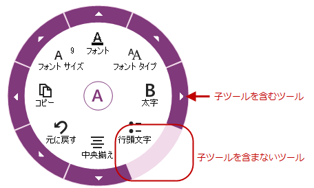
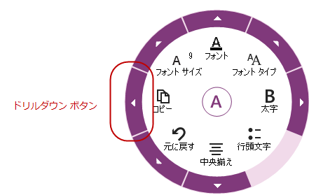
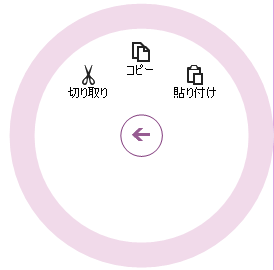
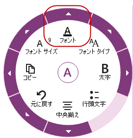
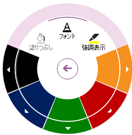
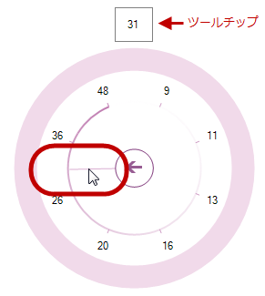
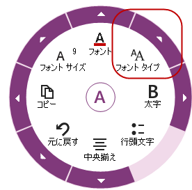

////

|metadata|
{
    "name": "winradialmenu-winradialmenu-tools",
    "controlName": [],
    "tags": [],
    "guid": "c3ce7892-4649-44bd-8a39-749606de12ed",  
    "buildFlags": [],
    "createdOn": "2013-09-15T21:51:05.3924555Z"
}
|metadata|
////

= WinRadialMenu のツール

== トピックの概要

=== 目的

このトピックは、 _WinRadialMenu_   コンポーネントのツール タイプの概要について紹介します。

=== 前提条件

このトピックを理解するためには、以下のトピックを理解しておく必要があります。

[options="header", cols="a,a"]
|====
|トピック|目的

| link:winradialmenu.html[WinRadialMenu]
|このトピックは、Microsoft の OneNote MX 2013 ラジアル メニューと同様のタッチ操作を完全にサポートする、Windows Forms 用の 2013 Infragistics _WinRadialMenu_ コンポーネントを紹介します。

|====

=== このトピックの内容

このトピックは、以下のセクションで構成されます。

* <<_Ref364619403,はじめに>>
* <<_Ref364619412, _WinRadialMenu_   ツール タイプ>>
** <<_Ref364619421,RadialMenuTool>>
** <<_Ref364619431,RadialMenuColorTool>>
** <<_Ref364619444,RadialMenuColorWellTool>>
** <<_Ref364619454,RadialMenuNumericTool>>
** <<_Ref364619460,RadialMenuNumericGaugeTool>>
** <<_Ref364619485,RadialMenuFontListTool>>
** <<_Ref364619494,RadialMenuListTool>>

* <<_Ref364619504,関連コンテンツ>>

[[_Ref364619403]]
== はじめに

=== WinRadialMenu のツール

_WinRadialMenu_   コンポーネントは、Microsoft  _OneNote MX 2013_   ラジアル メニューと類似したツールおよび機能性を提供します。Windows 8 のみではなく、Windows 7 および Windows XP OSとも互換性があります。複数の  _WinRadialMenu_   コンポーネントをアプリケーションに表示し、異なるツールのセットでそれぞれインスタンスを作成できます。

以下のスクリーンショットは、子ツールを持つツールや持たないツールを表示するラジアル メニューを示します。

[[_Ref364619412]]
== _WinRadialMenu_   ツール タイプ

[[_Ref364619421]]

=== RadialMenuTool

link:{ApiPlatform}win.ultrawinradialmenu{ApiVersion}~infragistics.win.ultrawinradialmenu.radialmenutool_members.html[RadialMenuTool] は、すべのラジアル メニューのツール タイプの基本クラスです。一部のツール タイプは link:{ApiPlatform}win.ultrawinradialmenu{ApiVersion}~infragistics.win.ultrawinradialmenu.radialmenutool_members.html[RadialMenuTool] クラスから派生し、その他は、自身のクラスを直接使用します。たとえば、フォント、コピー/貼り付け、元に戻す/やり直しは、 link:{ApiPlatform}win.ultrawinradialmenu{ApiVersion}~infragistics.win.ultrawinradialmenu.radialmenutool_members.html[RadialMenuTool] タイプであるため子ツールとなります。

以下のスクリーンショットは、中央ツールの子ツールである、メイン メニューのコピー ツールを示します。

以下のスクリーンショットは、コピー ツールのドリルダウン ボタンのクリックで表示された、コピー ツールの子ツール (コピー/貼り付け) を示します。

[[_Ref364619431]]

=== RadialMenuColorTool

link:{ApiPlatform}win.ultrawinradialmenu{ApiVersion}~infragistics.win.ultrawinradialmenu.radialmenucolortool_members.html[RadialMenuColorTool] は link:{ApiPlatform}win.ultrawinradialmenu{ApiVersion}~infragistics.win.ultrawinradialmenu.radialmenutool_members.html[RadialMenuTool] から派生しています。テキストのカラー ツールは、フォント、塗りつぶし、強調表示で構成されています。カラー ツールのサブメニューをドリル ダウンして、外観オプションを選択します。たとえば、 link:{ApiPlatform}win.ultrawinradialmenu{ApiVersion}~infragistics.win.ultrawinradialmenu.radialmenucolortool_members.html[RadialMenuColorTool] のドリブダウン ボタンをクリックします。

以下のスクリーンショットは、カラー ツールを含む  _RadialMenuTool_   コントロールを示します。

以下のスクリーンショットは、`RadialMenuColorTools` を示します。

フォント、塗りつぶし、強調表示の 3 種類のカラー ツールに加え、 link:{ApiPlatform}win.ultrawinradialmenu{ApiVersion}~infragistics.win.ultrawinradialmenu.radialmenucolortool_members.html[RadialMenuColorTool] には使用可能なカラーから自由に選択できる ColorWell ツールが含まれています。各 ColorWell は、選択したカラーを複数の色調で表示するカラー コレクションで構成されています。たとえば、赤色のカラー ツールは、明るい色調から暗い色調の赤色で構成されています。これらのカラーは、 link:{ApiPlatform}win.ultrawinradialmenu{ApiVersion}~infragistics.win.ultrawinradialmenu.radialmenucolorwelltool_members.html[RadialMenuColorWellTool] タイプです。

[[_Ref364619444]]

=== RadialMenuColorWellTool

link:{ApiPlatform}win.ultrawinradialmenu{ApiVersion}~infragistics.win.ultrawinradialmenu.radialmenucolorwelltool_members.html[RadialMenuColorWellTool] は、選択したカラーの各色調を持つ 各 link:{ApiPlatform}win.ultrawinradialmenu{ApiVersion}~infragistics.win.ultrawinradialmenu.radialmenucolortool_members.html[RadialMenuColorTool] のカラー コレクションを表します。このツールの階層は深さに制限がありません。

以下のスクリーンショットは、選択したカラーの各色調を持つ ColorWell ツールを示します。

image::images/WinRadialMenu_Tools_6.png[]

メニューには、中央ツールと ColorWell ツールの間に位置する親のプレビュー領域も表示されます。これらのカラー ウェッジは、[戻る] ボタンと同様に機能します。クリックをすると、中央で [戻る] ボタンをクリックしたときと同様に親メニューに戻ります。

.注:
[NOTE]
====
親のプレビュー カラー ボタンでは、何も選択できません。
====

ColorWell にマウスを移動すると、メニューの一番上にツールチップが表示され、マウス ポイントで現在参照 (選択ではありません) しているカラーが表示されます。ただし、タッチ画面は指でタッチして操作するため、この操作はできません。

[[_Ref364619454]]

=== RadialMenuNumericTool

link:{ApiPlatform}win.ultrawinradialmenu{ApiVersion}~infragistics.win.ultrawinradialmenu.radialmenunumerictool_members.html[RadialMenuNumericTool] は、数値のコレクションを表します。フォント サイズまたはその他の数値のコレクションをリストすることができます。以下のセクションで説明するように、Microsoft OneNote MX 2013 と同様に、フォント サイズには数値リストの代わりに link:{ApiPlatform}win.ultrawinradialmenu{ApiVersion}~infragistics.win.ultrawinradialmenu.radialmenunumericgaugetool_members.html[RadialMenuNumericGaugeTool] を使用します。

以下のスクリーンショットは、 link:{ApiPlatform}win.ultrawinradialmenu{ApiVersion}~infragistics.win.ultrawinradialmenu.radialmenunumerictool_members.html[RadialMenuNumericTool] を示します。

image::images/WinRadialMenu_Tools_7.png[]

[[_Ref364619460]]

=== RadialMenuNumericGaugeTool

link:{ApiPlatform}win.ultrawinradialmenu{ApiVersion}~infragistics.win.ultrawinradialmenu.radialmenunumericgaugetool_members.html[RadialMenuNumericGaugeTool] はラジアル ゲージを表示します。ラジアル ゲージは、時計のように中央ボタンの周囲に針と数字を表示します。数字をタップする (タッチ画面の場合) または針をクリックして、時計回りや反時計回りにゲージを動かします。親メニューに戻るには、[戻る] ボタンをクリックします。

以下のスクリーンショットは、インナー リングに沿って針を動かし、選択されたフォント サイズをツールチップに表示した link:{ApiPlatform}win.ultrawinradialmenu{ApiVersion}~infragistics.win.ultrawinradialmenu.radialmenunumericgaugetool_members.html[RadialMenuNumericGaugeTool] を示しています。

[[_Ref364619485]]

=== RadialMenuFontListTool

link:{ApiPlatform}win.ultrawinradialmenu{ApiVersion}~infragistics.win.ultrawinradialmenu.radialmenufontlisttool_members.html[RadialMenuFontListTool] は定義済みのシステム フォントのリストです。ドリルダウン ボタンをクリックしフォントのリストをドロップダウンして、フォント タイプを選択できます。フォントを選択すると、リストが閉じます。このツールは項目のコレクションを含むのみで、サブメニューがありません。

以下のスクリーンショットは、フォントのドリルダウン リストを持つ link:{ApiPlatform}win.ultrawinradialmenu{ApiVersion}~infragistics.win.ultrawinradialmenu.radialmenufontlisttool_members.html[RadialMenuFontListTool] を示します。

以下のスクリーンショットは、RadialMenuFontListTool のフォントのドリルダウン リストを示します。

image::images/WinRadialMenu_Tools_10.png[]

[[_Ref364619494]]

=== RadialMenuListTool

link:{ApiPlatform}win.ultrawinradialmenu{ApiVersion}~infragistics.win.ultrawinradialmenu.radialmenulisttool_members.html[RadialMenuListTool] は、項目の定義済みのリスト以外は link:{ApiPlatform}win.ultrawinradialmenu{ApiVersion}~infragistics.win.ultrawinradialmenu.radialmenufontlisttool_members.html[RadialMenuFontListTool] と類似しています。このツールでは、項目のコレクションを独自に定義できます。項目の選択は、 link:{ApiPlatform}win.ultrawinradialmenu{ApiVersion}~infragistics.win.ultrawinradialmenu.radialmenufontlisttool_members.html[RadialMenuFontListTool] と同じです。このツールは項目のコレクションを含むのみで、サブメニューがありません。

以下のスクリーンショットは、 link:{ApiPlatform}win.ultrawinradialmenu{ApiVersion}~infragistics.win.ultrawinradialmenu.radialmenulisttool_members.html[RadialMenuListTool] を示します。

image::images/WinRadialMenu_Tools_11.png[]

以下のスクリーンショットは、RadialMenuListTool の項目のドリルダウン リストを示します。

image::images/WinRadialMenu_Tools_12.png[]

[[_Ref364619504]]
== 関連コンテンツ

=== トピック

このトピックの追加情報については、以下のトピックも合わせてご参照ください。

[options="header", cols="a,a"]
|====
|トピック|目的

| link:winradialmenu-winradialmenu-tools.html[WinRadialMenu のツール]
|このグループのトピックでは、コンポーネントのデザイナーまたはコード ビハインドを使用して、ラジアル メニューのツールを追加する方法を説明します。

| link:winradialmenu-using-winradialmenu.html[WinRadialMenu の使用]
|このセクションには、 _WinRadialMenu_ コンポーネントを使用する方法についての特定のヘルプ トピックのリストが含まれています。

|====