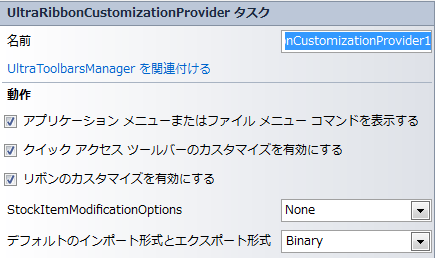

////

|metadata|
{
    "name": "winribboncustomizationprovider-smart-tag",
    "controlName": ["WinRibbonCustomizationProvider"],
    "tags": ["Design Environment","Editing"],
    "guid": "5f16d9c7-1127-4340-8963-2bb84ae311d3",  
    "buildFlags": [],
    "createdOn": "2011-05-16T15:49:09.040865Z"
}
|metadata|
////

= WinRibbonCustomizationProvider スマート タグ

Visual Studio 2005/2008（.NET Framework 2.0/3.5）では、{ProductName} の個々のコントロール/コンポーネントにはスマートタグがあります。コントロールやコンポーネントを選択するだけで、スマート タグのアンカーが表示されます。このアンカーをクリックするとポップアップ パネルが表示され、そこからコントロール/コンポーネントの最もよく使うプロパティや設定にすばやく簡単にアクセスできます。

WinRibbonCustomizationProvider™ スマートタグには、コンポーネントの名前と次の項目があります。

* UltraToolbarsManagers を関連付ける - UltraToolbarsManager がこの UltraRibbonCustomizationProvider と関連付けられるコンテナーを選択するダイアログを提供します。
* 動作 -- フォーム上でのコンポーネントの動作を制御するプロパティに簡単にアクセスできます。

[options="header", cols="a,a,a"]
|====
|動作|説明|対応するプロパティ

|クイック アクセス ツールバーをカスタマイズを有効にする
|このチェック ボックスを選択してクイック アクセス ツールバーをカスタマイズを有効にします。
| link:{ApiPlatform}win.supportdialogs{ApiVersion}~infragistics.win.supportdialogs.ribboncustomizationprovider.ultraribboncustomizationprovider~allowqatcustomization.html[AllowQATCustomization]

|リボンをカスタマイズを有効にする
|このチェック ボックスを選択してリボンをカスタマイズを有効にします。
| link:{ApiPlatform}win.supportdialogs{ApiVersion}~infragistics.win.supportdialogs.ribboncustomizationprovider.ultraribboncustomizationprovider~allowribboncustomization.html[AllowRibbonCustomization]

|アプリケーション メニュー/ファイル メニューにコマンドを表示する
|このチェック ボックスを選択して、カスタマイズ ダイアログ内の「コマンドの選択」コンボ ボックス リストにアプリケーション メニュー/ファイル メニュー コマンド オプションを表示します。
| link:{ApiPlatform}win.supportdialogs{ApiVersion}~infragistics.win.supportdialogs.ribboncustomizationprovider.ultraribboncustomizationprovider~showapplicationmenucommands.html[ShowApplicationMenuCommands]

|インポート形式とエクスポート形式を表示する
|リボンをエクスポートするときに使用される書式設定 (XML または Binary) を示します。
| link:{ApiPlatform}win.supportdialogs{ApiVersion}~infragistics.win.supportdialogs.ribboncustomizationprovider.ultraribboncustomizationprovider~defaultserializationformat.html[DefaultSerializationFormat]

|StockItemModificationOptions を表示する
|デフォルトのタブ、グループ、ツールを変更する方法を示します。
| link:{ApiPlatform}win.supportdialogs{ApiVersion}~infragistics.win.supportdialogs.ribboncustomizationprovider.ultraribboncustomizationprovider~stockitemmodificationoptions.html[StockItemModificationOptions]

|====