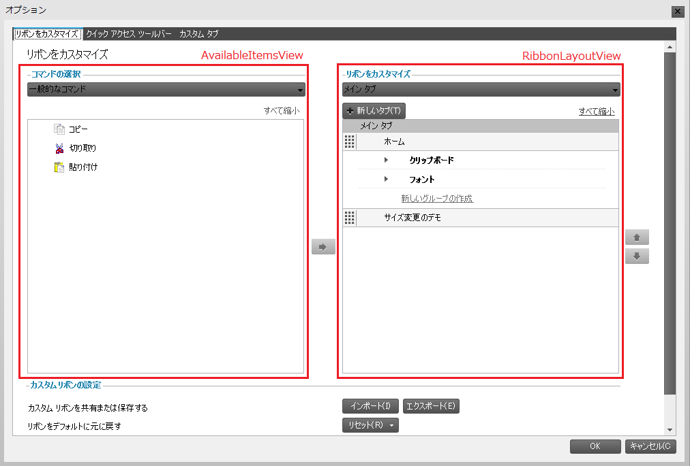
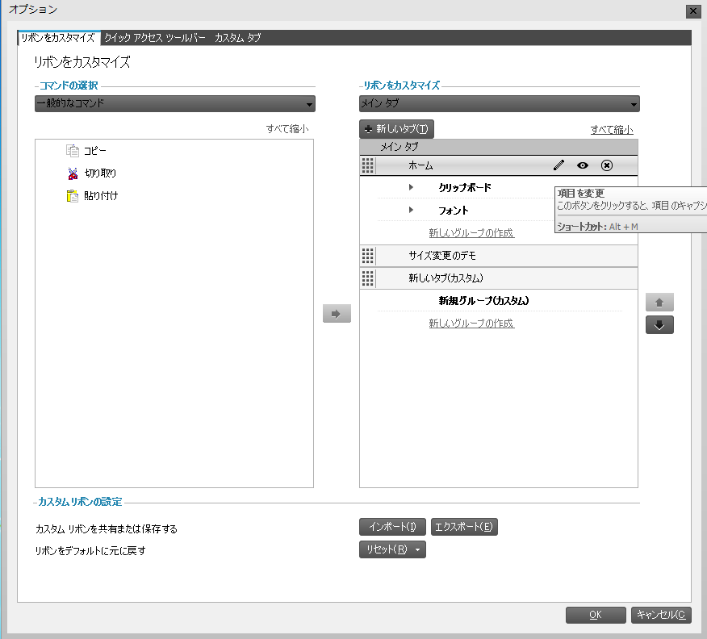
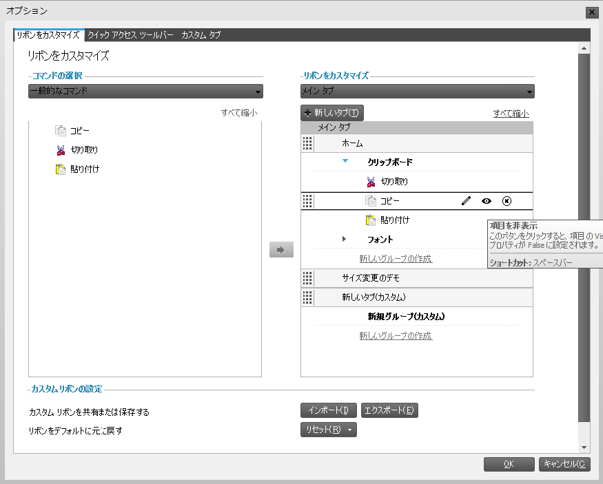

////
|metadata|
{
    "name": "winribboncustomizationprovider-using-the-ribbon-customization-dialog",
    "controlName": ["WinRibbonCustomizationProvider"],
    "tags": ["Editing","Extending","Getting Started","How Do I"],
    "guid": "366a4424-a84d-4387-88c3-fc3c48a5b4f8",
    "buildFlags": [],
    "createdOn": "2011-04-26T21:32:27.1423671Z"
}
|metadata|
////

= リボン カスタマイズ ダイアログを使用

このトピックでは、リボン カスタマイズ ダイアログ、ダイアログの実装、エンドユーザーによる操作について説明します。

toc::[]

[[Intro]]
== 概要

リボン カスタマイズ ダイアログによって、エンドユーザーはリボン タブ、グループおよびツールをカスタマイズできます。WinRibbonCustomizationProvider コントロールによって実装されます。いったん実装されたら、ユーザーは右クリックのコンテキスト メニューのオプションを使用してアクセスできます（詳細は「WinRibbonCustomizationProvider について」を参照してください）。

このダイアログにはデフォルトで、リボンをカスタマイズとクイック アクセス ツール バー（QAT）をカスタマイズの 2 つのタブが表示されます。これらの対応するカスタマイズ コントロールは、RibbonCustomizationControl （リボンをカスタマイズ タブ）と QATCustomizationControl（クイック アクセス ツール バーをカスタマイズ）です。左側のリボンをカスタマイズ タブには、すべての ultraToolbarsManager 項目（AvailableItemsView）がリストされます。右側には、リボンのコンテンツと構造（RibbonLayoutView）、つまりタブ、グループ、ツールが表示されます。

図 1: リボン カスタマイズ ダイアログとリボンをカスタマイズ タブ

.注:
[NOTE]
====
RibbonCustomizationControl と QATCustomizationControl はカスタム作成ダイアログでも使用できます。
====

[[EnableRibbonCust]]
== リボンのカスタマイズを有効にする

既存/デフォルト/ストック タブ、グループ、ツールのカスタマイズを有効にするには、UltraRibbonCustomizationProvider コンポーネントの link:{ApiPlatform}win.supportdialogs{ApiVersion}~infragistics.win.supportdialogs.ribboncustomizationprovider.ultraribboncustomizationprovider~stockitemmodificationoptions.html[StockItemModificationOptions] プロパティを使用します。このプロパティはフラグ列挙型です。ユーザーに許可したいストック項目変更の型を指定する必要があります。デフォルトでこのプロパティは None に設定されます。

*Visual Basic の場合:*
[source,vb]
----
Me.ultraRibbonCustomizationProvider1.StockItemModificationOptions = Infragistics.Win.SupportDialogs.RibbonCustomizationProvider.StockItemModificationOption.AllowTabModify
----

*C# の場合:*
[source,csharp]
----
this.ultraRibbonCustomizationProvider1.StockItemModificationOptions = Infragistics.Win.SupportDialogs.RibbonCustomizationProvider.StockItemModificationOption.AllowTabModify;
----

[[DisableRibbonCust]]
== リボンのカスタマイズを無効にする

リボンまたはクイック アクセス ツール バーのカスタマイズを無効にするには、UltraRibbonCustomizationProvider コンポーネントの link:{ApiPlatform}win.supportdialogs{ApiVersion}~infragistics.win.supportdialogs.ribboncustomizationprovider.ultraribboncustomizationprovider~allowribboncustomization.html[AllowRibbonCustomization] プロパティまたは link:{ApiPlatform}win.supportdialogs{ApiVersion}~infragistics.win.supportdialogs.ribboncustomizationprovider.ultraribboncustomizationprovider~allowqatcustomization.html[AllowQATCustomization] プロパティを使用します。これらのプロパティを False に設定すると、対応するコンテキスト メニュー オプション（リボンをカスタマイズまたはクイック アクセス ツール バーをカスタマイズ）をユーザーが使用するのを防止します。

*Visual Basic の場合:*
[source,vb]
----
' リボンのカスタマイズを無効にします
Me.ultraRibbonCustomizationProvider1.AllowRibbonCustomization = False
' クイック アクセス ツール バー（QAT）のカスタマイズを無効にします
Me.ultraRibbonCustomizationProvider1.AllowQATCustomization = false
----

*C# の場合:*
[source,csharp]
----
// リボンのカスタマイズを無効にします
this.ultraRibbonCustomizationProvider1.AllowRibbonCustomization = false;
// クイック アクセス ツール バー（QAT）のカスタマイズを無効にします
this.ultraRibbonCustomizationProvider1.AllowQATCustomization = false;
----

[[Events]]
== イベント

ダイアログを変更する機能は、UltraRibbonCustomizationProvider コンポーネントの BeforeCustomizationDialogDisplayed イベントと AfterCustomizationDialogClosed イベントで提供されます。

UltraToolbarsManager コンポーネントも、BeforeRibbonCustomizationDialogDisplayed と AfterRibbonCustomizationDialogClosed という 2 つのイベントを公開します。

[[ShowCustDialog]]
== カスタマイズ ダイアログを表示する

UltraToolbarsManager の Ribbon はランタイムにダイアログを表示するために ShowRibbonCustomizationDialog メソッドを公開します。このメソッドの RibbonCustomizationType 引数は、リボンをカスタマイズとクイック アクセス ツール バー（QAT）をカスタマイズのいずれのタブがダイアログでアクティブになるかを指定します。

*Visual Basic の場合:*
[source,vb]
----
Imports Infragistics.Win.UltraWinToolbars
Me. ultraToolbarsManager1.Ribbon. ShowRibbonCustomizationDialog (RibbonCustomizationType. QuickAccessToolbar)
----

*C# の場合:*
[source,csharp]
----
using Infragistics.Win.UltraWinToolbars;
this.ultraToolbarsManager1.Ribbon.ShowRibbonCustomizationDialog(RibbonCustomizationType.QuickAccessToolbar);
----

[[PopularCommands]]
== 一般的なコマンド機能を追加する

コマンドの選択コンボ ボックスがすべてのコマンドに設定されると、カスタマイズ ダイアログに ultraToolbarsManager に追加されたすべてのツールが表示されます。ただし、PopularCommand プロパティを使用して、一般的なコマンド ツールとしてより広く使用されるツールをグループ化できます。このプロパティによって、コマンドの選択コンボ ボックスを一般的なコマンドに設定すると、ツールを表示できます。

*Visual Basic の場合:*
[source,vb]
----
Imports Infragistics.Win.UltraWinToolbars
Dim pasteTool As New StateButtonTool("Paste")
Me.ultraToolbarsManager1.Tools.Add(pasteTool)
pasteTool.SharedProps.Caption = "Paste"
pasteTool.SharedProps.PopularCommand = True
----

*C# の場合:*
[source,csharp]
----
using Infragistics.Win.UltraWinToolbars;
StateButtonTool pasteTool = new StateButtonTool("Paste");
this.ultraToolbarsManager1.Tools.Add(pasteTool);
pasteTool.SharedProps.Caption = "Paste";
pasteTool.SharedProps.PopularCommand = true;
----

[[CustDefault]]
== デフォルトのタブ、グループおよびツールをカスタマイズする

既存/デフォルト/ストック タブ、グループ、ツールをカスタマイズするには、UltraRibbonCustomizationProvider の StockItemModificationOptions プロパティを使用します。このタイプのプロパティは、どのタイプの変更をストック項目に行うことができるのかを指定することができるフラグ列挙体です。使用可能な列挙値は以下のとおりです。

* All
* AllowGroupAddTools
* AllowGroupModify
* AllowGroupRemove
* AllowGroupReposition
* AllowGroupShowHide
* AllowTabAddGroups
* AllowTabChangeContextualGroup
* AllowTabModify
* AllowTabReposition
* AllowTabRemove
* AllowTabShowHide
* AllowToolModify
* AllowToolRemove
* AllowToolReposition
* AllowToolShowHide
* None

*Visual Basic の場合:*
[source,vb]
----
Imports Infragistics.Win.UltraWinToolbars
'  デフォルトのタブ、グループ、ツールの変更を可能にします
Me.ultraRibbonCustomizationProvider1.StockItemModificationOptions = Infragistics.Win.SupportDialogs.RibbonCustomizationProvider.StockItemModificationOption.All
----

*C# の場合:*
[source,csharp]
----
using Infragistics.Win.UltraWinToolbars;
// デフォルトのTab、Group、Toolの変更を可能にします
this.ultraRibbonCustomizationProvider1.StockItemModificationOptions = Infragistics.Win.SupportDialogs.RibbonCustomizationProvider.StockItemModificationOption.All;
----

[[ResetButton]]
== リセット ボタン機能を実装する

デフォルトで、リボンのデザイン時初期化が完了すると、リセット ボタン機能のこの保存ポイントが作成されます。ただし、CreateRestorePoint と呼ばれるメソッドも、保存ポイントを作成する機能を提供する ultraToolbarsManager で公開されます。これによって、リボンをプログラムによってデザイン/変更し、「デフォルト」のレイアウトにこれらの変更が含まれるようにすることができます。Restore メソッドは、UltraToolbarsManager をこの内部保存される復元ポイントに復元します。

*Visual Basic の場合:*
[source,vb]
----
' UltraToolbarsManager の保存ポイントを作成します
Me.ultraToolbarsManager1.CreateRestorePoint()
' UltraToolbarsManager を保存された復元ポイントに復元します
Me.ultraToolbarsManager1.Restore()
----

*C# の場合:*
[source,csharp]
----
// UltraToolbarsManager の保存ポイントを作成します
this.ultraToolbarsManager1.CreateRestorePoint();
// UltraToolbarsManager を保存された復元ポイントに復元します
this.ultraToolbarsManager1.Restore();
----

[[UserInteractions]]
== カスタマイズ ダイアログでのユーザー操作

image::images/WinToolbarsManager_Ribbon_Customization_Dialog_02.png[]

図 2: マウス ポインターが Home タブのヘッダー上にホバーすると、RibbonLayoutView でユーザー操作を提供するボタンは表示される

以下は、リボン カスタマイズ ダイアログで使用可能なユーザー操作です。

== タブの追加

=== 新しいタブの追加

新しいタブが新規タブ ボタンで作成されます。「カスタム」という語がテキストの前に付けられて新しいタブが表示されます。

=== 既存のタブの追加

既存のタブを追加するには、ユーザーは以下を実行します。

* AvailableItemsView から RibbonLayoutView にドラッグ アンド ドロップ
* AvailableItemsView でタブを選択し、次に追加ボタンをクリック

== タブの削除

削除（X）ボタンでリボンからタブが削除されます。RibbonLayoutView のタブ ヘッダー上にホバーするとこのボタンが表示されます（上記の図 2 を参照してください）。

== 表示/非表示

表示/非表示ボタンでタブの表示/非表示を切り替えます。このボタンは、RibbonLayoutView のタブ ヘッダー上の目のアイコンで表されます。マウスがタブ ヘッダー上にある、またはヘッダーが選択されるとこのボタンが表示されます（上記の図 2 を参照してください）。

== タブのキャプションと画像の変更

タブのキャプションと画像は、ペン アイコンで表される変更ボタンで変更されます。マウスがタブ ヘッダー上にある、またはヘッダーが選択されるとこのボタンが表示されます（上記の図 2 を参照してください）。変更ボタンをクリックすると、リボン タブを変更という別のダイアログが表示します。このダイアログはタブのキャプションと画像を変更する機能を提供します。

== タブの移動

タブ ヘッダーの左側にあるドラッグ ハンドルでタブの位置を変更できます。

== タブ内のグループのカスタマイズ

図 3: タブ内でグループをカスタマイズするために使用されるボタン

== グループの追加

=== 新しいグループの追加

タブ内の新しいグループは、各タブ内の新規グループを作成ボタンで作成されます。（上記の図 3 を参照してください）。RibbonLayoutView で、「カスタム」という語がテキストの前に付けられた新しい groupsaredisplayed。

=== 既存のグループの追加

既存のグループを追加するには、ユーザーは以下を実行します。

* AvailableItemsView から RibbonLayoutView にドラッグ アンド ドロップ
* AvailableItemsView でグループを選択し、次に追加ボタンをクリック

== グループの削除

削除（X）ボタンでリボンからグループが削除されます。RibbonLayoutView のグループ ヘッダー上にホバーする、またはグループ ヘッダーが選択されるとこのボタンが表示されます。

== グループの表示/非表示

グループの表示/非表示は、RibbonLayoutView のグループ ヘッダー上の目のアイコンによって表される表示/非表示ボタンで切り替えます。マウスがグループ ヘッダー上にある、またはヘッダーが選択されるとこのボタンが表示されます。

== グループのキャプションと画像の変更

グループのキャプションと画像は、ペン アイコンで表される変更ボタンで変更されます。マウスがグループ ヘッダー上にホバーする、またはヘッダーが選択されるとこのボタンが表示されます（上記の図 3 を参照してください）。このボタンをクリックすると、リボン グループを変更という別のダイアログが表示します。このダイアログは、リボン グループのキャプション、画像、グループ内のツールのサイズを変更する機能を提供します。

== グループの移動

グループ ヘッダーの左側にあるドラッグ ハンドルでグループの位置を変更できます。

== グループ内のツールのカスタマイズ

図 4: グループ内でツールをカスタマイズするために使用されるボタン

== ツールの追加

既存のツールを追加するには、ユーザーは以下を実行します。

* AvailableItemsView から RibbonLayoutView にドラッグ アンド ドロップ
* AvailableItemsView でツールを選択し、次に追加ボタンをクリック

== ツールの削除

削除（X）ボタンでリボンからグループが削除されます。RibbonLayoutView のツール要素上にホバーするとこのボタンが表示されます。

== ツールの表示/非表示

グループの表示/非表示は、RibbonLayoutView のツール要素上の目のアイコンによって表される表示/非表示ボタンで切り替えます。マウスがツール要素上にある、またはヘッダーが選択されるとこのボタンが表示されます（上記の図 4 を参照してください）。

== グループのキャプションと画像の変更

ツールのキャプションと画像は、ペン アイコンで表される変更ボタンで変更されます。このボタンをクリックすると、ツールを変更という別のダイアログが表示します。このダイアログは、ツールのキャプション、画像、サイズ指定の動作を変更する機能を提供します。マウスがツール要素上にある、またはツールが選択されるとこのボタンが表示されます。

== ツールの移動

ツール要素の左側にあるドラッグ ハンドルでツールの位置を変更できます。

[[Layout]]
== リボンのレイアウトのインポート/エクスポート

ダイアログの一番下にあるインポートおよびエクスポート ボタンによって、リボンのレイアウトを保存するだけでなく、バイナリと XML 形式のいずれかで以前に保存したレイアウトをロードできます。

[[RelatedTopics]]
== 関連トピック

* link:winribboncustomizationprovider-about-winribboncustomizationprovider.html[WinRibbonCustomizationProvider について]
* link:winribboncustomizationprovider-adding-custom-tab-to-ribbon-customization-dialog.html[カスタム タブをカスタマイズ ダイアログに追加]