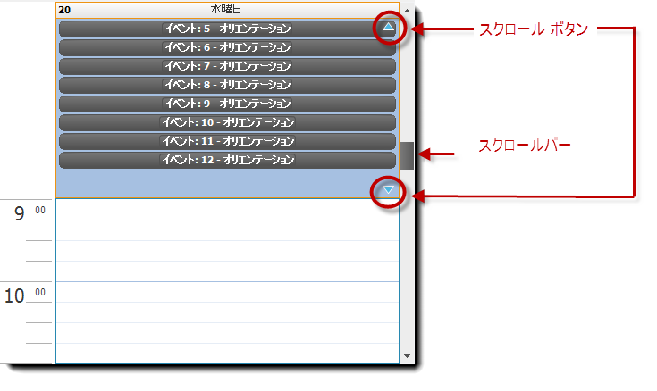

////

|metadata|
{
    "name": "winschedule-scrollable-alldayevent-area",
    "controlName": ["WinSchedule"],
    "tags": [],
    "guid": "666a919f-fb52-49a8-b2e5-bde1474f6bef",  
    "buildFlags": [],
    "createdOn": "2013-01-23T19:26:12.7203815Z"
}
|metadata|
////

= スクロール可能な AllDayEvent 領域

== トピックの概要

=== 目的

このトピックでは、 _UltraDayView_   コントロールの link:{ApiPlatform}win.ultrawinschedule{ApiVersion}~infragistics.win.ultrawinschedule.appointment~alldayevent.html[AllDayEvent] 領域のスクロール機能を説明します。制限なしで終日イベントの同時表示を許可します。

=== 前提条件

このトピックを理解するためには、以下のトピックを理解しておく必要があります。

[options="header", cols="a,a"]
|====
|トピック|目的

| link:winschedule-understanding-winschedule-controls-and-components.html[WinScheduleコントロール/コンポーネントの理解]
|_WinSchedule_ コントロールおよびその主要な機能と機能性について解説しています。

|====

=== このトピックの内容

このトピックは、以下のセクションで構成されます。

* <<_Ref342310371,AllDayEvent 領域のスクロールの有効化>>

** <<_Ref342310379,概要とプレビュー>>
** <<_Ref342310386,プロパティ設定>>

* <<_Ref342310394,関連コンテンツ>>

[[_Ref342310371]]
== _AllDayEvent_  領域のスクロールの有効化

[[_Ref342310379]]

=== 概要とプレビュー

_UltraDayView_   コントロールの 13.1 以前のバージョンでは link:{ApiPlatform}win.ultrawinschedule{ApiVersion}~infragistics.win.ultrawinschedule.appointment~alldayevent.html[AllDayEvent] 領域のスクロール サポートがなく、16 イベントに制限されていました。

デフォルトでは、 _UltraDayView_   コントロールは以前のバージョンと同じように終日イベント領域をスクロールバーまたはスクロール ボタンなしで表示します。

_UltraDayView_   コントロールのプロパティは、制限なく link:{ApiPlatform}win.ultrawinschedule{ApiVersion}~infragistics.win.ultrawinschedule.appointment~alldayevent.html[AllDayEvent] 領域にスクロール ボタンおよびスクロールバーを有効にできます。

以下のプレビューは、スクロールバーおよびスクロール ボタンが有効な終日イベントを表示します。

スクロール機能に加え、 _UltraDayView_   コントロールは、 link:{ApiPlatform}win.ultrawinschedule{ApiVersion}~infragistics.win.ultrawinschedule.appointment~alldayevent.html[AllDayEvent] 領域の垂直サイズを制御する新しい link:{ApiPlatform}win.ultrawinschedule{ApiVersion}~infragistics.win.ultrawinschedule.ultradayview~alldayeventareapreferredmaxheight.html[AllDayEventAreaPreferredMaxHeight] プロパティが追加しました。デフォルト サイズは 0 (整数値) です。コントロールはビューの最適なサイズを計算します。

.注:
[NOTE]
====
`AllDayEventAreaPreferredMaxHeight=0` の場合にスクロールを有効にすると、終日イベント領域は現在の表示日のすべてのイベントを表示できるようにスペースで描画されますが、以下の表に応じてコントロールの高さの *半分* より大きくはなりません。
====

[options="header", cols="a,a"]
|====
|`AllDayEventAreaScrolling = None`|`AllDayEventAreaScrolling = ScrollBar`

|image::images/WinSchedule_Scrollable_AllDayEvent_Area_2.png[]
|image::images/WinSchedule_Scrollable_AllDayEvent_Area_3.png[]

|====

[[_Ref342310386]]

=== プロパティ設定

_UltraDayView_   コントロールは link:{ApiPlatform}win.ultrawinschedule{ApiVersion}~infragistics.win.ultrawinschedule.ultradayview~alldayeventareascrolling.html[AllDayEventAreaScrolling] プロパティを公開します。スクロール機能の 3 つのオプションがあります。

[options="header", cols="a,a,a,a"]
|====
|プロパティ名|オプション|説明|デフォルト値

|AllDayEventAreaScrolling
| _ScrollButtons_ 
|スクロール ボタンを有効にします
|Disabled

|
| _ScrollBar_ 
|スクロールバーを有効にします
|Disabled

|
| _ScrollButtonsAndScrollBar_ 
|スクロール ボタンおよびスクロールバーを有効にします
|Disabled

|
| _None_ 
|デフォルト オプション
|Enabled

|====

[[_Ref342310394]]
== 関連コンテンツ

=== トピック

以下のトピックでは、このトピックに関連する追加情報を提供しています。

[options="header", cols="a,a"]
|====
|トピック|目的

| link:winschedule.html[WinSchedule]
|このトピックは、 _WinSchedule_ コントロールの機能やアプリケーションで使用する方法、複数の _WinSchedule_ で共通するタスクを実行する際の詳細な手順に至るまで、 _WinSchedule_ コントロールに関するさまざまな情報へのリンクを提供します。

|====