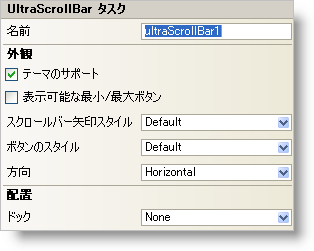

////

|metadata|
{
    "name": "winscrollbar-smart-tag",
    "controlName": ["WinScrollBar"],
    "tags": ["API","Design Environment"],
    "guid": "{EAC1B2B4-AE77-4E72-90BC-4144B95F5E83}",  
    "buildFlags": [],
    "createdOn": "0001-01-01T00:00:00Z"
}
|metadata|
////

= WinScrollBar スマート タグ

Visual Studio 2005（.NET Framework 2.0）では、それぞれの {ProductName} コントロール/コンポーネントが固有のスマート タグを備えています。 コントロール/コンポーネントを単に選択すると、Smart Tag のアンカーが表示されます。このアンカーをクリックするとポップアップ パネルが表示され、そこからコントロール/コンポーネントの最もよく使用するプロパティや設定にすばやく簡単にアクセスできます。

WinScrollBar スマート タグには、以下のセクションと共にコントロールの名前が含まれます。

* 外観 -- コントロールの外観やルック アンド フィールに関連する一般的なタスクがあります。
* レイアウト -- コントロールをフォームのどこに、どのように配置するかを指定するプロパティがあります。

各セクションの項目（たとえば、フィールド、ドロップダウン リスト、チェックボックス）およびプロパティ グリッドの項目の対応するプロパティの説明については以下を参照してください。

[options="header", cols="a,a,a"]
|====
|外観|説明|対応するプロパティ

|表示可能な最小/最大ボタン
|このチェックボックスを選択すると、最小ボタンと最大ボタンが表示されます。最小ボタンと最大ボタンの配置は、スクロールバーの方向によります。スクロールバーが水平の場合には、最小ボタンと最大ボタンはそれぞれスクロールバーの左側と右側に表示されます。スクロールバーが垂直の場合には、最小ボタンと最大ボタンはそれぞれスクロールバーの上と下の領域に表示されます。
| link:{ApiPlatform}win{ApiVersion}~infragistics.win.ultrawinscrollbar.ultrascrollbar~minmaxbuttonsvisible.html[MinMaxButtonsVisible]

|テーマのサポート
|このチェックボックスを選択すると、Microsoft の基本的な OS テーマ（Windows クラシック テーマまたは Windows XP テーマ）がサポートされます。
| link:{ApiPlatform}win{ApiVersion}~infragistics.win.ultracontrolbase~supportthemes.html[SupportThemes]

|ボタンのスタイル
|ドロップダウンを使用して、スクロールバーのボタンの外観を選択します。SupportThemes プロパティが True に設定されるとこれは無効になります。
| link:{ApiPlatform}win{ApiVersion}~infragistics.win.ultrawinscrollbar.ultrascrollbar~buttonstyle.html[ButtonStyle]

|方向
|ドロップダウン ボックスから水平または水平を選択して、スクロールバーを水平または垂直に表示します。
| link:{ApiPlatform}win{ApiVersion}~infragistics.win.ultrawinscrollbar.ultrascrollbar~orientation.html[Orientation]

|スクロールバー矢印スタイル
|各端にひとつの矢印を表示する、両端に両方の矢印を表示する、左側に両方の矢印を表示する、右側に両方の矢印を表示する、または矢印を表示しないのいずれかを選択できます。
| link:{ApiPlatform}win{ApiVersion}~infragistics.win.ultrawinscrollbar.ultrascrollbar~scrollbararrowstyle.html[ScrollBarArrowStyle]

|====

[options="header", cols="a,a,a"]
|====
|レイアウト|説明|対応するプロパティ

|ドッキング
|コントロールを上、右、下、左、全体のどこにドッキングするか、またはどこにもドッキングしないかを選択します。
|Dock

|====