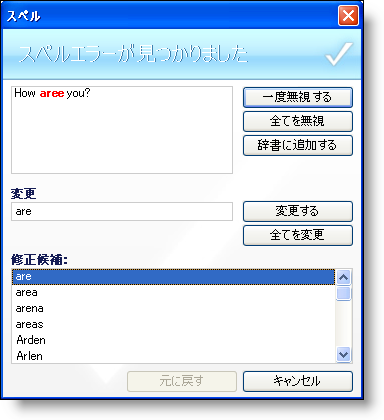

////

|metadata|
{
    "name": "winspellchecker-about-winspellchecker",
    "controlName": ["WinSpellChecker"],
    "tags": ["Application Scenarios","Getting Started"],
    "guid": "{4BD2EC02-6A20-4241-922A-FD83DB0633FB}",  
    "buildFlags": [],
    "createdOn": "0001-01-01T00:00:00Z"
}
|metadata|
////

= WinSpellChecker について

WinSpellChecker コンポーネントは、インボックス TextBox、インボックス RichTextBox、WinTextEditor などのテキスト ベースのコントロール、および pick:[win-forms="link:{ApiPlatform}win{ApiVersion}~infragistics.win.ultrawinspellchecker.iprovidetextbox.html[IProvideTextBox]"]  または pick:[win-forms="link:{ApiPlatform}win{ApiVersion}~infragistics.win.ultrawinspellchecker.ispellchecktarget.html[ISpellCheckTarget]"]  インタフェースを実装するコントロールなどをスペルチェックできます。フォームに WinSpellChecker を追加することで、SpellCheckerSettings と呼ばれる拡張プロパティがこれらのタイプのコントロールに追加されます。Enabled プロパティを True に設定することで、WinSpellChecker コンポーネントにスペルチェックを実行する必要があることを認識させることができます。WinSpellChecker コンポーネントには、Microsoft® Word のスペルチェックに対抗する重要な機能が付属します。これらの機能の一部には以下が含まれます。

* 辞書のサポート -- WinSpellChecker には、オーストラリア、カナダ、英語、オランダ、フランス、ドイツ、イタリア、ポルトガル、およびスペインの 9 ヶ国語の辞書が標準で付属します。ユーザー辞書に新しい用語を追加するオプションもあります。
* ユーザー入力時 -- エンド ユーザーが入力した時に WinSpellChecker がドキュメントのスペルをチェックします。WinSpellChecker は、スペルミスがあった場合、修正候補と置き換えることもできます。
* SpellChecker ダイアログ -- WinSpellChecker のスペルチェック ダイアログは、検証またはボタン クリックで起動できます。このダイアログは、スペルミスをエンド ユーザーにガイドして対応策を提案します。
* ビジュアル キュー -- Microsoft Word で有名になった赤色の波線でスペルエラーをした時にエンド ユーザーにエラーを知らせることができます。赤色の波線が気に入らない場合、青、オレンジ、黒、または他の色に変更できます。くねくね線が気に入りませんか？1 本の線または二重線にすることができます。

