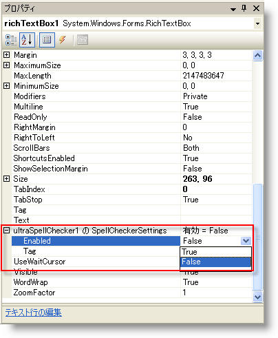

////

|metadata|
{
    "name": "winspellchecker-adding-winspellchecker-to-a-form",
    "controlName": ["WinSpellChecker"],
    "tags": ["Getting Started","Validation"],
    "guid": "{1BFA36A1-F6EB-4786-BAEF-49A25CB64CFE}",  
    "buildFlags": [],
    "createdOn": "2006-02-05T00:00:00Z"
}
|metadata|
////

= WinSpellChecker をフォームに追加

このトピックは、WinSpellChecker アプリケーションを起動したり、できるだけ敏速に実行することを目的としています。WinSpellChecker 機能を取得するための最小限の手順を説明します。このトピックでは、WinSpellChecker で RichTextBox をスペルチェックします。

[start=1]
. *フォームにコントロールをドロップします。*

新しい C# または Visual Basic プロジェクトでは、ツールボックスの [Windows Forms] タブで RichTextBox コントロールをダブルクリックします。RichTextBox の Dock プロパティをトップに設定すれば、簡単に確認できます。RichTextBox と同じようにツールボックスでこれをダブルクリックしてフォームにボタンを追加します。次に、ツールボックスで UltraSpellChecker コンポーネントをダブルクリックします。以下のように表示されるようにフォームを配置します。

image::images/WinSpellChecker_Adding_WinSpellChecker_to_a_Form_01.png[]

[start=2]
. *スペルチェッカーとして ultraSpellChecker1 を使用するために RichTextBox を設定します。*

RichTextBox を選択し、[プロパティ] ウィンドウに移動し、pick:[win-forms="link:{ApiPlatform}win.ultrawinspellchecker{ApiVersion}~infragistics.win.ultrawinspellchecker.spellcheckersettings.html[SpellCheckerSettings]"]  と呼ばれるプロパティを見つけます。このプロパティを展開し、Enabled プロパティを True に設定します。

[start=3]
. *クリックした時に RichTextBox のテキストをチェックするようにボタンを設定します。*

ボタンをダブルクリックすると、ボタンのクリック イベントのコードビハインドに移動します。そのクリック イベントの内部には、以下のコードを追加します。

*Visual Basic の場合：*

----
Me.UltraSpellChecker1.ShowSpellCheckDialog(Me.RichTextBox1)
----

*C# の場合：*

----
this.ultraSpellChecker1.ShowSpellCheckDialog(this.richTextBox1);
----

[start=4]
. *プロジェクトを実行します。*

プロジェクトを実行すると、RichTextBox とボタンが見えます。ボタンをクリックします。[SpellCheck] ダイアログが表示します（"richTextBox1" は辞書に存在しないので）。

image::images/WinSpellChecker_Adding_WinSpellChecker_to_a_Form_03.png[]