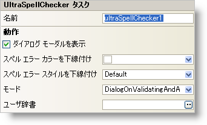

////

|metadata|
{
    "name": "winspellchecker-smart-tag",
    "controlName": ["WinSpellChecker"],
    "tags": ["API","Design Environment"],
    "guid": "{95A8C7F0-30BE-4FD7-88C2-CFE83EA3E5E8}",  
    "buildFlags": [],
    "createdOn": "0001-01-01T00:00:00Z"
}
|metadata|
////

= WinSpellChecker スマート タグ

Visual Studio 2005（.NET Framework 2.0）では、それぞれの {ProductName} コントロール/コンポーネントが固有のスマート タグを備えています。 コントロール/コンポーネントを単に選択すると、Smart Tag のアンカーが表示されます。このアンカーをクリックするとポップアップ パネルが表示され、そこからコントロール/コンポーネントの最もよく使用するプロパティや設定にすばやく簡単にアクセスできます。

WinSpellChecker スマート タグには、以下のセクションと共にコントロールの名前が含まれます。

* Behavior -- フォーム上でのコントロールの動作を制御するプロパティに簡単にアクセスできます。

各セクションの項目（たとえば、フィールド、ドロップダウン リスト、チェック ボックス）およびプロパティ グリッドの項目の対応するプロパティの説明については以下を参照してください。

[options="header", cols="a,a,a"]
|====
|動作|説明|対応するプロパティ

|ダイアログ モーダルを表示
|チェックボックスをチェックしてスペル チェック ダイアログ ボックスをモーダルで表示します。
| link:{ApiPlatform}win.ultrawinspellchecker{ApiVersion}~infragistics.win.ultrawinspellchecker.ultraspellchecker~showdialogsmodal.html[ShowDialogsModal]

|モード
|ドキュメントのスペル チェックの検証で、エンド ユーザーが入力する時のドキュメントのスペル チェックの操作モードを選択します。
| link:{ApiPlatform}win.ultrawinspellchecker{ApiVersion}~infragistics.win.ultrawinspellchecker.ultraspellchecker~mode.html[Mode]

|スペル エラー カラーを下線付け
|スペルミスのワードの下の赤色の波線の色を変更
| link:{ApiPlatform}win.ultrawinspellchecker{ApiVersion}~infragistics.win.ultrawinspellchecker.ultraspellchecker~underlinespellingerrorcolor.html[UnderlineSpellingErrorColor]

|スペル エラー スタイルを下線付け
|スペルミスのワードの下の赤色の波線のスタイルを 1 本の下線、二重下線、または下線なしに変更します。
| link:{ApiPlatform}win.ultrawinspellchecker{ApiVersion}~infragistics.win.ultrawinspellchecker.ultraspellchecker~underlinespellingerrorstyle.html[UnderlineSpellingErrorStyle]

|ユーザー辞書
|テキスト ボックスの右側の省略記号をクリックし、[ファイルを開く] ダイアログ ボックスから辞書ファイルを選択してユーザー辞書を設定します。
| link:{ApiPlatform}win.ultrawinspellchecker{ApiVersion}~infragistics.win.ultrawinspellchecker.ultraspellchecker~userdictionary.html[UserDictionary]

|====