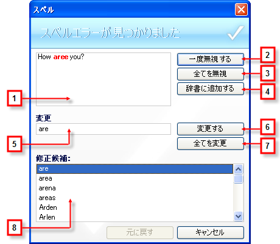

////

|metadata|
{
    "name": "winspellchecker-using-the-spell-checker-dialog",
    "controlName": ["WinSpellChecker"],
    "tags": ["Getting Started","Validation"],
    "guid": "{E2EF7BE1-8D9C-481C-92BA-D11E862BA398}",  
    "buildFlags": [],
    "createdOn": "0001-01-01T00:00:00Z"
}
|metadata|
////

= スペル チェッカー ダイアログを使用

ドキュメントのスペル チェック時、エンド ユーザーにスペル チェック ダイアログ ボックスが表示されます。このダイアログ ボックスはエンド ユーザーに複数の異なる方法で表示できます。エンド ユーザーにこのダイアログ ボックスを表示する方法の詳細は、 link:winspellchecker-display-the-spell-checker-dialog-box.html[「スペル チェック ダイアログ ボックスを表示」]を参照してください。

スペル チェック ダイアログ ボックスにはドキュメントのミススペル ワードを処理するための複数の便利なオプションがあります。WinSpellChecker がスペル チェック ダイアログ ボックスからスペルをチェック中、すべてのエラーが無視される、ユーザー辞書に追加される、または修正されるまで、一度にひとつのスペルミス ワードがチェックされます。

以下は、スペル チェック ダイアログ ボックスの画像です。ダイアログ ボックスの異なる部分をラベル表示し、詳細を以下に説明します。

[start=1]
. *辞書にない* – このテキスト領域には、コンテキストに赤色でスペルミス ワードを表示します（通常はセンテンス全体を表示）。
[start=2]
. *一度無視する* – [一度無視する] をクリックすると、スペル チェッカーはスペルミス ワードのひとつのインスタンスを無視し、次のスペルミス ワードを続行します。
[start=3]
. *[すべてを無視]* – [すべてを無視] はスペルミス ワードおよびすべての以降のインスタンスを無視します。[すべてを無視] は本質的には、そのワードが辞書に存在するとスペル チェッカーに思わせる「トリック」です。ただし、次にスペル チェック ダイアログ ボックスが開くと、これらの設定は記憶されません。
[start=4]
. *辞書に追加* - [辞書に追加] をクリックすると、ユーザーの辞書に現在のスペルミス ワードを追加します。このボタンは、pick:[win-forms="link:{ApiPlatform}win.ultrawinspellchecker{ApiVersion}~infragistics.win.ultrawinspellchecker.ultraspellchecker~userdictionary.html[UserDictionary]"]  プロパティが設定されている場合に限って使用できます。
[start=5]
. *変更先* – エンド ユーザーが手動でスペルミス ワードを編集したい場合、このテキスト ボックスのスペルミス ワードを置き換えるためのワードを入力できます。
[start=6]
. *変更* – このボタンをクリックすると、[辞書にない] ボックスのスペルミス ワードは、[変更先] ボックスのワードで置き換えられます。これはワードの現在のインスタンスだけを置き換えます。
[start=7]
. *すべてを変更* – [すべてを変更] をクリックすると、ドキュメント全体のスペルミス ワードの発生を [変更先] ボックスのワードに置き換えます。
[start=8]
. *修正候補* – [修正候補] ボックスのリストは、エンド ユーザーがスペルミスをした可能性のあるワードに対するすべての修正候補を表示します。これらのワードのひとつを選択すると、[変更先] ボックスに配置されます。