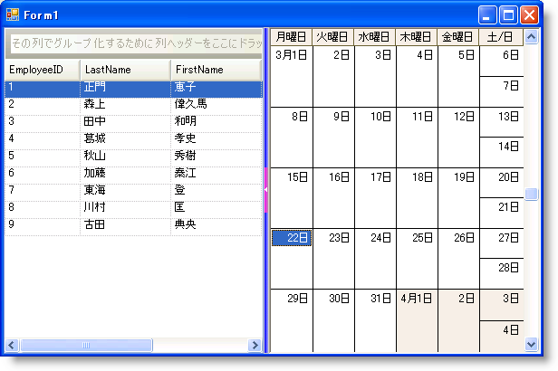
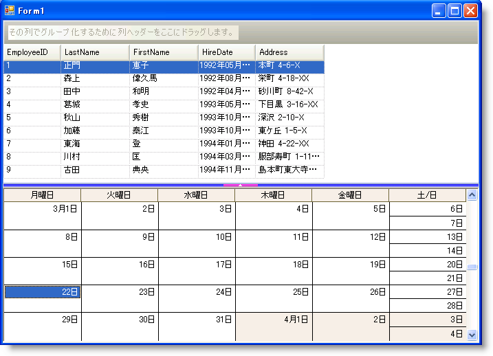

////

|metadata|
{
    "name": "winsplitter-adding-winsplitter-to-your-form",
    "controlName": ["WinSplitter"],
    "tags": [],
    "guid": "{63BA9539-B0B9-4DFD-8DF4-C2052923B203}",  
    "buildFlags": [],
    "createdOn": "2009-10-12T16:14:08Z"
}
|metadata|
////

= WinSplitter をフォームに追加

== 始める前に

WinSplitter™ コントロールによってエンドユーザーは、ランタイムに WinSplitter の端にドックされるコントロールをリサイズできます。 エンドユーザーは、ドックの順序でその直前のドックされたコントロールをリサイズできます。 したがって、ドックされたコントロールのリサイズを可能にするには、コンテナーの端にコントロールをドックし、次にコンテナーの同じ側にドックされたコントロールに対して WinSplitter コントロールをドックします。

== 達成すること

このトピックは、フォームに垂直および水平 WinSplitter コントロールを追加し、ドックされたコントロールをリサイズする方法を説明します。

== 次の手順を実行します

[start=1]
. UltraGrid コントロールをフォームにドラッグ アンド ドロップし、その pick:[win-forms="link:{ApiPlatform}win.misc{ApiVersion}~infragistics.win.misc.ultrasplitter~dock.html[Dock]"]  プロパティを left に設定します。 このトピックでは、UltraGrid コントロールは Northwind データベースの Employees テーブルにバインドされます。
[start=2]
. UltraSplitter コントロールをフォームにドラッグ アンド ドロップし、その Dock プロパティを left に設定します。
[start=3]
. UltraMonthViewSingle コントロールをフォームにドラッグ アンド ドロップし、その Dock プロパティを left に設定します。

[NOTE]
====
*注：* このケースでは、WinSplitter の前にある UltraGrid コントロールだけをリサイズできます。 UltraGrid および UltraMonthViewSingle コントロールの両方をリサイズするには、UltraMonthViewSingle の Dock プロパティを fill に設定します。
====

[start=4]
. これで、フォームは垂直の WinSplitter が追加されたコントロールをリサイズするように設定されます。 水平の WinSplitter を付けるには、各コントロールをドラッグ アンド ドロップして、それらの Dock プロパティを上または下に設定します。
[start=5]
. 以下のコードは、WinSplitter コントロールおよびコントロールに表示できる縮小/復元ボタンのスタイル プロパティを設定します。

*Visual Basic の場合：*

----
Me.ultraSplitter1.Appearance.BackColor = Color.Blue
Me.ultraSplitter1.ButtonExtent = 50
Me.ultraSplitter1.ButtonAppearance.BackColor = Color.Fuchsia
----

*C# の場合：*

----
this.ultraSplitter1.Appearance.BackColor = Color.Blue;
this.ultraSplitter1.ButtonExtent = 50;
this.ultraSplitter1.ButtonAppearance.BackColor = Color.Fuchsia;
----

[start=6]
. アプリケーションを実行します。

==== 垂直の WinSplitter を示すフォーム

==== 水平の WinSplitter を示すフォーム

== 関連トピック

* link:winsplitter-using-winsplitter.html[WinSplitter の使用]