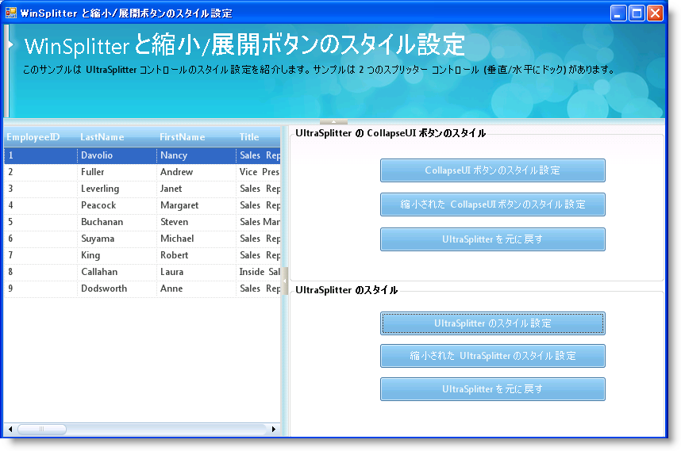
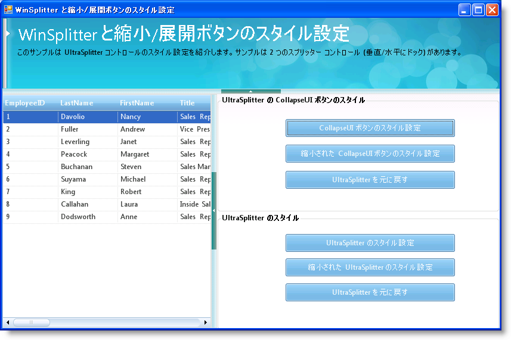

////

|metadata|
{
    "name": "winsplitter-styling-winsplitter-and-collapse-restore-button",
    "controlName": ["WinSplitter"],
    "tags": ["Styling"],
    "guid": "{06C27E6B-D252-4CC6-A62F-993B3A51FAE9}",  
    "buildFlags": [],
    "createdOn": "2009-10-12T16:26:33Z"
}
|metadata|
////

= WinSplitter および縮小/復元ボタンのスタイル

AppStyling を使用し、また Appearance プロパティ設定から、すべての他の Windows Forms のコントロールのスタイルと同様に WinSplitter™ コントロールをスタイルできます。 WinSplitter で使用できる縮小/復元ボタンをスタイルすることもできます。

このトピックは、以下に指定した順序で、以下のコントロールがフォームにドロップされていることを前提とします。

1. UltraLabel をドロップして Top にドックします。

2. UltraSplitter をドロップして Top にドックします。

3. UltraGrid をドロップして Left にドックします。

4. UltraSplitter をドロップして Left にドックします。

4. UltraPanel をドロップして、その Dock プロパティを Left に設定します。 このサンプルで使用されている UltraButtons は、パネル内の GroupBox にドロップされます。

以下の例のコードは、通常の状態および縮小された時に WinSplitter コントロールで使用できるさまざまなスタイル オプションを示します。

*Visual Basic の場合：*

----
#Region "Styling UltraSplitter"
Private Sub styleSplitter_Click(ByVal sender As Object, ByVal e As EventArgs) Handles styleSplitter.Click
' UltraSplitter の背景色を設定します。
Me.UltraSplitter1.Appearance.BackColor = Color.LightBlue
Me.UltraSplitter2.Appearance.BackColor = Color.LightBlue
' ドラッグされている UltraSplitter の Appearance を設定します。
Me.UltraSplitter1.DragIndicatorColor = Color.Blue
Me.UltraSplitter2.DragIndicatorColor = Color.Blue
' UltraSplitter がホットトラッキングされているときに Appearance を設定します。
Me.UltraSplitter1.UseHotTracking = Infragistics.Win.DefaultableBoolean.[True]
Me.UltraSplitter1.HotTrackingAppearance.BackColor = Color.Green
Me.UltraSplitter2.UseHotTracking = Infragistics.Win.DefaultableBoolean.[True]
Me.UltraSplitter2.HotTrackingAppearance.BackColor = Color.Green
End Sub
#Region "Styling UltraSplitter when collapsed"
Private Sub splitterCollapsed_Click(ByVal sender As Object, ByVal e As EventArgs) Handles splitterCollapsed.Click
' Splitter コントロールを縮小します。
Me.UltraSplitter1.Collapsed = True
Me.UltraSplitter2.Collapsed = True
' 縮小される UltraSplitter の Appearance を設定します。
Me.UltraSplitter1.CollapsedAppearance.BackColor = Color.Orange
Me.UltraSplitter2.CollapsedAppearance.BackColor = Color.Orange
End Sub
#End Region
#Region "Restore Splitter"
Private Sub restoreSplitter1_Click(ByVal sender As Object, ByVal e As EventArgs) Handles restoreSplitter1.Click
' Splitter コントロールを元に戻します。
Me.UltraSplitter1.Collapsed = False
Me.UltraSplitter2.Collapsed = False
End Sub
#End Region
#End Region
----

*C# の場合：*

----
#region Styling UltraSplitter
private void styleSplitter_Click(object sender, EventArgs e)
{
// UltraSplitter の背景色を設定します。
this.ultraSplitter1.Appearance.BackColor = Color.LightBlue;
this.ultraSplitter2.Appearance.BackColor = Color.LightBlue;
// ドラッグされている UltraSplitter の Appearance を設定します。
this.ultraSplitter1.DragIndicatorColor = Color.Blue;
this.ultraSplitter2.DragIndicatorColor = Color.Blue;
// UltraSplitter がホットトラッキングされているときに Appearance を設定します。
this.ultraSplitter1.UseHotTracking = Infragistics.Win.DefaultableBoolean.True;
this.ultraSplitter1.HotTrackingAppearance.BackColor = Color.Green;
this.ultraSplitter2.UseHotTracking = Infragistics.Win.DefaultableBoolean.True;
this.ultraSplitter2.HotTrackingAppearance.BackColor = Color.Green;
}
#region Styling UltraSplitter when Collapsed
private void splitterCollapsed_Click(object sender, EventArgs e)
{
// Splitter コントロールを縮小します。
this.ultraSplitter1.Collapsed = true;
this.ultraSplitter2.Collapsed = true;
// 縮小される UltraSplitter の Appearance を設定します。
this.ultraSplitter1.CollapsedAppearance.BackColor = Color.Orange;
this.ultraSplitter2.CollapsedAppearance.BackColor = Color.Orange;
}
#endregion // Styling UltraSplitter when Collapsed
#region Restore Splitter
private void restoreSplitter1_Click(object sender, EventArgs e)
{
// Splitter コントロールを元に戻します。
this.ultraSplitter1.Collapsed = false;
this.ultraSplitter2.Collapsed = false;
}
#endregion // Restore Splitter
#endregion //Styling UltraSplitter
----

=== 以下のスクリーンショットは、Apperance オブジェクトが設定された UltraSplitter コントロールを示します。

*Visual Basic の場合：*

----
#Region "Styling CollapseUI Button on UltraSplitter"
----

----
Private Sub styleCollapseUI_Click(ByVal sender As Object, ByVal e As EventArgs) Handles styleCollapseUI.Click
' ultraSplitter の縮小/元に戻す UI ボタンの背景色を設定します。
Me.UltraSplitter1.ButtonAppearance.BackColor = Color.DarkCyan
Me.UltraSplitter2.ButtonAppearance.BackColor = Color.DarkCyan
' 縮小/元に戻すボタンのスタイルを設定します。
Me.UltraSplitter1.ButtonStyle = Infragistics.Win.UIElementButtonStyle.Button3D
Me.UltraSplitter2.ButtonStyle = Infragistics.Win.UIElementButtonStyle.Office2007RibbonButton
' 縮小/元に戻すボタンの Extent を設定します。
Me.UltraSplitter1.ButtonExtent = 100
Me.UltraSplitter2.ButtonExtent = 130
' ホットトラッキングされている縮小/元に戻す UI ボタンの Appearance を設定します。
Me.UltraSplitter1.HotTrackingButtonAppearance.BackColor = Color.Green
Me.UltraSplitter2.HotTrackingButtonAppearance.BackColor = Color.Green
' 押されている縮小/もとに戻す UI ボタンの Appearance を設定します。
Me.UltraSplitter1.PressedButtonAppearance.BackColor = Color.Fuchsia
Me.UltraSplitter2.PressedButtonAppearance.BackColor = Color.Fuchsia
End Sub
----

----
#Region "Styling the Buttons when UltraSplitter is collapsed"
Private Sub collapsedUIButton_Click(ByVal sender As Object, ByVal e As EventArgs) Handles collapsedUIButton.Click
' Splitter コントロールを縮小します。
Me.UltraSplitter1.Collapsed = True
Me.UltraSplitter2.Collapsed = True
' 縮小されている縮小/もとに戻す UI ボタンの Appearance を設定します。
Me.UltraSplitter1.CollapsedButtonAppearance.BackColor = Color.Red
Me.UltraSplitter2.CollapsedButtonAppearance.BackColor = Color.Red
End Sub
#End Region
----

----
#Region "Restore Splitter"
Private Sub restoreSplitter2_Click(ByVal sender As Object, ByVal e As EventArgs) Handles restoreSplitter2.Click
' Restore Splitter control
Me.UltraSplitter1.Collapsed = False
Me.UltraSplitter2.Collapsed = False
End Sub
#End Region
----

----
#End Region
----

*C# の場合：*

----
#region Styling CollapseUI Button on UltraSplitter
private void styleCollapseUI_Click(object sender, EventArgs e)
{
// ultraSplitter の縮小/元に戻す UI ボタンの背景色を設定します。
this.ultraSplitter1.ButtonAppearance.BackColor = Color.DarkCyan;
this.ultraSplitter2.ButtonAppearance.BackColor = Color.DarkCyan;
// 縮小/元に戻すボタンのスタイルを設定します。
this.ultraSplitter1.ButtonStyle = Infragistics.Win.UIElementButtonStyle.Button3D;
this.ultraSplitter2.ButtonStyle = Infragistics.Win.UIElementButtonStyle.Office2007RibbonButton;
// 縮小/元に戻すボタンの Extent を設定します。
this.ultraSplitter1.ButtonExtent = 100;
this.ultraSplitter2.ButtonExtent = 130;
// ホットトラッキングされている縮小/元に戻す UI ボタンの Appearance を設定します。
this.ultraSplitter1.HotTrackingButtonAppearance.BackColor = Color.Green;
this.ultraSplitter2.HotTrackingButtonAppearance.BackColor = Color.Green;
// 押されている縮小/もとに戻す UI ボタンの Appearance を設定します。
this.ultraSplitter1.PressedButtonAppearance.BackColor = Color.Fuchsia;
this.ultraSplitter2.PressedButtonAppearance.BackColor = Color.Fuchsia;
}
#region Styling Button when UltraSplitter is collapsed
private void collapsedUIButton_Click(object sender, EventArgs e)
{
// Splitter コントロールを縮小します。
this.ultraSplitter1.Collapsed = true;
this.ultraSplitter2.Collapsed = true;
// 縮小されている縮小/もとに戻す UI ボタンの Appearance を設定します。
this.ultraSplitter1.CollapsedButtonAppearance.BackColor = Color.Red;
this.ultraSplitter2.CollapsedButtonAppearance.BackColor = Color.Red;
}
#endregion // Styling Button when UltraSplitter is collapsed 
#region Restore UltraSplitter
private void restoreSplitter2_Click(object sender, EventArgs e)
{
// Restore Splitter control
this.ultraSplitter1.Collapsed = false;
this.ultraSplitter2.Collapsed = false;
}
#endregion // Restore UltraSplitter
#endregion //Styling CollapseUI Button on UltraSplitter
----

=== 以下のスクリーンショットは、縮小/復元ボタンに Appearance オブジェクトが設定された UltraSplitter コントロールを示します。

