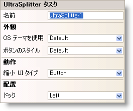

////

|metadata|
{
    "name": "winsplitter-winsplitter-smart-tag",
    "controlName": ["WinSplitter"],
    "tags": ["Design Environment"],
    "guid": "{7E291D2F-CD3D-46FF-B2D3-30BDF0B86063}",  
    "buildFlags": [],
    "createdOn": "2009-10-12T16:23:25Z"
}
|metadata|
////

= WinSplitter スマートタグ

Visual Studio 2005/2008（.NET Framework 2.0/3.5）では、{ProductName} の個々のコントロール/コンポーネントにはスマートタグがあります。 コントロールやコンポーネントを選択するだけで、スマートタグのアンカーが表示されます。 このアンカーをクリックするとポップアップ パネルが表示され、そこからコントロール/コンポーネントの最もよく使うプロパティや設定にすばやく簡単にアクセスできます。

WinSplitter™ スマートタグには、以下のセクションと共にコントロールの名前が含まれます。

* 外観 -- コントロールの外観やルック アンド フィールに関連する一般的なタスクがあります。
* 動作 -- フォーム上でのコントロールの動作を制御するプロパティに簡単にアクセスできます。
* レイアウト -- コントロールをフォームのどこに配置するかを指定するプロパティがあります。

各セクションの項目（フィールド、ドロップダウン リスト、チェックボックスなど）の説明と、各項目が対応するプロパティ グリッドのプロパティについては、以下の表を参照してください。

[options="header", cols="a,a,a"]
|====
|外観|説明|対応するプロパティ

|ボタンのスタイル
|WinSplitter でボタンのスタイルを適用または取得します
|pick:[win-forms="link:{ApiPlatform}win.misc{ApiVersion}~infragistics.win.misc.ultrasplitter~buttonstyle.html[ButtonStyle]"] 

|OS テーマを使用
|コントロールがオペレーティング システムのテーマを使用して描画しなければならない場合に選択します
|pick:[win-forms="link:{ApiPlatform}win{ApiVersion}~infragistics.win.ultracontrolbase~useosthemes.html[UseOSThemes]"] 

|====

[options="header", cols="a,a,a"]
|====
|動作|説明|対応するプロパティ

|UI タイプを縮小
|スプリッターを縮小/復元するために使用されるユーザー インターフェイスのタイプを指定します
|pick:[win-forms="link:{ApiPlatform}win.misc{ApiVersion}~infragistics.win.misc.ultrasplitter~collapseuitype.html[CollapseUIType]"] 

|====

[options="header", cols="a,a,a"]
|====
|レイアウト|説明|対応するプロパティ

|ドック
|コントロールを上、右、下、左、全体のどこにドッキングするか、またはどこにもドッキングしないかを選択します。
|pick:[win-forms="link:{ApiPlatform}win.misc{ApiVersion}~infragistics.win.misc.ultrasplitter~dock.html[Dock]"] 

|====

