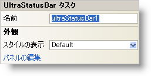

////

|metadata|
{
    "name": "winstatusbar-smart-tag",
    "controlName": ["WinStatusBar"],
    "tags": ["API","Design Environment"],
    "guid": "{BB18A552-CF6C-4360-8210-8BBE3B469DAD}",  
    "buildFlags": [],
    "createdOn": "0001-01-01T00:00:00Z"
}
|metadata|
////

= WinStatusBar スマート タグ

Visual Studio 2005（.NET Framework 2.0）では、それぞれの {ProductName} コントロール/コンポーネントが固有のスマート タグを備えています。コントロール/コンポーネントを単に選択すると、Smart Tag のアンカーが表示されます。このアンカーをクリックするとポップアップ パネルが表示され、そこからコントロール/コンポーネントの最もよく使用するプロパティや設定にすばやく簡単にアクセスできます。

WinStatusBar スマート タグには、以下のセクションと共にコントロールの名前が含まれます。

* 外観 -- コントロールの外観やルック アンド フィールに関連する一般的なタスクがあります。

各セクションの項目（たとえば、フィールド、ドロップダウン リスト、チェックボックス）およびプロパティ グリッドの項目の対応するプロパティの説明については以下を参照してください。

[options="header", cols="a,a,a"]
|====
|外観|説明|対応するプロパティ

|ViewStyle
|ステータス バーの外観を Office 2003、Visual Studio 2005、Office 2007 に変更します。
| link:{ApiPlatform}win.ultrawinstatusbar{ApiVersion}~infragistics.win.ultrawinstatusbar.ultrastatusbar~viewstyle.html[ViewStyle]

|パネルの編集
|ステータス バーを複数のパネルに分割し、それぞれに固有の情報を表示できます。[パネルの編集] をクリックすると UltraStatusPanel コレクション エディタが開き、そこでパネルの追加や変更を行うことができます。
| link:{ApiPlatform}win.ultrawinstatusbar{ApiVersion}~infragistics.win.ultrawinstatusbar.ultrastatusbar~panels.html[Panels]

|====