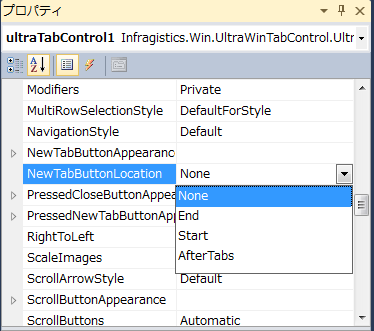

////

|metadata|
{
    "name": "wintab-adding-new-tab-button",
    "controlName": [],
    "tags": [],
    "guid": "493e9549-d935-4562-8376-a0997553b435",  
    "buildFlags": [],
    "createdOn": "2014-01-29T18:00:06.3524867Z"
}
|metadata|
////

= 新しいタブ ボタンの追加

[[_Ref377392040]]
== トピックの概要

=== 目的

このトピックでは、 _WinTabStrip_   および  _WinTab_   コントロールでランタイムに新しいタブ ボタンを追加する方法を紹介します。

=== このトピックの内容

このトピックは、以下のセクションで構成されます。

* <<_Ref377462986,新しいタブ ボタンの追加>>

** <<_Ref377462993,はじめに>>
** <<_Ref377463001,新しいタブ ボタンの位置の有効化>>
** <<_Ref377463007,イベント>>
** <<_Ref377463015,スタイル設定>>

* <<_Ref370929790,関連コンテンツ>>

[[_Ref377462986]]
== 新しいタブ ボタンの追加

[[_Ref377462993]]

=== はじめに

この機能は、最新ブラウザーのタブのようにアプリケーション実行中に新しいタブを追加する機能を提供します。 _WinTabStrip_   および  _WinTab_   コントロールは、この機能を構成するための link:{ApiPlatform}win{ApiVersion}~infragistics.win.ultrawintabs.newtabbuttonlocation.html[NewTabButtonLocation] プロパティを公開します。

`NewTabButtonLocation` プロパティに 3 つのオプション設定があります。

[options="header", cols="a,a"]
|====
|オプション|説明

| _None_ 
|新しいタブ ボタンが表示されていません (デフォルト値)。 

image::images/Adding_New_Tab_Button_1.png[]

| _End_ 
|新しいタブ ボタンはタブの最後に追加されます。 

image::images/Adding_New_Tab_Button_2.png[]

| _Start_ 
|新しいタブ ボタンはタブの最初に追加されます。 

image::images/Adding_New_Tab_Button_3.png[]

| _AfterTabs_ 
|新しいタブ ボタンは最後のタブの後に追加されます。 

image::images/Adding_New_Tab_Button_4.png[]

|====

[[_Ref376430820]]

=== 新しいタブ ボタンの位置の有効化

`NewTabButtonLocation` プロパティを Visual Studio のデザイナーまたはコードで設定できます。

コードで新しいタブ ボタンの位置を構成する実例:

*C# の場合:*

[source,csharp]
----
ultraTabControl1.NewTabButtonLocation = NewTabButtonLocation.AfterTabs;
----

*Visual Basic の場合:*

[source,vb]
----
ultraTabControl1.NewTabButtonLocation = NewTabButtonLocation.AfterTabs
----

[[_Ref377463007]]

=== イベント

以下のイベントが link:{ApiPlatform}win.ultrawintabcontrol{ApiVersion}~infragistics.win.ultrawintabcontrol.ultratabcontrolbase_members.html[UltraTabControlBase] クラスに追加されました。

[options="header", cols="a,a"]
|====
|イベント|説明

| link:{ApiPlatform}win.ultrawintabcontrol{ApiVersion}~infragistics.win.ultrawintabcontrol.ultratabcontrolbase~beforenewtabbuttonclicked_ev.html[BeforeNewTabButtonClicked]
|このイベントで、新しいタブの追加を無効にできます。イベントを処理し、`EventArgs` 引数の *Cancel* プロパティを _True_ に設定します。

| link:{ApiPlatform}win.ultrawintabcontrol{ApiVersion}~infragistics.win.ultrawintabcontrol.ultratabcontrolbase~afternewtabbuttonclicked_ev.html[AfterNewTabButtonClicked]
|このイベントでは、新しいタブを作成しコンテンツを設定できます。イベントを処理し、`EventArgs` の *Tab* プロパティを参照します。

|====

[[_Ref377463015]]

=== スタイル設定

新しいタブ ボタンは  _AppStylist_   をサポートします。`NewTabButton` の新しいロールは、新しいタブ ボタンの外観のスタイル設定を有効にします。

image::images/Adding_New_Tab_Button_6.png[]

==== 関連トピック

* link:styling-guide-setting-up-your-application-for-styling.html[アプリケーションにスタイルを設定]

[[_Ref370929790]]
== 関連コンテンツ

=== トピック

以下のトピックでは、このトピックに関連する追加情報を提供しています。

[options="header", cols="a,a"]
|====
|トピック|目的

| link:wintab-using-wintab-and-wintabstrip.html[WinTab と WinTabStrip の使用]
|このセクションでは、 _WinTab_ コントロールと _WinTabStrip_ コントロールに関連する特定のタスクを実行する方法を説明するトピックを提供します。

|====