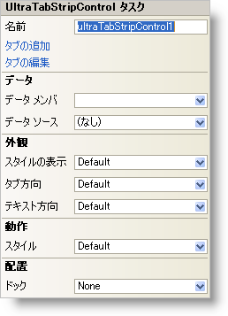

////

|metadata|
{
    "name": "wintabstrip-smart-tag",
    "controlName": ["WinTab"],
    "tags": ["Getting Started"],
    "guid": "{AB15DCE1-5FCB-4EC3-8DFC-B6D403E0E327}",  
    "buildFlags": [],
    "createdOn": "0001-01-01T00:00:00Z"
}
|metadata|
////

= WinTabStrip スマート タグ

Visual Studio 2005（.NET Framework 2.0）では、それぞれの {ProductName} コントロール/コンポーネントが固有のスマート タグを備えています。コントロール/コンポーネントを単に選択すると、Smart Tag のアンカーが表示されます。このアンカーをクリックするとポップアップ パネルが表示され、そこからコントロール/コンポーネントの最もよく使用するプロパティや設定にすばやく簡単にアクセスできます。

WinTabStrip スマート タグには、以下のセクションと共にコントロールの名前が含まれます。

* 外観 -- コントロールの外観やルック アンド フィールに関連する一般的なタスクがあります。
* 操作 -- フォーム上でのコントロールの動作を制御するプロパティに簡単にアクセスできます。
* データ -- コントロールの基になるデータ（データソースやデータメンバなど）を参照します。
* 配置 -- コントロールをフォームのどこに、どのように配置するかを指定するプロパティがあります。

各セクションの項目（たとえば、フィールド、ドロップダウン リスト、チェックボックス）およびプロパティ グリッドの項目の対応するプロパティの説明については以下を参照してください。

[options="header", cols="a,a,a"]
|====
|外観|説明|対応するプロパティ

|TabOrientation
|タブ コントロールのどこにタブを表示するのかをドロップダウンから選択します。
| link:{ApiPlatform}win.ultrawintabcontrol{ApiVersion}~infragistics.win.ultrawintabcontrol.ultratabcontrolbase~taborientation.html[TabOrientation]

|TextOrientation
|タブのテキストの表示方法をドロップダウンから選択します。
| link:{ApiPlatform}win.ultrawintabcontrol{ApiVersion}~infragistics.win.ultrawintabcontrol.ultratabcontrolbase~textorientation.html[TextOrientation]

|ViewStyle
|WinTabControl のスタイルを、Office 2003、Visual Studio 2005、または Office 2007 に似たスタイルに変更します。
| link:{ApiPlatform}win.ultrawintabcontrol{ApiVersion}~infragistics.win.ultrawintabcontrol.ultratabcontrolbase~viewstyle.html[ViewStyle]

|====

[options="header", cols="a,a,a"]
|====
|動作|説明|対応するプロパティ

|スタイル
|タブの外観を、プロパティ ページ、Visual Studio、Excel、Visual Studio 2005 などに変更します。
| link:{ApiPlatform}win.ultrawintabcontrol{ApiVersion}~infragistics.win.ultrawintabcontrol.ultratabcontrolbase~style.html[Style]

|====

[options="header", cols="a,a,a"]
|====
|データ|説明|対応するプロパティ

|DataMember
|有効なデータ ソースを選択した後、このドロップダウンから使用可能なすべてのデータ メンバを選択できます。
| link:{ApiPlatform}win.ultrawintabcontrol{ApiVersion}~infragistics.win.ultrawintabcontrol.ultratabstripcontrol~datamember.html[DataMember]

|データ ソース
|ドロップダウンをクリックすると、プロジェクトで使用可能なすべてのデータ ソースが表示されます。データソースがまだ設定されていない場合は、［プロジェクトデータソースの追加...］ を選択してデータソースを作成できます。
| link:{ApiPlatform}win.ultrawintabcontrol{ApiVersion}~infragistics.win.ultrawintabcontrol.ultratabstripcontrol~datasource.html[DataSource]

|====

[options="header", cols="a,a,a"]
|====
|レイアウト|説明|対応するプロパティ

|ドック
|コントロールを上、右、下、左、全体のどこにドッキングするか、またはどこにもドッキングしないかを選択します。
|Dock

|====