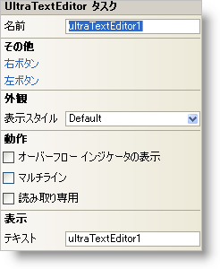

////
|metadata|
{
    "name": "wintexteditor-smart-tag",
    "controlName": ["WinTextEditor"],
    "tags": ["Design Environment"],
    "guid": "{50453B76-5F24-4742-9F7F-7A4276C3EE7F}",
    "buildFlags": [],
    "createdOn": "2005-09-11T00:00:00Z"
}
|metadata|
////

= WinTextEditor スマート タグ

Visual Studio 2005（.NET Framework 2.0）では、それぞれの {ProductName} コントロール/コンポーネントが固有のスマート タグを備えています。コントロール/コンポーネントを単に選択すると、Smart Tag のアンカーが表示されます。このアンカーをクリックするとポップアップ パネルが表示され、そこからコントロール/コンポーネントの最もよく使用するプロパティや設定にすばやく簡単にアクセスできます。

WinTextEditor スマート タグには、以下のセクションと共にコントロールの名前が含まれます。

* 外観 -- コントロールの外観やルック アンド フィールに関連する一般的なタスクがあります。
* 動作 -- フォーム上でのコントロールの動作を制御するプロパティに簡単にアクセスできます。
* 表示 -- コントロールの基になるデータ（データソースやデータメンバなど）を参照します。
* その他 -- コントロールの全体的な外観やパフォーマンスを拡張する各種オプションがあります。

各セクションの項目（たとえば、フィールド、ドロップダウン リスト、チェックボックス）およびプロパティ グリッドの項目の対応するプロパティの説明については以下を参照してください。

[options="header", cols="a,a,a"]
|====
|外観|説明|対応するプロパティ

|表示スタイル
|WinTextEditor の外観を、Office 2000、Office XP、Office 2003、Visual Studio 2005、または Office 2007 に似たスタイルに変更します。
| link:{ApiPlatform}win.ultrawineditors{ApiVersion}~infragistics.win.ultrawineditors.texteditorcontrolbase~displaystyle.html[DisplayStyle]

|====

[options="header", cols="a,a,a"]
|====
|動作|説明|対応するプロパティ

|Multiline
|このチェックボックスを ON にすると、WinTextEditor でコントロールに複数行のテキストを入力できます。
| link:{ApiPlatform}win.ultrawineditors{ApiVersion}~infragistics.win.ultrawineditors.ultratexteditor~multiline.html[Multiline]

|読み取り専用
|エディタを読み取り専用にすると、ユーザーがテキストを挿入したり変更したりできなくなります。
| link:{ApiPlatform}win.ultrawineditors{ApiVersion}~infragistics.win.ultrawineditors.texteditorcontrolbase~readonly.html[ReadOnly]

|ShowOverflowIndicator
|Text プロパティが長すぎてエディタに収まらないときに、テキストの続きがあることを示す二重の右矢印の付いた小さなボックスが表示されます。
| link:{ApiPlatform}win.ultrawineditors{ApiVersion}~infragistics.win.ultrawineditors.texteditorcontrolbase~showoverflowindicator.html[ShowOverflowIndicator]

|====

[options="header", cols="a,a,a"]
|====
|データ|説明|対応するプロパティ

|テキスト
|WinTextEditor がフォームに初めてロードされたときに表示されるテキスト。
| link:{ApiPlatform}win.ultrawineditors{ApiVersion}~infragistics.win.ultrawineditors.texteditorcontrolbase~text.html[Text]

|====

[options="header", cols="a,a,a"]
|====
|その他|説明|対応するプロパティ

|ButtonsLeft
|省略（...）ボタンをクリックすると、ButtonsLeft コレクションが開きます。これはエディタの左側に配置できるカスタム ボタンのコレクションです。
| link:{ApiPlatform}win{ApiVersion}~infragistics.win.ultrawineditors.editorbuttoncontrolbase~buttonsleft.html[ButtonsLeft]

|ButtonsRight
|省略（...）ボタンをクリックすると、ButtonsRight コレクションが開きます。これはエディタの右側に配置できるカスタム ボタンのコレクションです。
| link:{ApiPlatform}win{ApiVersion}~infragistics.win.ultrawineditors.editorbuttoncontrolbase~buttonsright.html[ButtonsRight]

|====