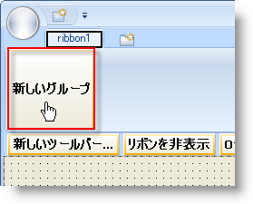

////

|metadata|
{
    "name": "wintoolbarsmanager-add-a-group-to-a-ribbon-tab",
    "controlName": ["WinToolbarsManager"],
    "tags": [],
    "guid": "{CF89BCFF-3914-4D27-ABEA-C452B2605C18}",  
    "buildFlags": [],
    "createdOn": "0001-01-01T00:00:00Z"
}
|metadata|
////

= リボン タブにグループを追加

[NOTE]
====
注：{ProductName} の一部として提供されている Microsoft Office 2007 UI 機能を使用する場合、本ライセンスが、ユーザーに MICROSOFT OFFICE 2007 UI に対する権利を付与するものではないことに注意してください。詳細は、 officeui@microsoft.comにお問い合わせください。
====

リボンの構造はタブを作成することで構築され、それらのタブ内にグループを配置し、そしてグループ内にツールを配置します。以下の図は、この構造的な関係を示しています。

image::images/WinToolbarsManager_Add_a_Tab_to_a_Ribbon_01.png[オブジェクト関係を説明するリボンの画像]

このトピックは、[リボン] タブにグループを追加する方法を説明します。グループを追加後、 link:wintoolbarsmanager-add-a-tool-to-a-ribbon-group.html[ツールをリボン グループに追加]できます。このトピックは、リボンに既にタブが存在していると想定します。そうでなければ、詳細は link:wintoolbarsmanager-add-a-tab-to-the-ribbon.html[「リボンにタブを追加」]を参照してください。

デザイン タイムまたはラン タイムに [リボン] タブにグループを追加できます。デザイン タイムには、WinToolbarsManager コンポーネントがコンポーネント トレイで選択され、[リボンを表示] ボタンがクリックされていることを確認してください。タブが既に存在していれば、[新しいグループ] ボタンが表示されます。これをクリックし、このタブで新しいグループを作成します。あるいは、以下のコードを FormLoad イベントに追加できます。

 ボタンの画像]

*Visual Basic の場合：*

----
Imports Infragistics.Win.UltraWinToolbars
...
' タブを作成してリボンに追加します。
Dim homeTab As New RibbonTab("Home")
Me.UltraToolbarsManager1.Ribbon.Tabs.Add(homeTab)
' グループを作成してタブに追加します。
Dim fontGroup As New RibbonGroup("Font")
Me.UltraToolbarsManager1.Ribbon.Tabs("Home").Groups.Add(fontGroup)
----

*C# の場合：*

----
using Infragistics.Win.UltraWinToolbars;
...
// タブを作成してリボンに追加します。
RibbonTab homeTab = new RibbonTab("Home");
this.ultraToolbarsManager1.Ribbon.Tabs.Add(homeTab);
// グループを作成してタブに追加します。
RibbonGroup fontGroup = new RibbonGroup("Font");
this.ultraToolbarsManager1.Ribbon.Tabs["Home"].Groups.Add(fontGroup);
----